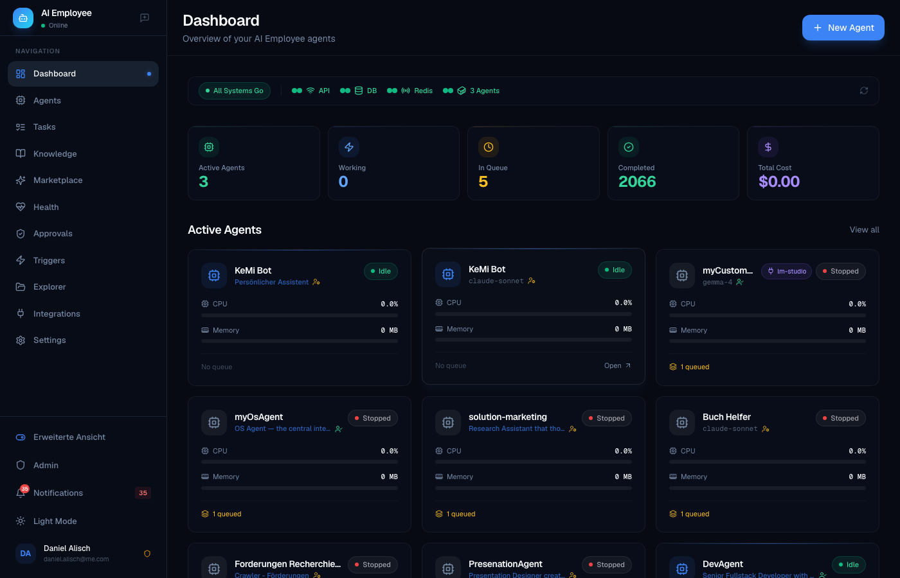
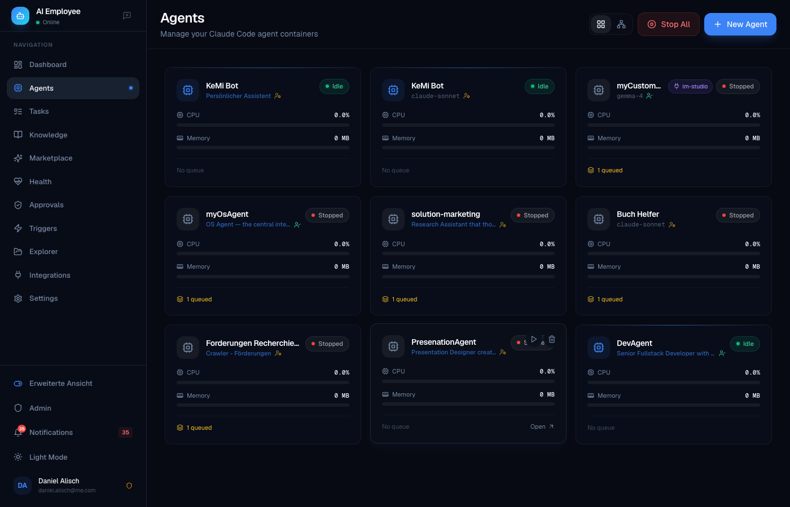
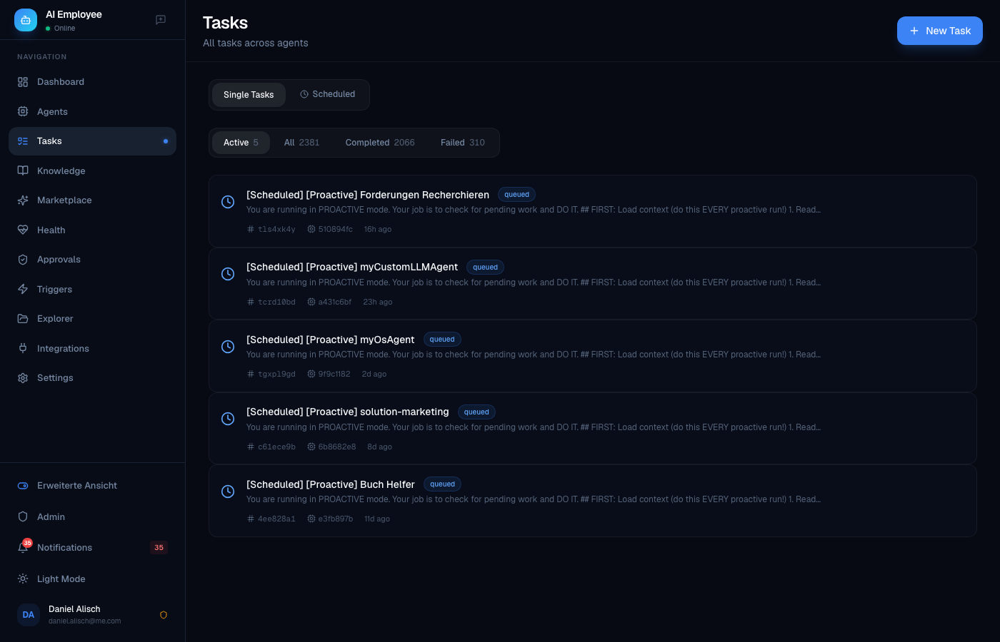

<div align="center">

# AI-Employee

**The self-hosted multi-agent AI platform for teams who need compliance, governance, and true isolation.**

[](LICENSE.md)
[](VERSION)
[](docker-compose.community.yml)
[](#governance--compliance)
[](#)

[Quick Start](#-quick-start) ·
[Features](#-features) ·
[Comparison](COMPARISON.md) ·
[Templates](#-agent-templates) ·
[Use Cases](#-use-cases) ·
[Contributing](CONTRIBUTING.md)

</div>

---

<div align="center">
  
  <p><em>Dashboard — live agent status, system health, task queue at a glance</em></p>
</div>

<div align="center">
  
  
  <p><em>Left: Agent grid with CPU/Memory monitoring &nbsp;·&nbsp; Right: Task history across all agents</em></p>
</div>

---

> **Deutsch (Kurzfassung):** AI-Employee ist eine selbst gehostete Multi-Agent-KI-Plattform für KMU, regulierte Branchen und Teams im DACH-Raum. Jeder Agent läuft in einem isolierten Docker-Container, alle Daten bleiben bei Ihnen (DSGVO-konform), und Governance-Regeln wie "Frage nach, bevor du mehr als 50 EUR ausgibst" sind von Haus aus eingebaut. Kostenlos für den internen geschäftlichen Einsatz — eine kommerzielle Lizenz ist nur erforderlich, wenn Sie AI-Employee als SaaS an Dritte weiterverkaufen möchten. Kontakt: daniel.alisch@me.com

---

## What is AI-Employee?

Modern businesses need more than a single AI chatbot — they need **teams of specialized agents** that remember context, follow company rules, and collaborate on real work. But most AI platforms today force an uncomfortable trade-off: you either run everything in somebody else's cloud (losing control over your data) or you stitch together frameworks, vector DBs, and prompt templates by hand.

**AI-Employee is a self-hosted platform that gives each agent its own isolated Docker container, semantic memory, knowledge base, and governance rules — out of the box.** You can spin up a Fullstack Developer, a Legal Assistant, a Marketing Manager, and a Tax Preparer in minutes, each with their own role, workspace, and Telegram bot. Agents can hold meetings with each other, ask you for approval before spending money, deploy their own Docker apps, and reflect on their work to improve over time.

It is built for **KMU (small and medium-sized businesses) and regulated industries in the DACH region** — lawyers, tax advisors, medical practices, agencies, and dev teams who need multi-user support, audit logs, DSGVO compliance, and data sovereignty. It is not trying to win the single-user hobbyist market. It is trying to be the boring, reliable, compliant AI backbone your team runs for the next decade.

## Why AI-Employee?

Here is how AI-Employee compares to the platforms people usually evaluate alongside it:

| Feature | AI-Employee | OpenClaw | CrewAI | Lindy | OpenAI GPTs |
|---|:---:|:---:|:---:|:---:|:---:|
| Self-hosted | Yes | Yes | Yes (BYO) | No | No |
| Multi-agent (isolated containers) | Yes | No (shared FS) | No | No | No |
| Multi-user with RLS isolation | Yes | No | No | Yes | Yes |
| Local semantic memory (no OpenAI) | Yes (bge-m3) | Partial | BYO | No | No |
| Approval rules & governance | Yes | No | No | Partial | No |
| Meeting rooms (multi-agent chat) | Yes | No | Partial | No | No |
| DSGVO-compliant by default | Yes | Partial | BYO | No | No |
| Telegram + Voice (STT/TTS) | Yes | Yes | BYO | No | No |
| Agents deploy Docker apps | Yes | No | No | No | No |
| 25 pre-built agent templates | Yes | Marketplace | No | Yes | Yes |
| LLM-agnostic (Claude / GPT-4o / Gemini / local) | Yes | Yes | Yes | No | No |

For a detailed, honest comparison including scenarios where competitors are a better fit, see **[COMPARISON.md](COMPARISON.md)**.


## Quick Start

Get a working platform in under 5 minutes.

### Prerequisites

- Docker Desktop **4.x+** (or Docker Engine 24+ on Linux) — **Docker Compose v2** is required (`docker compose`, not `docker-compose`). Update Docker Desktop if `docker compose version` fails.
- 8 GB RAM minimum, 16 GB recommended
- One of:
  - **Claude Pro/Team subscription** (no per-token costs, OAuth login)
  - **Anthropic API key** (pay-per-token)
  - **OpenAI / Gemini / local Ollama** (via the custom-LLM adapter)

### Install

```bash
# 1. Clone
git clone https://github.com/greeves89/AI-Employee.git
cd AI-Employee

# 2. Copy the community env template
cp .env.community.example .env

# 3. Generate required secrets
python -c "from cryptography.fernet import Fernet; print('ENCRYPTION_KEY=' + Fernet.generate_key().decode())" >> .env
echo "JWT_SECRET=$(openssl rand -base64 32)" >> .env
echo "POSTGRES_PASSWORD=$(openssl rand -base64 32)" >> .env

# 4. Add your Claude token (OAuth or API key) to .env
#    CLAUDE_CODE_OAUTH_TOKEN=sk-ant-oat01-...   OR
#    ANTHROPIC_API_KEY=sk-ant-api-...

# 5. Start the stack
docker compose -f docker-compose.community.yml up -d

# 6. Open the UI
open http://localhost:3000
```

First login will walk you through creating an admin user, picking an agent template, and running your first task.

### Updating

```bash
git pull
docker compose -f docker-compose.community.yml pull
docker compose -f docker-compose.community.yml up -d
```

Database migrations run automatically on startup. Your data is persisted in named Docker volumes.

## Features

### Core

- **Docker-isolated agents** — Every agent runs in its own container with its own workspace, filesystem, and resource limits. True isolation, not shared scratch dirs.
- **Claude Code CLI runtime** — Battle-tested headless Claude with native tool use, file editing, and shell access.
- **LLM-agnostic** — Swap in GPT-4o, Gemini 2.0, Mistral Large, or local Ollama models via the custom-LLM adapter.
- **Auto-scaling** — Load balancer distributes tasks across available agent containers.
- **Live log streaming** — WebSocket-powered log viewer, no polling.

### Multi-Agent Collaboration

- **Meeting Rooms** — Put 3-4 agents in a room and they will round-robin on a topic until they reach a decision. Useful for design reviews, legal-vs-marketing tradeoffs, or architecture debates.
- **Shared team volume** — Agents can drop files for each other, hand off work, or collaborate on a document.
- **Orchestrator MCP** — Any agent can spawn or query sibling agents via a standard tool interface.

### Memory & Knowledge

- **Semantic memory** — Each agent has its own vector memory powered by **BAAI/bge-m3 embeddings** (1024-dim, multilingual, runs locally — no OpenAI embedding fees, no data leaving your server).
- **Obsidian-style knowledge base** — Per-user knowledge graph with `[[backlinks]]`, `#tags`, and markdown. Agents can read and write to it as a first-class tool.
- **Self-improvement loop** — After every task, agents reflect on what worked, extract lessons, and save them to memory. The `ImprovementEngine` periodically analyzes ratings and distils patterns.
- **Task ratings** — Users rate completed tasks via Telegram inline keyboards; poor ratings feed the improvement loop.

### Governance & Compliance

- **Approval rules** — Define natural-language rules like *"ask before spending more than 50 EUR"*, *"get sign-off before emailing external clients"*, or *"always confirm before deleting files"*. Agents call the `request_approval` MCP tool automatically.
- **Inline Telegram approvals** — Approve or reject with a single button tap.
- **Audit logging** — Every agent action, tool call, and user interaction is logged with full context.
- **Multi-tenant RLS** — PostgreSQL Row-Level Security on 9 user-scoped tables. Users only ever see their own data, enforced at the database layer.
- **DSGVO-ready** — All embeddings generated locally, all data stays on your infrastructure, data export and deletion endpoints included.

### Integrations

- **Per-agent Telegram bots** — Each agent can have its own Telegram bot with voice STT/TTS.
- **OAuth integrations** — Google, Microsoft, Apple accounts with encrypted token storage. Gmail, Calendar, Outlook, Drive, OneDrive, iCloud.
- **MCP servers** — Memory, Knowledge, Notifications, Orchestrator, Skills. Plug in any third-party MCP server too.
- **Skills system** — Reusable capability modules (e.g. `invoice-parser`, `pdf-signer`, `contract-diff`) that any agent can pick up.
- **Docker-deploy capability** — Agents can write and deploy their own docker-compose apps. Your marketing agent can literally ship its own tool.

### Self-Host & Operations

- **Idle-timeout lifecycle** — Configurable per-user idle timeout (0 = always-on, 30 min default). Agents auto-start on login, incoming chat, or scheduled tasks.
- **Prometheus metrics** — Every service exports metrics; Grafana dashboards included.
- **Health dashboard** — Self-test suite validates Redis, Postgres, Docker, embedding service, and each agent on demand.
- **Backup scripts** — Scheduled `pg_dump` + volume tar + SHA256 manifest. Systemd timer examples included.
- **Traefik / Caddy** — Reverse-proxy configs with automatic TLS via Let's Encrypt.
- **High-availability** — Optional `docker-compose.ha.yml` for multi-node setups.

## Architecture

```
+----------------------------------------------------------------+
|                        Browser / Mobile                        |
|         Next.js 14 UI  +  Telegram Clients  +  API users       |
+-------------------------------+--------------------------------+
                                |
                         Caddy / Traefik (TLS)
                                |
+-------------------------------+--------------------------------+
|                         Orchestrator                           |
|     FastAPI  +  SQLAlchemy async  +  Docker SDK  +  WebSocket  |
|            Load balancer  |  Agent manager  |  MCP routes      |
+----+-----------+----------------+--------------+---------------+
     |           |                |              |
     |           |                |              |
     v           v                v              v
+--------+  +---------+      +----------+   +------------+
| Redis  |  | Postgres|      | Embedding|   | Agent Pool |
| PubSub |  |    16   |      |  Service |   |  (Docker)  |
|  Queue |  | pgvector|      | bge-m3   |   |  Claude    |
+--------+  +----+----+      +----------+   |  Code CLI  |
                 |                          +------+-----+
                 |  RLS: 9 user-scoped             |
                 |      tables                     |  Workspaces,
                 |                                 |  Memory, KB,
                 |                                 |  Skills, MCP
                 +---------------------------------+
```

## Agent Templates

25 pre-configured roles, ready to launch with one click:

| # | Template | Description |
|---|---|---|
| 1 | **Fullstack Developer** | TypeScript + Python, writes tests, deploys with Docker |
| 2 | **Frontend Specialist** | React/Next.js, Tailwind, accessibility, Figma-to-code |
| 3 | **Backend Engineer** | APIs, databases, message queues, observability |
| 4 | **DevOps Engineer** | Docker, Kubernetes, CI/CD, Terraform |
| 5 | **Data Engineer** | ETL, SQL, Airflow, dbt, warehousing |
| 6 | **Data Scientist** | Python, pandas, scikit-learn, notebook reports |
| 7 | **QA Engineer** | Test strategy, Playwright, load testing |
| 8 | **Code Reviewer** | Security, performance, idiomatic code, PR feedback |
| 9 | **Technical Writer** | API docs, tutorials, changelogs |
| 10 | **Marketing Manager** | Campaign planning, copy, analytics |
| 11 | **Content Creator** | Blog posts, social, SEO-aware |
| 12 | **SEO Specialist** | Keyword research, on-page, competitor analysis |
| 13 | **Sales Assistant** | Lead research, outreach drafts, CRM hygiene |
| 14 | **Customer Support** | Tier-1 triage, knowledge-base lookups |
| 15 | **Project Manager** | Planning, status reports, risk tracking |
| 16 | **HR Assistant** | Job descriptions, interview plans, onboarding |
| 17 | **Legal Assistant** | Contract review, clause extraction, redlines |
| 18 | **Tax Advisor** | Document sorting, deduction hints, DATEV export |
| 19 | **Accountant** | Invoice processing, reconciliation, reporting |
| 20 | **Financial Analyst** | P&L, cash flow, scenario modeling |
| 21 | **Researcher** | Literature review, source triangulation, citations |
| 22 | **Translator** | DE/EN/FR/ES/IT with tone and terminology control |
| 23 | **Medical Assistant** | Triage notes, documentation, appointment prep |
| 24 | **Personal Assistant** | Calendar, email triage, reminders |
| 25 | **Executive Assistant** | Briefings, travel, meeting prep, minutes |

Each template ships with a role prompt, recommended skills, default approval rules, and example tasks.

## Use Cases

Real scenarios AI-Employee is already used for:

- **Tax prep automation** — Tax Advisor agent sorts invoices, extracts line items, flags deductibles, exports DATEV CSV. Triggers approval before changing historical entries.
- **Customer support tier-1** — Customer Support agent answers from the KB, escalates to a human via Telegram when confidence is low.
- **Content calendar** — Marketing Manager + Content Creator + SEO Specialist meet weekly in a Meeting Room, produce a 4-week content plan.
- **Code review bot** — Code Reviewer agent watches GitHub webhooks, leaves PR comments, blocks risky merges until a human approves.
- **Legal contract triage** — Legal Assistant agent reads incoming contracts, summarizes, flags unusual clauses, drafts redlines for the lawyer.
- **Medical practice intake** — Medical Assistant agent reviews patient intake forms and prepares a briefing for the doctor before the appointment.
- **Multi-language translation workflow** — Translator agent handles DE→EN website translation with glossary enforcement.
- **Internal docs assistant** — Researcher agent indexes company wiki, answers questions with citations, writes onboarding guides.
- **Agency client reporting** — Project Manager agent compiles weekly client reports from Jira, Slack, and Google Analytics.
- **Personal CEO assistant** — Executive Assistant agent prepares morning briefings, summarizes overnight email, suggests agenda for meetings.

## Configuration

Key environment variables (see `.env.community.example` for the full list):

| Variable | Purpose | Default |
|---|---|---|
| `CLAUDE_CODE_OAUTH_TOKEN` | Claude Pro/Team OAuth token | — |
| `ANTHROPIC_API_KEY` | Alternative to OAuth | — |
| `ENCRYPTION_KEY` | Fernet key for secrets at rest | **required** |
| `JWT_SECRET` | JWT signing key | **required** |
| `POSTGRES_PASSWORD` | Database password | **required** |
| `AGENT_IDLE_TIMEOUT_MIN` | Auto-stop idle agents after N minutes | `30` |
| `AGENT_MAX_CONCURRENT` | Max agents running simultaneously | `10` |
| `EMBEDDING_MODEL` | Local embedding model | `BAAI/bge-m3` |
| `TELEGRAM_BOT_TOKEN` | Optional — master bot token | — |
| `DEFAULT_LLM_PROVIDER` | `claude` / `openai` / `gemini` / `ollama` | `claude` |
| `DSGVO_MODE` | Enforce strict data locality | `true` |

## License

AI-Employee is **Fair-Code** licensed under the **Sustainable Use License**, inspired by [n8n.io](https://n8n.io).

**Free for:**
- Internal business use (including commercial organizations)
- Personal projects, education, research
- Client work where you deliver the service directly
- Integrating AI-Employee as a component into your own products

**Requires a commercial license:**
- Hosting AI-Employee as a SaaS offering where third parties pay to use it
- Reselling AI-Employee as your own branded product
- White-label commercial distribution

See **[LICENSE.md](LICENSE.md)** for the complete terms. For commercial licensing inquiries contact **daniel.alisch@me.com**.

## Contributing

We welcome contributions of all kinds — bug reports, features, docs, translations, templates. See **[CONTRIBUTING.md](CONTRIBUTING.md)** for dev setup, conventions, and workflow.

## Security

Found a vulnerability? Please **do not** open a public issue. See **[SECURITY.md](SECURITY.md)** for our disclosure policy.

## Community

- **GitHub Discussions**: https://github.com/greeves89/AI-Employee/discussions

## Credits

AI-Employee stands on the shoulders of outstanding open-source projects:

- **Claude Code** (Anthropic) — the agent runtime
- **FastAPI** (Sebastián Ramírez) — the backend framework
- **Next.js** (Vercel) — the frontend framework
- **SQLAlchemy** — the ORM
- **PostgreSQL** + **pgvector** — the database
- **Redis** — pub/sub and queue
- **BAAI/bge-m3** (BAAI) — local multilingual embeddings
- **python-telegram-bot** — Telegram integration
- **Radix UI** — accessible UI primitives
- **Tailwind CSS** — styling
- **Framer Motion** — animations
- **Docker** — container runtime
- **Traefik** / **Caddy** — reverse proxy
- **Prometheus** / **Grafana** — observability
- **n8n** — inspiration for the Fair-Code license

Built with care by **Daniel Alisch** in the DACH region.

---

<div align="center">
  <sub>If AI-Employee saves you hours, please star the repo. If it saves your business, please consider sponsoring.</sub>
</div>
