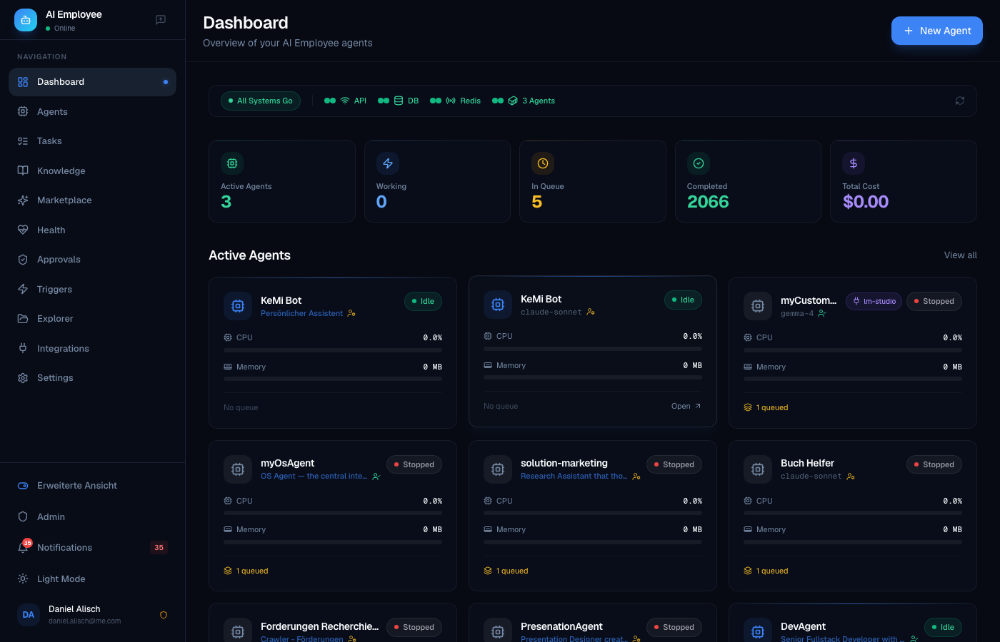
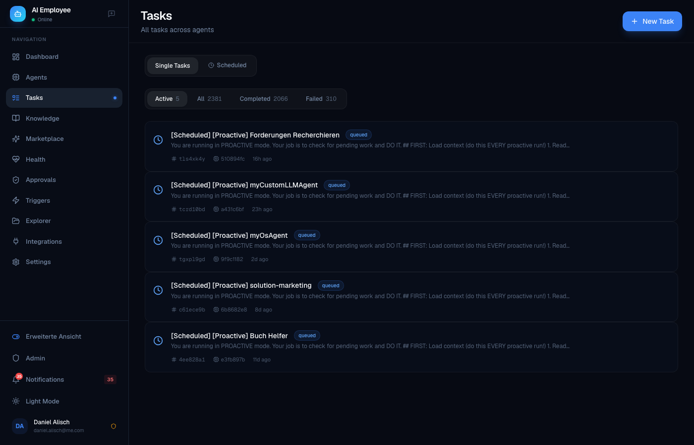
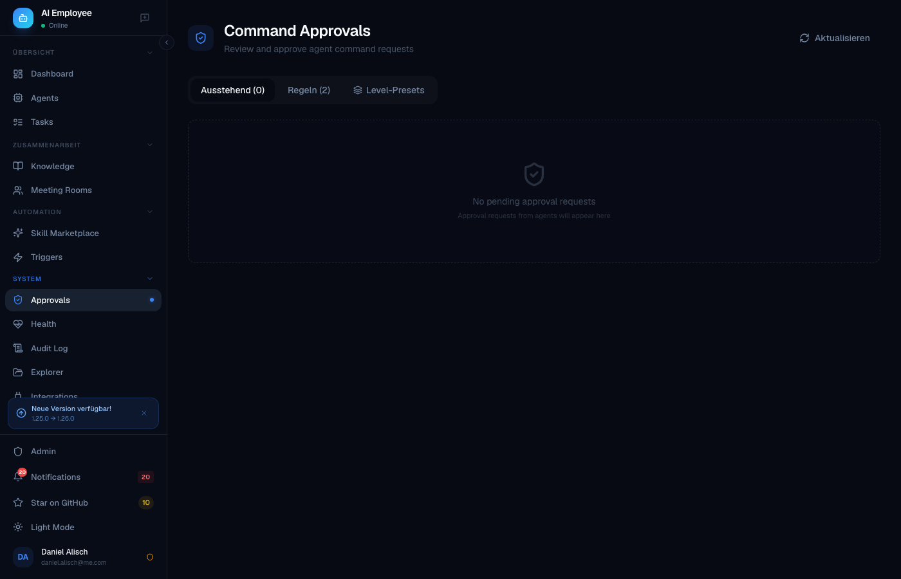
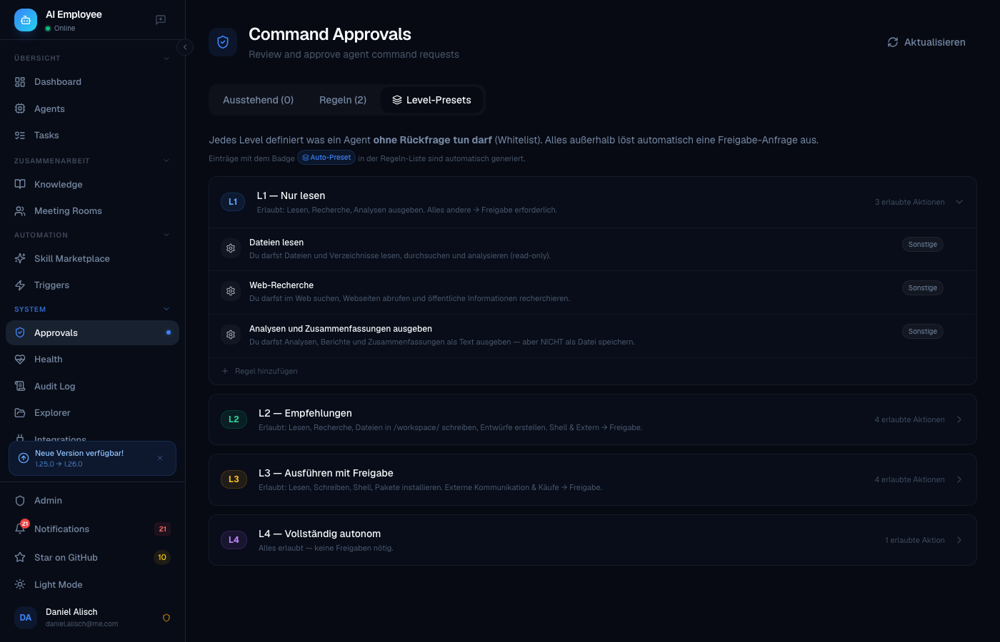
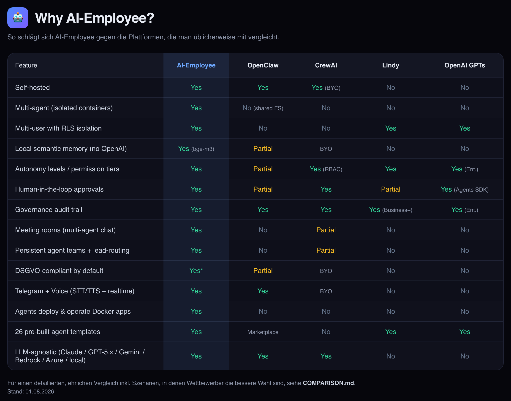
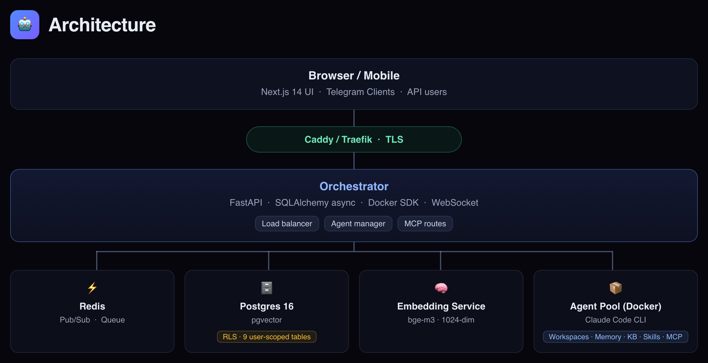
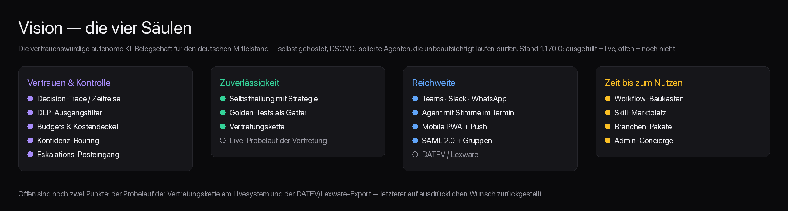
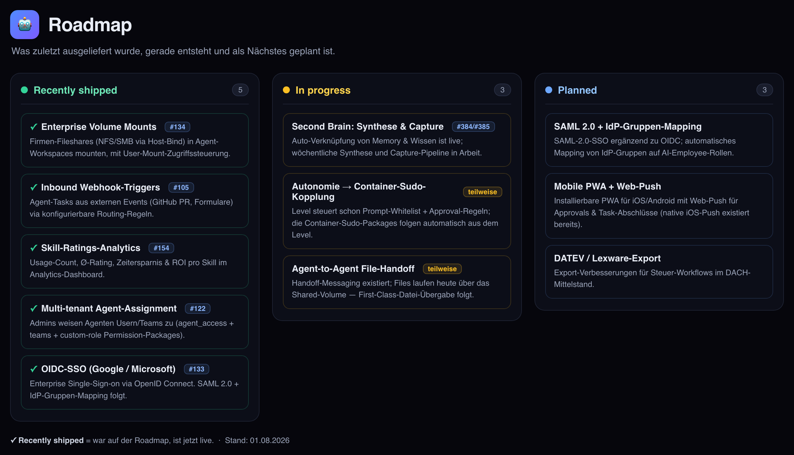

<div align="center">

# AI-Employee

**The self-hosted multi-agent AI platform for teams who need compliance, governance, and true isolation.**

[](LICENSE.md)
[](VERSION)
[](docker-compose.community.yml)
[](#governance--compliance)
[](#)

[Quick Start](#-quick-start) ·
[Features](#-features) ·
[Comparison](COMPARISON.md) ·
[Templates](#-agent-templates) ·
[Use Cases](#-use-cases) ·
[Roadmap](#roadmap) ·
[Contributing](CONTRIBUTING.md)

</div>

---

<div align="center">
  
  <p><em>Dashboard — live agent status, system health, task queue at a glance</em></p>
</div>

<div align="center">
  
  
  <p><em>Left: Agent grid with CPU/Memory monitoring &nbsp;·&nbsp; Right: Task history across all agents</em></p>
</div>

<div align="center">
  
  
  <p><em>Left: Approval request queue with risk levels &nbsp;·&nbsp; Right: L1–L4 autonomy whitelist editor</em></p>
</div>

---

> **Deutsch (Kurzfassung):** AI-Employee ist eine selbst gehostete Multi-Agent-KI-Plattform für KMU, regulierte Branchen und Teams im DACH-Raum. Jeder Agent läuft in einem isolierten Docker-Container, alle Daten bleiben bei Ihnen. Vollständige Multi-User-Datenisolation — jeder Nutzer sieht ausschließlich seine eigenen Agents, Tasks, Schedules, Regeln und eine eigene Knowledge Base (automatisch von allen seinen Agents geteilt). Autonomie als **3-stufige Fähigkeits-Matrix (Erlaubt/Freigabe/Verboten)** mit L1–L4-Presets — alles auf „Freigabe" löst automatisch eine Freigabe-Anfrage aus, „Verboten" wird nie ausgeführt. Native Microsoft 365-Integration über 47 MS-Graph-MCP-Tools; jeder Nutzer verbindet sein eigenes M365-Konto per OAuth. Kostenlos für private Nutzung — gewerbliche Nutzung erfordert eine kommerzielle Lizenz. Kontakt: daniel.alisch@me.com

> **Aktuell (v1.127):** **Visueller Workflow-Builder (n8n-Stil)** (Issue #394) — ein Drag-&-Drop-Editor auf React Flow, aufgesetzt auf die **Workflow-Engine** (Issue #392, v1.126): eine Seite **Workflows** (Sidebar → Automation) mit Liste und Canvas-Editor, in dem Bausteine **Aufgabe / Bedingung / Warten** per Klick hinzugefügt und per Ziehen verbunden werden (Bedingung mit „ja"/„nein"-Ausgängen), pro Baustein ein Konfig-Panel (Agent, Prompt mit `{{schritt}}`-Platzhaltern, Operator/Wert, Sekunden); **Speichern** und **Ausführen** direkt aus dem Canvas mit live hervorgehobenem Schritt und Ergebnissen pro Schritt · **#392 Cron-Auto-Trigger** — Workflows mit `trigger.cron` starten automatisch (croniter, verpasste Slots werden einmalig nachgeholt); Editor und Engine teilen sich **eine** Definition, keine Doppel-Logik · **Dry-Run / Simulationsmodus** (Issue #386, Vertrauen & Kontrolle) — vor der echten Ausführung läuft eine Aufgabe als **Vorschau**: der Agent erstellt einen strukturierten Ausführungsplan (Schritte, betroffene Dateien/Befehle, externe Aktionen, Aufwands-/Risiko-Schätzung) und führt **nichts** aus; die Task-Detailseite zeigt ein Vorschau-Banner mit **„Jetzt wirklich ausführen"**, das dieselbe Aufgabe mit Original-Prompt regulär anlegt · **„Planen"-Button im Chat** — neben „Senden" schickt „Planen" die Nachricht mit einer „nur planen, nichts ausführen"-Anweisung an den Agenten; die angezeigte Nutzer-Nachricht bleibt wie getippt, nur was der Agent empfängt wird umhüllt · **DLP-Egress-Filter** (Vertrauen & Kontrolle) — ausgehender Agenten-Text wird vor dem Versand auf PII/Secrets gescannt (secret/IBAN/Kreditkarte mit Luhn/E-Mail/Steuer-ID), Aktion pro Datenklasse **allow/log/mask/block**, Audit ohne Klartext, Admin-UI zum Konfigurieren · **Decision-Trace / Zeitreise** — volle, abspielbare Task-Timeline (Gedanke → Tool-Call → Ergebnis) mit Dauer pro Schritt, Governance-&-Kosten-Strip und JSON/PDF-Export („warum hat der Agent das getan?") · **Audit-Log-Cockpit** — der Compliance-Trail direkt in der Admin-Sidebar mit klickbaren Zeilen und selbsterklärendem Detail-Modal (Klartext-Titel + Ein-Satz-Erklärung je Ereignistyp, freundliche Feld-Labels, Roh-JSON einklappbar); DLP-Treffer zeigen die erkannten Datenklassen samt maskiertem Ausschnitt (`df***as`), der Voll-Wert wird nie gespeichert · **Second Brain Stufe 1** — automatische semantische Verknüpfung von Agent-Memories **und** Cross-System-Brücke Memory↔Wissen, Graph-View unterscheidet Backlinks vs. semantische Kanten · **Per-Agent „Immer an"** (nimmt einen Agenten von beiden Idle-Sweeps aus) · **Realtime Voice Assistant** (Nova Sonic / Azure Realtime) — spricht live mit dem Nutzer und kann per Stimme das Workspace durchsuchen und Dateien lesen (inkl. PDF/Word/Excel), ins **Second Brain** schreiben, eigene **Docker-Apps verwalten** (list/logs/start/stop/**rebuild**), **Microsoft 365** nutzen (Mail senden, Termine anlegen), proaktiv an Kalendertermine erinnern und Tasks über den vollen Lebenszyklus steuern · **Live-Steering** — mitten im laufenden Turn nachsteuern (Queue → Interrupt → Resume), für Claude **und** Codex · **eigene Auth-Header für externe MCP-Server** (Composio, Home Assistant, UniFi, Computer-Use-Bridge) · 3-stufige **Autonomie-Matrix** (Erlaubt/Freigabe/Verboten) mit L1–L4-Presets · **provider-abhängige Modellauswahl** (Claude / GPT-5.x via Codex / Custom-LLM) · persistente **Agenten-Teams mit Lead-Routing** · **47 MS-Graph-Tools**.

---

## What is AI-Employee?

Modern businesses need more than a single AI chatbot — they need **teams of specialized agents** that remember context, follow company rules, and collaborate on real work. But most AI platforms today force an uncomfortable trade-off: you either run everything in somebody else's cloud (losing control over your data) or you stitch together frameworks, vector DBs, and prompt templates by hand.

**AI-Employee is a self-hosted platform that gives each agent its own isolated Docker container, semantic memory, knowledge base, and governance rules — out of the box.** You can spin up a Fullstack Developer, a Legal Assistant, a Marketing Manager, and a Tax Preparer in minutes, each with their own role, workspace, and Telegram bot. Agents can hold meetings with each other, ask you for approval before spending money, deploy their own Docker apps, and reflect on their work to improve over time.

It is built for **KMU (small and medium-sized businesses) and regulated industries in the DACH region** — lawyers, tax advisors, medical practices, agencies, and dev teams who need multi-user support, audit logs, DSGVO compliance, and data sovereignty. It is not trying to win the single-user hobbyist market. It is trying to be the boring, reliable, compliant AI backbone your team runs for the next decade.

## Why AI-Employee?

Here is how AI-Employee compares to the platforms people usually evaluate alongside it:

<p align="center">
  
</p>

<details>
<summary>Same comparison as a table</summary>

| Feature | AI-Employee | OpenClaw | CrewAI | Lindy | OpenAI Responses API / Agents SDK |
|---|:---:|:---:|:---:|:---:|:---:|
| Self-hosted | Yes | Yes | Yes (BYO) | No | No |
| Multi-agent (isolated containers) | Yes | No (shared FS) | No | No | No |
| Multi-user with RLS isolation | Yes | No | No | Yes | Yes |
| Local semantic memory (no OpenAI) | Yes (bge-m3) | Partial | BYO | No | No |
| Autonomy levels / permission tiers | Yes | Partial | Yes (RBAC) | Yes | Yes (Enterprise) |
| Human-in-the-loop approvals | Yes | Partial | Yes | Partial | Yes (Agents SDK) |
| Governance audit trail | Yes | Yes | Yes | Yes (Business+) | Yes (Enterprise) |
| Meeting rooms (multi-agent chat) | Yes | No | Partial | No | No |
| Persistent agent teams + lead-routing | Yes | No | Partial | No | No |
| DSGVO-compliant by default | Yes* | Partial | BYO | No (SOC2/GDPR, US cloud) | No (EU residency/ZDR on Enterprise) |
| Telegram + Voice (STT/TTS + realtime voice) | Yes | Yes | BYO | No | No |
| Agents deploy & operate Docker apps | Yes | Partial (Docker via shell) | No | No | No |
| 27 pre-built agent templates | Yes | Marketplace | Yes (Marketplace) | Yes | Yes |
| LLM-agnostic (Claude / GPT-5.x via Codex / Gemini / Bedrock / Azure / local) | Yes | Yes | Yes | Partial (GPT/Claude, no BYO/local) | No |

</details>

For a detailed, honest comparison including scenarios where competitors are a better fit, see **[COMPARISON.md](COMPARISON.md)**.


## Quick Start

Get a working platform in under 5 minutes.

### Prerequisites

- Docker Desktop **4.x+** (or Docker Engine 24+ on Linux) — **Docker Compose v2** is required (`docker compose`, not `docker-compose`). Update Docker Desktop if `docker compose version` fails.
- 8 GB RAM minimum, 16 GB recommended
- One of:
  - **Claude Pro/Team subscription** (no per-token costs, OAuth login)
  - **Anthropic API key** (pay-per-token)
  - **OpenAI / Gemini / local Ollama** (via the custom-LLM adapter)

### Install

```bash
git clone https://github.com/greeves89/AI-Employee.git
cd AI-Employee
./scripts/setup.sh
```

The setup script handles everything: generates secrets, copies the env template, builds the agent image, and starts the stack. Open **http://localhost:3000** when it's done and create your admin account on first login.

### Updating

```bash
git pull
./scripts/setup.sh
```

Database migrations run automatically on startup. Your data is persisted in named Docker volumes.

## Features

### Core

- **Docker-isolated agents** — Every agent runs in its own container with its own workspace, filesystem, and resource limits. True isolation, not shared scratch dirs.
- **Claude Code CLI runtime** — Battle-tested headless Claude with native tool use, file editing, and shell access.
- **LLM-agnostic** — Native Claude Code and OpenAI Codex (GPT-5.x) harnesses, plus Gemini (Vertex), AWS Bedrock, Azure Foundry, or local Ollama/LM-Studio models via the custom-LLM adapter.
- **Auto-scaling** — Load balancer distributes tasks across available agent containers.
- **Live log streaming** — WebSocket-powered log viewer, no polling.
- **Live-Steering** — Send a new instruction while the agent is mid-task and it steers without losing context: the message is queued, the current turn is cleanly interrupted, and the run resumes with your correction folded in. Works on both the Claude and Codex runtimes.

### Multi-Agent Collaboration

- **Meeting Rooms** — Put 3-4 agents in a room and they will round-robin on a topic until they reach a decision. Useful for design reviews, legal-vs-marketing tradeoffs, or architecture debates.
- **Shared team volume** — Agents can drop files for each other, hand off work, or collaborate on a document.
- **Orchestrator MCP** — Any agent can spawn or query sibling agents via a standard tool interface.

### Automation & Workflows

- **Visual workflow builder (n8n-style)** — A drag-and-drop editor on React Flow (Sidebar → Automation → Workflows). Add **Task / Condition / Wait** blocks by click, wire them by dragging (conditions have "yes"/"no" outputs), and configure each block in a side panel (agent, prompt with `{{step}}` placeholders, operator/value, seconds). **Save** and **Run** straight from the canvas — the running step is highlighted live and per-step results show in the panel.
- **Workflow engine** — Declarative multi-step agent workflows that actually run: a safe state machine (no `eval`) advances one move per scheduler tick. Step types are **agent_task** (spawns an agent task and waits for it), **condition** (structured `contains/equals/…` → true/false branch), and **wait** (delay); `{{step_id}}` placeholders feed earlier results into later prompts. The visual builder edits the same definition — one source of truth, no duplicated logic.
- **Cron auto-trigger** — Workflows with a `trigger.cron` start automatically (croniter; a missed slot is caught up once). Inbound-webhook workflow triggers are on the roadmap.
- **Self-directed proactive agents** — Agents survey what's outstanding, plan the run, pull the next item forward when they finish early, and propose (never open-endedly ask) once nothing's left — rate-limited to one check-in per half-day. They can set up their own recurring schedules or event-driven triggers (`trigger_create`) instead of only reacting to what a human scheduled, and respect a configured working-hours window for their point of contact.
- **Activity timeline** — One day-strip per agent (Sidebar → Activity): planned runs from schedules as markers, actual task runs as bars, with date navigation for past and future days alike. Click a bar to jump into that task's full decision trace.

### Memory & Knowledge

- **Semantic memory** — Each agent has its own vector memory powered by **BAAI/bge-m3 embeddings** (1024-dim, multilingual, runs locally — no OpenAI embedding fees, no data leaving your server).
- **Per-user knowledge base** — Each user has their own isolated knowledge graph with `[[backlinks]]`, `#tags`, and markdown. All of that user's agents share the same KB — they read and write to it as a first-class tool. Other users see nothing.
- **Second Brains — department-shared vaults** — Admins create a shared Markdown vault per department in the UI (under `/srv/secondbrain/<slug>/`). It's a DB-managed mount entry, so per-person read/write is set in the existing mount-permissions modal (and groups via custom roles), and assigned agents mount it at `/mnt/brains/<slug>`. Agents auto-search the vault (`grep`) before answering support questions and cite the source `.md`. File history is tracked via a **local** git repo per vault (no remote — nothing leaves the server) plus `FILE_WRITTEN` audit events.
- **Self-improvement loop** — After every task, agents reflect on what worked, extract lessons, and save them to memory. The `ImprovementEngine` periodically analyzes ratings and distils patterns.
- **Task ratings** — Users rate completed tasks via Telegram inline keyboards; poor ratings feed the improvement loop.
- **Skill Analytics Dashboard** — `/analytics` shows time savings per skill (vs. manual baseline), ROI, daily task volume, per-agent success rate, cost, and average duration. Set manual effort estimates per skill to calculate real productivity gains.

### Governance & Compliance

- **Autonomy Matrix (3-state) + L1–L4 presets** — Every capability is set to **Allow / Ask / Deny**, grouped into *own container* (read/write files, shell, packages) and *external tools* (email/M365, web, external APIs, messaging, git push, purchases). The L1–L4 buttons fill the matrix as a starting point (L1 = read-only, L2 = recommendations + workspace writes, L3 = full container execution, L4 = fully autonomous), then every cell is fine-tunable → "custom". The matrix is rendered into every prompt: Allow = do freely, Ask = call `request_approval` first, Deny = refuse.
- **Whitelist-based approval model** — Instead of listing what agents must ask about (blacklist), you define what they *may* do freely. Everything outside the whitelist automatically triggers an approval request — no gaps, no forgotten rules.
- **DB-backed level presets** — The allowed-action sets per level are stored in the database and editable in the UI. Add domain-specific permissions to a level without touching code. Seeded automatically on first startup.
- **Group-based resource grants (Custom Roles)** — Bundle access into a group and assign users to it: a role can grant **Second Brains/mounts**, **AI-Accounts (models)** and **Keys/Secrets** directly (plus templates, LLM-providers, menu paths, URL allowlist, agent limits). Group grants union with per-user grants, so a user inherits the group and can still get manual extras. All editable as multi-selects in the Roles admin UI.
- **Approval rules & inline Telegram approvals** — Define additional natural-language rules on top of the level preset. Agents call the `request_approval` MCP tool and wait. Approve or deny with a single Telegram button tap.
- **Full governance audit trail** — Every governance event is written to `audit_logs`: approval requests, approvals/denials, level changes, rule edits, preset changes. Enterprise-ready traceability out of the box.
- **DLP egress filter** — Outbound, agent-generated text is scanned for PII/secrets before it leaves the platform (credentials, IBAN, credit card with Luhn check, email, German tax ID). The action per data class is configurable — **allow / log / mask / block** (agent-specific > global > default) — and every hit is audited **without the sensitive value** (only class + count). Opt-in and fail-open, with an admin UI to toggle rules and preview a test scan. The argument for DSGVO-sensitive customers.
- **Confidence routing** — Agents report how sure they are before an uncertain decision; below the operator's threshold the decision goes to a human instead of being guessed. The threshold lives on the server — an agent judging whether its own 40% is enough would judge that just as unreliably as the answer. Per agent and per task, available in all three runtimes, escalating through the same approval inbox as everything else.
- **Self-healing with escalation** — A failed task is classified (transient vs. permanent) and retried with a growing delay and a changing strategy: same again, then in smaller steps, then with a different model. A permanent error (wrong credential, missing permission) is never retried — it costs money and changes nothing. Once exhausted, a human gets the full attempt history rather than a bare "Task failed".
- **Golden tests as an update gate** — Versioned task sets per role, executed as real tasks through the real agent. If the score drops below the baseline, the container update is refused (with a documented override). Scoring is deterministic on purpose — a gate whose verdict wobbles is a gate nobody trusts.
- **Decision-Trace / time-travel** — A full, replayable task timeline answers "why did the agent do that?" on demand: raw steps are folded into thought → tool-call → result, with per-step duration, a governance & cost strip (blocked/failed actions visible), play/pause playback, and export as JSON or PDF.
- **Multi-tenant isolation** — Complete data isolation at both the API and database layer (PostgreSQL RLS). Users see only their own agents, tasks, schedules, knowledge entries, approval rules, and memories. Agents of the same user share one knowledge base; agents of different users are completely isolated.
- **DSGVO-ready\*** — All embeddings, memory, knowledge, and logs stay on your infrastructure. Data export and deletion endpoints included. *\*Note: LLM inference via Claude API or OpenAI routes prompts through external servers (US). For full DSGVO compliance use local models (Ollama/Mistral) or Azure OpenAI in EU data regions.*

### Integrations

- **Per-agent Telegram bots** — Each agent can have its own Telegram bot with voice STT/TTS.
- **Realtime Voice Assistant** — A live, low-latency voice conversation with your agent (Amazon Nova Sonic or Azure OpenAI Realtime). It is not just talk: by voice it can **search and read your workspace files** (including PDF, Word, and Excel), **open a file**, **write notes to a Second Brain**, **manage the agent's own Docker apps** (list, tail logs, start, stop, and rebuild), use **Microsoft 365** (send mail, create calendar events), **proactively remind you** of upcoming calendar events, and drive the full **task lifecycle** (submit a task and hear plan feedback, cancel a running task, ask for spoken help). Responses are sanitized for natural speech.
- **Microsoft 365 (MS Graph MCP)** — Native Office 365 integration via a built-in MCP server with 47 tools: read/send Outlook mail, manage Calendar events, post to Teams channels and 1:1 chats, Planner tasks, Microsoft To-Do lists, and OneDrive file search/read/move/copy. Each user connects their own M365 account via OAuth — tokens are stored per-user, never shared. Admin configures the Azure App Registration once in Settings; users sign in individually.
- **OAuth integrations** — Per-user Google and Microsoft accounts with encrypted token storage. Gmail, Calendar, Outlook, Drive, OneDrive. Apple account support also included.
- **MCP servers** — Memory, Knowledge, Notifications, Orchestrator, Skills, MS Graph. Plug in any third-party MCP server too — with **custom auth headers** for servers that need them (encrypted per-server headers for Composio, Home Assistant, UniFi, the Computer-Use bridge, etc., including Cloudflare Access `CF-Access-Client-Id`/`Secret` handshake headers).
- **Skills system** — Reusable capability modules (e.g. `invoice-parser`, `pdf-signer`, `contract-diff`) that any agent can pick up. Skills can carry file attachments (scripts, configs) that are pushed into the agent workspace automatically.
- **Computer Use (Browser Automation)** — Agents control a headless Chromium browser via a Playwright MCP. Fill forms, scrape dynamic pages, and interact with web UIs that have no API.
- **Desktop Bridge** — A native macOS/Windows tray app connects your local desktop to the AI-Employee server. Agents can take screenshots, click, type, open apps, and run shell commands on your machine. Download it from the agent's Computer-Use tab or the [latest release](https://github.com/greeves89/AI-Employee/releases/tag/bridge-latest). Granular capability permissions (screenshots, mouse, keyboard, clipboard, shell), folder-access restrictions, and a configurable **auth-header handshake** (incl. Cloudflare Access) are set from the tray menu.
- **Agent-managed Docker app lifecycle** — Agents can write, deploy, and **operate** their own docker-compose apps end-to-end: list their apps, tail logs, start, stop, and **rebuild** them (five agent tools, on both the Claude and Codex runtimes), plus a **"Neu bauen" (rebuild)** button in the UI. Deployed apps are reachable through the built-in **app proxy** and get a **shareable public URL** (`PUBLIC_APP_URL`). Your marketing agent can literally ship — and maintain — its own tool.
- **App sharing** — Deployed apps are private to their owner by default. From the Apps overview, the owner grants access in three tiers: a **named user**, **every logged-in user**, or a **public link** that works without any login (token in the URL, mandatory expiry of 1–90 days, shown exactly once). A share opens the *access path* only — the proxy's SSRF gates are untouched, so a token for one app can never reach another container, and start/stop/rebuild/logs/re-share stay owner-only.

### Self-Host & Operations

- **Idle-timeout lifecycle** — Configurable per-user idle timeout (0 = always-on, 30 min default). Agents auto-start on login, incoming chat, or scheduled tasks.
- **Prometheus metrics** — Every service exports metrics; Grafana dashboards included.
- **Health dashboard** — Self-test suite validates Redis, Postgres, Docker, embedding service, and each agent on demand.
- **Backup scripts** — Scheduled `pg_dump` + volume tar + SHA256 manifest. Systemd timer examples included.
- **Traefik / Caddy** — Reverse-proxy configs with automatic TLS via Let's Encrypt.
- **iOS companion app landing page** — Every installation serves a static page for the iOS app at `/app/` (`docs/ios-app/`); make it the start page with a one-block `conf.d/site/` snippet (see `conf.d/README.md`).
- **High-availability** — Optional `docker-compose.ha.yml` for multi-node setups.

## Architecture

<p align="center">
  
</p>

<details>
<summary>ASCII version</summary>

```
+----------------------------------------------------------------+
|                        Browser / Mobile                        |
|         Next.js 14 UI  +  Telegram Clients  +  API users       |
+-------------------------------+--------------------------------+
                                |
                         Caddy / Traefik (TLS)
                                |
+-------------------------------+--------------------------------+
|                         Orchestrator                           |
|     FastAPI  +  SQLAlchemy async  +  Docker SDK  +  WebSocket  |
|            Load balancer  |  Agent manager  |  MCP routes      |
+----+-----------+----------------+--------------+---------------+
     |           |                |              |
     |           |                |              |
     v           v                v              v
+--------+  +---------+      +----------+   +------------+
| Redis  |  | Postgres|      | Embedding|   | Agent Pool |
| PubSub |  |    16   |      |  Service |   |  (Docker)  |
|  Queue |  | pgvector|      | bge-m3   |   |  Claude    |
+--------+  +----+----+      +----------+   |  Code CLI  |
                 |                          +------+-----+
                 |  RLS: 9 user-scoped             |
                 |      tables                     |  Workspaces,
                 |                                 |  Memory, KB,
                 |                                 |  Skills, MCP
                 +---------------------------------+
```

</details>

## Agent Templates

27 pre-configured roles, ready to launch with one click:

| # | Template | Description |
|---|---|---|
| 1 | **Fullstack Developer** | TypeScript + Python, writes tests, deploys with Docker |
| 2 | **Frontend Specialist** | React/Next.js, Tailwind, accessibility, Figma-to-code |
| 3 | **Backend Engineer** | APIs, databases, message queues, observability |
| 4 | **DevOps Engineer** | Docker, Kubernetes, CI/CD, Terraform |
| 5 | **Data Engineer** | ETL, SQL, Airflow, dbt, warehousing |
| 6 | **Data Scientist** | Python, pandas, scikit-learn, notebook reports |
| 7 | **QA Engineer** | Test strategy, Playwright, load testing |
| 8 | **Code Reviewer** | Security, performance, idiomatic code, PR feedback |
| 9 | **Technical Writer** | API docs, tutorials, changelogs |
| 10 | **Marketing Manager** | Campaign planning, copy, analytics |
| 11 | **Content Creator** | Blog posts, social, SEO-aware |
| 12 | **SEO Specialist** | Keyword research, on-page, competitor analysis |
| 13 | **Sales Assistant** | Lead research, outreach drafts, CRM hygiene |
| 14 | **Customer Support** | Tier-1 triage, knowledge-base lookups |
| 15 | **Project Manager** | Planning, status reports, risk tracking |
| 16 | **HR Assistant** | Job descriptions, interview plans, onboarding |
| 17 | **Legal Assistant** | Contract review, clause extraction, redlines |
| 18 | **Tax Advisor** | Document sorting, deduction hints, DATEV export |
| 19 | **Accountant** | Invoice processing, reconciliation, reporting |
| 20 | **Financial Analyst** | P&L, cash flow, scenario modeling |
| 21 | **Researcher** | Literature review, source triangulation, citations |
| 22 | **Translator** | DE/EN/FR/ES/IT with tone and terminology control |
| 23 | **Medical Assistant** | Triage notes, documentation, appointment prep |
| 24 | **Personal Assistant** | Calendar, email triage, reminders |
| 25 | **Executive Assistant** | Briefings, travel, meeting prep, minutes |
| 26 | **OS Agent (Brain)** | Orchestrator — decomposes goals, delegates to specialist agents, monitors, learns |
| 27 | **Meeting Agent** | Records/transcribes meetings, writes minutes, tracks action items, schedules follow-ups |

Each template ships with a role prompt, recommended skills, default approval rules, and example tasks.

## Use Cases

Real scenarios AI-Employee is already used for:

- **Tax prep automation** — Tax Advisor agent sorts invoices, extracts line items, flags deductibles, exports DATEV CSV. Triggers approval before changing historical entries.
- **Customer support tier-1** — Customer Support agent answers from the KB, escalates to a human via Telegram when confidence is low.
- **Content calendar** — Marketing Manager + Content Creator + SEO Specialist meet weekly in a Meeting Room, produce a 4-week content plan.
- **Code review bot** — Code Reviewer agent watches GitHub webhooks, leaves PR comments, blocks risky merges until a human approves.
- **Legal contract triage** — Legal Assistant agent reads incoming contracts, summarizes, flags unusual clauses, drafts redlines for the lawyer.
- **Medical practice intake** — Medical Assistant agent reviews patient intake forms and prepares a briefing for the doctor before the appointment.
- **Multi-language translation workflow** — Translator agent handles DE→EN website translation with glossary enforcement.
- **Internal docs assistant** — Researcher agent indexes company wiki, answers questions with citations, writes onboarding guides.
- **Agency client reporting** — Project Manager agent compiles weekly client reports from Jira, Slack, and Google Analytics.
- **Personal CEO assistant** — Executive Assistant agent prepares morning briefings, summarizes overnight email, suggests agenda for meetings.

## Roadmap

**North Star:** the trustworthy autonomous AI workforce for the German Mittelstand — self-hosted, DSGVO, isolated multi-agents a business can trust to run unattended. Tracked in **[Epic #397](https://github.com/greeves89/AI-Employee/issues/397)**.

<p align="center">
  
</p>

### Current status

What we shipped recently, what's in progress, and what's planned next:

<p align="center">
  
</p>

<details>
<summary>Roadmap as text</summary>

**Recently shipped** (was on the roadmap, now live)
- **Self-healing failed tasks** ([#390](https://github.com/greeves89/AI-Employee/issues/390)) — a timeout or a 503 is retried with a growing delay; a wrong credential never is. Escalates to a human with the full attempt history instead of a bare "Task failed". Per-agent policy.
- **Ask instead of guess** ([#389](https://github.com/greeves89/AI-Employee/issues/389)) — agents report a confidence per uncertain decision. The threshold lives on the **server**, not in the agent: an agent judging whether its own 40% is enough would judge that just as unreliably as the answer. Available in all three runtimes.
- **Golden tests as an update gate** ([#391](https://github.com/greeves89/AI-Employee/issues/391)) — versioned task sets per role, run as real tasks through the real agent. A regression against the baseline blocks the container update. Deliberately no LLM judge: a gate whose score wobbles blocks sometimes and passes sometimes, and then nobody trusts it.
- **Escalation inbox** — "too unsure" and "finally failed" arrive in one place, not two.
- **Any icon, any colour, one tag** ([#523](https://github.com/greeves89/AI-Employee/issues/523) / [#524](https://github.com/greeves89/AI-Employee/issues/524)) — the whole lucide set instead of 18 curated icons, free colours, plus a free-form tag with search, filter, grouping and sorting in the overview.
- **Claude-Code-style composer** ([#538](https://github.com/greeves89/AI-Employee/issues/538)) — input on top, controls in a footer, context ring next to send, and `/` commands that only lead to capabilities that already exist.
- **SAML 2.0 + IdP group mapping** — SAML SSO alongside OIDC, with automatic mapping of identity-provider groups to AI-Employee roles. Signature verification runs through `python3-saml`/`xmlsec` — never hand-rolled.
- **Mobile PWA + Web Push** — installable PWA for iOS/Android/desktop with encrypted web push for approvals and task completions, on the same fan-out point as the existing native iOS push.
- **Multi-channel gateway** — Microsoft Teams, Slack and WhatsApp next to Telegram. Teams works in three directions: a human messages the agent, an agent messages another agent, and an agent joins a meeting as scribe or participant. No Azure Bot registration needed for the chat side — the existing per-user Graph integration already covers it.
- **Agent with a voice in a Teams meeting** — joins, speaks, hears a reply and responds, turn by turn. Uses Graph Communications with *service-hosted media*, so no .NET media module and no open media ports. Admin card with a copyable callback URL plus a click-by-click Azure guide ([docs/TEAMS_CALLING_SETUP.md](docs/TEAMS_CALLING_SETUP.md)). `Calls.AccessMedia.All` is deliberately not requested.
- **Second Brain: Weekly Synthesis & Capture** ([#384](https://github.com/greeves89/AI-Employee/issues/384) / [#385](https://github.com/greeves89/AI-Employee/issues/385)) — a weekly pass over the last seven days surfaces patterns, contradictions, knowledge gaps and ONE action; links and long messages are captured into the vault automatically.
- **Autonomy level → container sudo** — the autonomy matrix now derives the container's sudo package set. An L1 "read-only" agent no longer receives a package-install grant it was never meant to have.
- **Self-improvement dashboard** — what the platform learned: skills that emerged on their own, drafts awaiting review, revisions kept vs. reverted.
- **Admin concierge widget** — "is everything fine?" in one answer, assembled from existing queries, deliberately without an LLM behind it.
- **Ticket system connector** — Matrix42 plus a generic JSON/REST profile. Read, create and comment; closing a ticket stays with a human.
- **Meeting templates** — Daily, Retrospective, Workshop, Decision.
- **Browser automation across all runtimes** — Playwright was only reachable from Claude Code; Codex and Custom-LLM agents now have the same capability.
- **MCP bridge: completion callbacks + `cancel_task`** — no more polling `get_task_status` in a loop, and a task that is no longer needed can be stopped.
- **Rework rate** — how often a task had to be touched twice, derived from data already collected. Feeds the "is this agent getting better?" verdict.
- **Visual workflow builder + engine** ([#392](https://github.com/greeves89/AI-Employee/issues/392) / [#394](https://github.com/greeves89/AI-Employee/issues/394)) — declarative multi-step agent workflows on a safe state machine, edited in an n8n-style canvas.
- **DLP egress filter** ([#388](https://github.com/greeves89/AI-Employee/issues/388)) — outbound agent text scanned for PII/secrets before send.
- **Decision-Trace / time-travel** ([#387](https://github.com/greeves89/AI-Employee/issues/387)) — replayable task timeline with per-step duration, governance & cost strip.
- **Second Brain — semantic auto-linking** ([#157](https://github.com/greeves89/AI-Employee/issues/157)) — memories and knowledge cross-linked by embedding similarity.
- **Enterprise Volume Mounts** ([#134](https://github.com/greeves89/AI-Employee/issues/134)), **inbound webhook triggers** ([#105](https://github.com/greeves89/AI-Employee/issues/105)), **skill ratings analytics** ([#154](https://github.com/greeves89/AI-Employee/issues/154)), **multi-tenant agent assignment** ([#122](https://github.com/greeves89/AI-Employee/issues/122)), **OIDC SSO** ([#133](https://github.com/greeves89/AI-Employee/issues/133)).

**In progress**
- **Agent-to-agent file handoff** — handoff messaging exists; files currently pass through the shared volume, first-class file handoff is next.
- **Deputy chain, verified live** — the team-lead fallback was repaired in 1.167.0 and is covered end-to-end against real SQL; a live drill on the production box is still outstanding.
- **Manual context trimming** (point 4 of [#538](https://github.com/greeves89/AI-Employee/issues/538)) — what exactly should be editable (individual messages, attachments, the system prompt) is not settled; the three readings lead to three different UIs.

**Planned**
- **DATEV / Lexware export** — export improvements for DACH tax workflows. Deferred at the user's explicit request.
- **Schema changes through migrations only** — 41 `CREATE TABLE IF NOT EXISTS` statements still run at startup alongside the Alembic history.
- **Documented local test setup** — 21 test files cannot even be collected without extra packages.

**Closed differently than planned**
- **Swallowed import errors** — rewriting 172 broad `except Exception` blocks around imports was the plan; that would have been a large, risky change, and most of those blocks legitimately catch runtime errors. Instead a static test now walks the AST of every module and checks that each `app.*` import resolves to a real module *and* a real attribute — including imports inside functions, which is exactly where the swallowed ones hide. It found two live bugs on its first run.

</details>

---

## Configuration

Key environment variables (see `.env.community.example` for the full list):

| Variable | Purpose | Default |
|---|---|---|
| `CLAUDE_CODE_OAUTH_TOKEN` | Claude Pro/Team OAuth token | — |
| `ANTHROPIC_API_KEY` | Alternative to OAuth | — |
| `ENCRYPTION_KEY` | Fernet key for secrets at rest | **required** |
| `JWT_SECRET` | JWT signing key | **required** |
| `POSTGRES_PASSWORD` | Database password | **required** |
| `AGENT_IDLE_TIMEOUT_MIN` | Auto-stop idle agents after N minutes | `30` |
| `AGENT_MAX_CONCURRENT` | Max agents running simultaneously | `10` |
| `EMBEDDING_MODEL` | Local embedding model | `BAAI/bge-m3` |
| `TELEGRAM_BOT_TOKEN` | Optional — master bot token | — |
| `DEFAULT_LLM_PROVIDER` | `claude` / `openai` / `gemini` / `ollama` | `claude` |
| `DSGVO_MODE` | Enforce strict data locality | `true` |

## License

AI-Employee is **Source Available**. The source code is publicly visible, but use is restricted by license.

**Free for:**
- Personal projects, learning, research, experimentation
- Non-commercial use

**Requires a license (contact first):**
- Any business or commercial use — internal company tooling, SaaS, products, client work, professional services

Contact **daniel.alisch@me.com** to obtain a business license.

See **[LICENSE.md](LICENSE.md)** for the complete terms.

## Contributing

We welcome contributions of all kinds — bug reports, features, docs, translations, templates. See **[CONTRIBUTING.md](CONTRIBUTING.md)** for dev setup, conventions, and workflow.

## Security

Found a vulnerability? Please **do not** open a public issue. See **[SECURITY.md](SECURITY.md)** for our disclosure policy.

## Community

- **GitHub Discussions**: https://github.com/greeves89/AI-Employee/discussions

## Credits

AI-Employee stands on the shoulders of outstanding open-source projects:

- **Claude Code** (Anthropic) — the agent runtime
- **FastAPI** (Sebastián Ramírez) — the backend framework
- **Next.js** (Vercel) — the frontend framework
- **SQLAlchemy** — the ORM
- **PostgreSQL** + **pgvector** — the database
- **Redis** — pub/sub and queue
- **BAAI/bge-m3** (BAAI) — local multilingual embeddings
- **python-telegram-bot** — Telegram integration
- **Radix UI** — accessible UI primitives
- **Tailwind CSS** — styling
- **Framer Motion** — animations
- **Docker** — container runtime
- **Traefik** / **Caddy** — reverse proxy
- **Prometheus** / **Grafana** — observability
- **n8n** — inspiration for the source-available licensing approach

Built with care by **Daniel Alisch** in the DACH region.

---

<div align="center">
  <sub>If AI-Employee saves you hours, please star the repo. If it saves your business, please consider sponsoring.</sub>
</div>
