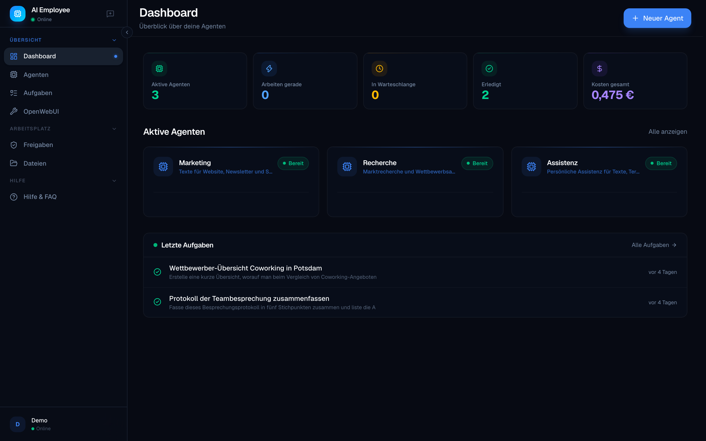
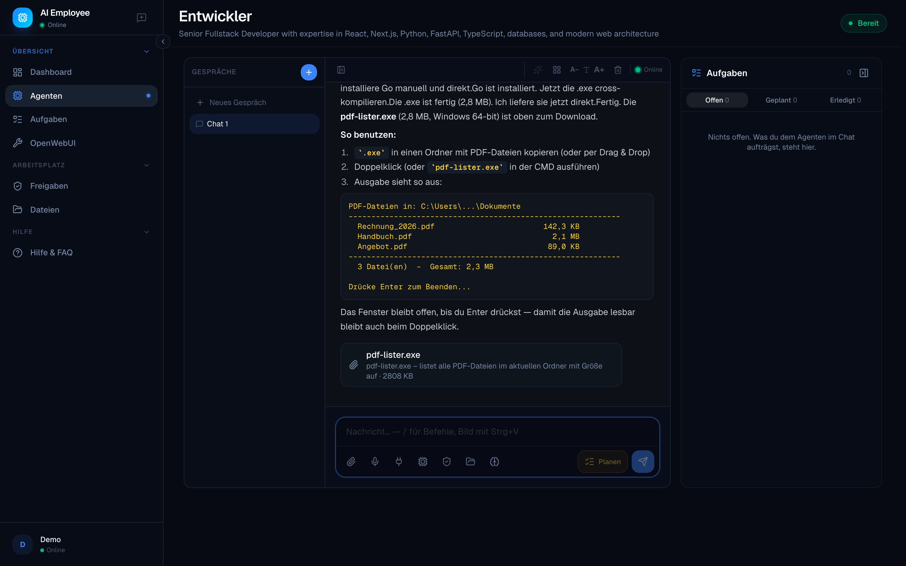
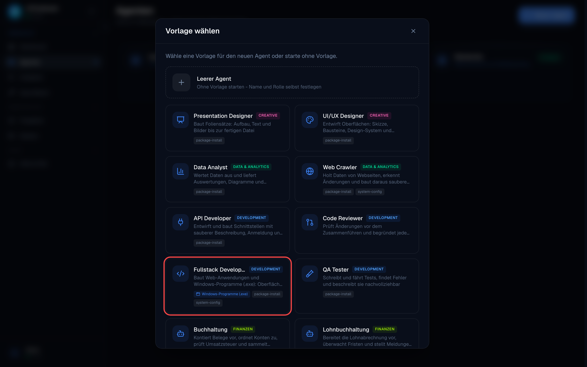
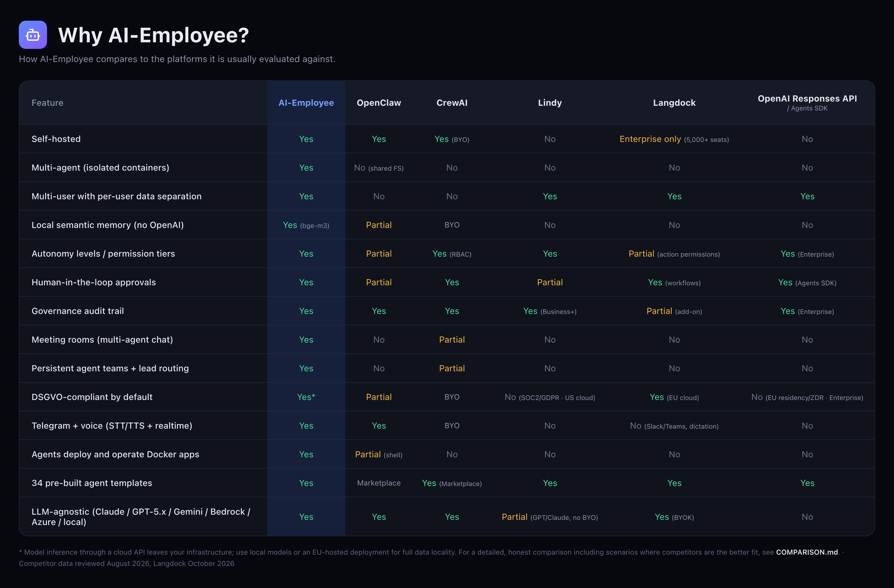
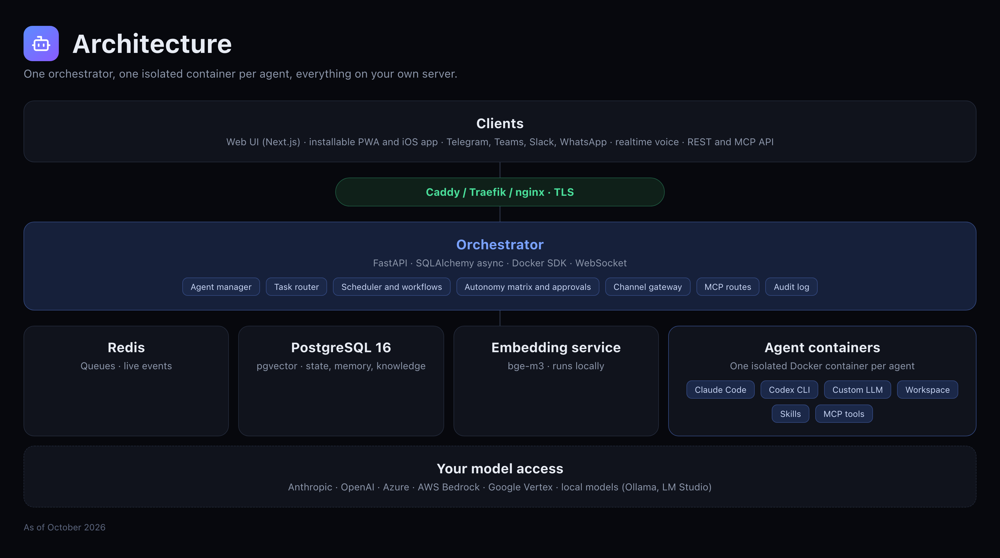
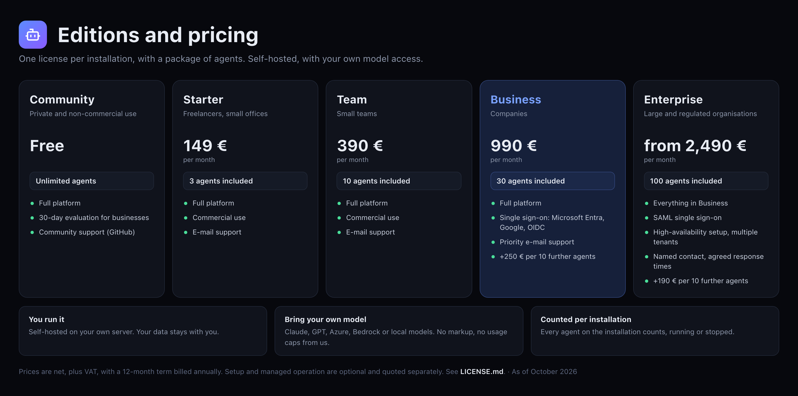

<div align="center">

# AI-Employee

**The self-hosted multi-agent AI platform for teams that need governance, traceability and data they keep.**

[](LICENSE.md)
[](https://github.com/greeves89/AI-Employee/releases)
[](docker-compose.community.yml)
[](#quick-start)
[](#)

[Quick Start](#quick-start) ·
[Features](#features) ·
[Comparison](COMPARISON.md) ·
[Templates](#agent-templates) ·
[Pricing](#license) ·
[Roadmap](#roadmap) ·
[Changelog](CHANGELOG.md)

</div>

---

<div align="center">
  
  <p><em>Dashboard — agent status, system health and the task queue at a glance</em></p>
</div>

<div align="center">
  
  
  <p><em>Left: an agent builds a Windows program and hands over the .exe &nbsp;·&nbsp; Right: 34 templates to start from</em></p>
</div>

---

> **Deutsch (Kurzfassung):** AI-Employee ist eine selbst betriebene Multi-Agenten-Plattform für Unternehmen im DACH-Raum. Jeder Agent läuft in einem eigenen Docker-Container auf Ihrem Server, mit Ihrem eigenen Modellzugang (Claude, GPT, Azure, Bedrock oder lokale Modelle). Jeder Nutzer arbeitet mit seinen eigenen Agenten, Aufgaben, Zeitplänen und seinem eigenen Wissen. Was ein Agent selbstständig darf, legt eine Matrix aus **Erlaubt / Freigabe / Verboten** fest; alles auf „Freigabe" geht vor der Ausführung an einen Menschen. Dazu kommen Microsoft 365, Telegram, Teams, Slack und WhatsApp, Sprachsteuerung, Workflows, Besprechungsräume für Agenten und ein lückenloses Protokoll. Kostenlos für private Nutzung; im Unternehmen eine Lizenz je Anlage mit Agenten-Paket (Starter 149 €, Team 390 €, Business 990 € im Monat, netto), 30 Tage kostenlos testen — siehe [Lizenz](#license). Kontakt: daniel.alisch@me.com

---

## What is AI-Employee?

Businesses need more than one chatbot. They need **a team of specialised agents** that remember context, follow company rules and finish real work — and they need to know what those agents did and why. Most platforms force a trade-off: run everything in somebody else's cloud, or stitch frameworks, vector stores and prompts together by hand.

**AI-Employee gives every agent its own isolated Docker container, memory, knowledge and rules, on a server you control.** Create a developer, a legal assistant and a bookkeeper in minutes, each with its own role and workspace. Agents hold meetings with each other, ask for approval before they act outside their limits, build and run their own apps, and learn from the feedback they get.

It is built for **small and medium-sized businesses and regulated organisations in the DACH region** that need several users, an audit trail and data sovereignty. It is not a single-user toy; it aims to be the dependable AI backbone a team runs for years.

## Why AI-Employee?

How AI-Employee compares to the platforms it is usually evaluated against:

<p align="center">
  
</p>

<details>
<summary>Same comparison as a table</summary>

| Feature | AI-Employee | OpenClaw | CrewAI | Lindy | Langdock | OpenAI Responses API / Agents SDK |
|---|:---:|:---:|:---:|:---:|:---:|:---:|
| Self-hosted | Yes | Yes | Yes (BYO) | No | Enterprise only (5,000+ seats) | No |
| Multi-agent (isolated containers) | Yes | No (shared FS) | No | No | No | No |
| Multi-user with per-user data separation | Yes | No | No | Yes | Yes | Yes |
| Local semantic memory (no OpenAI) | Yes (bge-m3) | Partial | BYO | No | No | No |
| Autonomy levels / permission tiers | Yes | Partial | Yes (RBAC) | Yes | Partial (action permissions) | Yes (Enterprise) |
| Human-in-the-loop approvals | Yes | Partial | Yes | Partial | Yes (workflows) | Yes (Agents SDK) |
| Governance audit trail | Yes | Yes | Yes | Yes (Business+) | Partial (add-on) | Yes (Enterprise) |
| Meeting rooms (multi-agent chat) | Yes | No | Partial | No | No | No |
| Persistent agent teams + lead routing | Yes | No | Partial | No | No | No |
| DSGVO-compliant by default | Yes* | Partial | BYO | No (SOC2/GDPR, US cloud) | Yes (EU cloud) | No (EU residency/ZDR on Enterprise) |
| Telegram + voice (STT/TTS + realtime) | Yes | Yes | BYO | No | No (Slack/Teams, dictation) | No |
| Agents deploy and operate Docker apps | Yes | Partial (shell) | No | No | No | No |
| 34 pre-built agent templates | Yes | Marketplace | Yes (Marketplace) | Yes | Yes | Yes |
| LLM-agnostic (Claude / GPT-5.x / Gemini / Bedrock / Azure / local) | Yes | Yes | Yes | Partial (GPT/Claude, no BYO) | Yes (BYOK) | No |

\* Model inference through a cloud API leaves your infrastructure. Use local models or an EU-hosted deployment for full data locality. Competitor data was last reviewed in August 2026, Langdock in October 2026.

</details>

For a detailed, honest comparison including scenarios where competitors are the better fit, see **[COMPARISON.md](COMPARISON.md)**.

## Quick Start

### Prerequisites

- Docker Desktop 4.x or Docker Engine 24+ with **Docker Compose v2** (`docker compose`, not `docker-compose`)
- 8 GB RAM minimum, 16 GB recommended
- Model access — one of:
  - a **Claude subscription** (sign in from the web UI, no per-token cost)
  - an **Anthropic API key**
  - an **OpenAI key or ChatGPT subscription** (Codex runtime)
  - **Azure, AWS Bedrock, Google Vertex or a local model** (Ollama, LM Studio) through an AI account

### Install

```bash
git clone https://github.com/greeves89/AI-Employee.git
cd AI-Employee
./scripts/setup.sh
```

The script checks the prerequisites, generates secrets, writes the `.env`, builds the agent image and starts the stack. Open **http://localhost:3000** and create the first account; it becomes the administrator.

### Update

```bash
git pull
./scripts/setup.sh
```

Database migrations run on start. Data lives in named Docker volumes and survives updates. After an update, agents show an **update** badge until their container is recreated on the new image.

## Features

### Agents and runtimes

- **One container per agent** — each agent has its own workspace, file system and resource limits. No shared scratch directories.
- **Three runtimes, one feature set** — Claude Code, OpenAI Codex CLI, and a built-in harness for any other model (Azure, Bedrock, Vertex, Ollama, LM Studio). Tools, instructions and approvals work the same in all three.
- **Bring your own model** — connect subscriptions or API keys as *AI accounts*; administrators decide which models each group may use. A model router can pick the model per task.
- **Live steering** — send a correction while the agent is working; the current turn is interrupted and resumes with your message folded in.
- **Parallel sessions** — an agent works on several conversations and tasks at once, with a visible queue when it is busy.
- **Builds software, including Windows programs** — agents from the *Fullstack Developer* template write, test and ship code, and cross-compile real Windows `.exe` files (Go, Rust, .NET, C/C++) from their Linux container.
- **Apps** — agents write, deploy and operate their own Docker Compose apps. Owners share an app with a named user, all signed-in users, or through an expiring public link.

### Working with agents

- **Chat with task results** — tasks run in their own session and report back as a card in the chat they came from.
- **Simple view for members** — users without the administrator role get a reduced interface: chat, voice, their tasks, and a few controls for connectors, model, permissions, files and knowledge.
- **Tasks, schedules and triggers** — one-off tasks, recurring schedules, webhook and event triggers, with a dry-run mode that shows the plan before anything is executed.
- **Visual workflow builder** — a drag-and-drop canvas for multi-step agent workflows with task, condition and wait blocks, started by hand or by cron.
- **Proactive agents** — agents with areas of responsibility plan their day, pick up outstanding work and report in, within configured working hours.
- **Realtime voice** — a live conversation with an agent (Amazon Nova Sonic or Azure OpenAI Realtime) that can search files, write notes, manage apps and drive tasks.

### Collaboration between agents

- **Teams with a lead** — persistent teams, delegation and a deputy chain when an agent is unavailable.
- **Meeting rooms** — several agents discuss a topic until they reach a result; action items are worked off and followed up.
- **Agent-to-agent messages and handoffs** — agents ask each other questions and hand over work.

### Memory and knowledge

- **Semantic memory** — per-agent memory with local **BAAI/bge-m3** embeddings; nothing is sent to an embedding API.
- **Knowledge base per user** — notes with backlinks and tags, shared by all of a user's agents.
- **Second Brains** — shared Markdown vaults per department with per-person read and write access, version history and a graph view.
- **Learning loop** — task ratings, nightly reflection, weekly synthesis and skills that emerge from repeated work.

### Governance and control

- **Autonomy matrix** — every capability is set to **Allow / Ask / Deny**, with L1–L4 presets as a starting point. *Ask* raises an approval request; *Deny* is never executed.
- **Approvals** — in the web UI, by Telegram button or by push notification. Uncertain decisions and failed tasks arrive in the same inbox.
- **Roles and groups** — bundle models, secrets, mounts, templates and limits into roles and assign users to them.
- **Per-user data separation** — users work with their own agents, tasks, schedules, knowledge and memories. Agents of one user share a knowledge base; agents of different users do not.
- **Audit log and decision trace** — every governance event is recorded, and each task has a replayable timeline of thought, tool call and result.
- **DLP egress filter** — outgoing agent text is scanned for credentials and personal data; each data class can be allowed, logged, masked or blocked.
- **Budgets** — monthly cost caps per agent with a model downgrade or a stop when the cap is reached.
- **Golden tests as an update gate** — versioned task sets per role; a regression against the baseline blocks an agent update.
- **Self-healing** — failed tasks are classified and retried with a changing strategy; permanent errors go to a human with the full history.

### Integrations

- **Microsoft 365** — mail, calendar, Teams, Planner, To-Do and OneDrive through a built-in MCP server. Each user connects their own account; a platform-wide read-only switch is available.
- **Channels** — Telegram (one bot per agent, with voice), Microsoft Teams, Slack and WhatsApp. An agent can join a Teams meeting and speak.
- **MCP servers** — connect any third-party MCP server, with custom auth headers or OAuth.
- **Skills** — reusable capability modules with attached files, a marketplace and your own skill sources.
- **Browser automation** — agents drive a headless browser, in all three runtimes.
- **Computer Bridge** — a tray app for macOS and Windows that lets an agent work on your desktop, with granular permissions and folder restrictions.
- **Single sign-on** — Microsoft Entra, Google, OIDC and SAML 2.0 with group mapping.
- **Ticket systems** — Matrix42 and a generic REST profile.

### Operations

- **Idle lifecycle** — agents stop when idle and wake on login, chat or a scheduled task; individual agents can be kept always on.
- **Health and self-test** — checks for Redis, Postgres, Docker, the embedding service and every agent, plus an administrator overview of what needs attention.
- **Monitoring** — Prometheus metrics and Grafana dashboards (`docker-compose.monitoring.yml`).
- **Landing page with blog** — an optional static landing page with a contact form and a blog: server-rendered posts with sitemap and feed, an admin editor with an SEO check, and an MCP service so agents can draft and publish posts. Off by default; see [docs/BLOG.md](docs/BLOG.md).
- **Backups** — scripts for database dumps and volume archives, with a cron installer.
- **Reverse proxy** — Caddy and Traefik configurations with TLS.
- **High availability** — an optional multi-node setup (`deploy/docker-compose.ha.yml`).
- **Mobile** — an installable PWA with web push, and a native iOS app (beta).

## Architecture

<p align="center">
  
</p>

<details>
<summary>Text version</summary>

```
Clients        Web UI (Next.js) · PWA and iOS app · Telegram, Teams, Slack, WhatsApp · voice · API
                    |
Reverse proxy  Caddy / Traefik / nginx, TLS
                    |
Orchestrator   FastAPI · SQLAlchemy async · Docker SDK · WebSocket
               agent manager · task router · scheduler and workflows ·
               autonomy matrix and approvals · channel gateway · MCP routes · audit log
                    |
      +-------------+--------------+----------------------+
      |             |              |                      |
    Redis      PostgreSQL 16    Embedding service    Agent containers
    queues,    pgvector         bge-m3, local        one per agent:
    live       state, memory,                        Claude Code · Codex CLI · Custom LLM
    events     knowledge                             workspace · skills · MCP tools

Your model access: Anthropic · OpenAI · Azure · AWS Bedrock · Google Vertex · local models
```

</details>

Operating the platform is covered in **[docs/INSTALLATION.md](docs/INSTALLATION.md)** and **[docs/OPERATIONS.md](docs/OPERATIONS.md)**; the click-by-click user guide is in **[docs/benutzerhandbuch](docs/benutzerhandbuch/README.md)** (German).

## Agent Templates

34 pre-configured roles. Each template brings a role, a knowledge starter and, where it makes sense, standing responsibilities. Administrators can add their own.

| Category | Templates |
|---|---|
| **Development** | Fullstack Developer (also builds Windows programs), API Developer, Code Reviewer, QA Tester |
| **Operations** | DevOps Engineer, Database Admin, Automation Agent |
| **Security** | Security Auditor |
| **Data** | Data Analyst, Web Crawler |
| **Management** | CEO / Manager, Product Manager |
| **Marketing** | Marketing Agent, SEO Specialist, Social Media Manager, Press |
| **Sales** | Sales Agent |
| **Support** | First Level Support |
| **Finance** | Bookkeeping, Payroll |
| **Writing** | Technical Writer, Translator, Content Writer |
| **Creative** | Presentation Designer, UI/UX Designer |
| **Productivity** | Meeting Agent |
| **General** | Research Assistant, Legal Assistant, Law (answers with citations from current German statutes), Recruiter, Quotes and Costing, Dispatch, Meeting Tasks, OS Agent (Brain) |

## Example scenarios

What teams build with these pieces:

- **Bookkeeping preparation** — the Bookkeeping agent pre-codes receipts, checks VAT and collects open questions; anything that changes booked entries asks for approval first.
- **First-level support** — the support agent answers from the knowledge base and escalates to a human when it is not sure enough.
- **Editorial planning** — Marketing, SEO and Content agents meet in a meeting room and produce a four-week plan with assigned tasks.
- **Code review** — the Code Reviewer reacts to a webhook, comments on the change and holds risky merges until a human approves.
- **Contract triage** — the Legal Assistant reads incoming contracts, summarises them and marks what a lawyer must see.
- **Meeting follow-up** — the Meeting Agent turns a transcript into minutes with tasks and owners and schedules the follow-up.
- **Internal tools** — the Fullstack Developer builds a small web app or a Windows program, deploys it and shares it with the team.
- **Morning briefing** — an assistant summarises mail and calendar every morning and proposes the agenda for the day.

## Roadmap

**North star:** a trustworthy autonomous AI workforce for the German Mittelstand — self-hosted, with isolated agents a business can let run unattended.

**Now**
- **Keeping agent groups on course** ([Epic #885](https://github.com/greeves89/AI-Employee/issues/885)) — link delegated tasks to the task they came from ([#880](https://github.com/greeves89/AI-Employee/issues/880)), remind agents of the goal chain ([#881](https://github.com/greeves89/AI-Employee/issues/881)), measure coordination against progress ([#882](https://github.com/greeves89/AI-Employee/issues/882)), provenance and recall for learned knowledge ([#883](https://github.com/greeves89/AI-Employee/issues/883)), and required context for agent-to-agent questions ([#884](https://github.com/greeves89/AI-Employee/issues/884)).
- **A simpler menu and settings structure** ([#787](https://github.com/greeves89/AI-Employee/issues/787)).

**Next**
- **Vision roadmap H2 2026** ([Epic #397](https://github.com/greeves89/AI-Employee/issues/397)) — trust and control, reliability, reach, time to value.
- **A server-side browser as a visible work surface** ([#828](https://github.com/greeves89/AI-Employee/issues/828)) — the agent operates a page while the user watches and can take over.
- **Hard tool enforcement for the Codex runtime** ([#781](https://github.com/greeves89/AI-Employee/issues/781)).

**Recently shipped**
- License editions, agent packages and a license status for administrators.
- Windows programs (`.exe`) from Fullstack Developer agents.
- The simple view for members, with task results in the chat.
- Faster agent start and a visible queue for waiting messages.
- Self-healing tasks, confidence routing, golden tests as an update gate, the visual workflow builder, the DLP filter and the decision trace.

The full history is in the **[CHANGELOG](CHANGELOG.md)**.

---

## Configuration

`./scripts/setup.sh` writes these for you. The most important variables (see `.env.community.example` for the full list):

| Variable | Purpose | Default |
|---|---|---|
| `DB_PASSWORD` | Database password | **required** |
| `REDIS_PASSWORD` | Redis password | **required** |
| `ENCRYPTION_KEY` | Fernet key for secrets at rest. Never change it once data exists | **required** |
| `API_SECRET_KEY` | Signing key for agent tokens and derived credentials | **required** |
| `ANTHROPIC_API_KEY` | Claude through an API key | — |
| `CLAUDE_CODE_OAUTH_TOKEN` | Claude through a subscription; set by the sign-in in the web UI | — |
| `OPENAI_API_KEY` | OpenAI models | — |
| `DEFAULT_MODEL` | Model for new agents | `claude-sonnet-4-6` |
| `MAX_AGENTS` | Maximum number of agent containers | `10` |
| `MAX_TURNS` | Maximum turns per task | `100` |
| `FRONTEND_PORT` / `ORCHESTRATOR_PORT` | Ports on the host | `3000` / `8000` |
| `CORS_ALLOW_ORIGIN` | Your domain when you run behind a reverse proxy | — |
| `TELEGRAM_BOT_TOKEN` | Optional master bot | — |

Model providers, single sign-on, Microsoft 365 and most other settings are configured in the web UI under **Settings**, not in the `.env`.

## License

AI-Employee is **Source Available**. The source code is publicly visible, but use is restricted by license.

**Free for:**
- Personal projects, learning, research, experimentation
- Non-commercial use
- **Businesses for 30 days** — evaluate the full platform before you buy

**Requires a paid license:**
- Any business or commercial use after the evaluation period — internal company tooling, SaaS, products, client work, professional services

### Editions and pricing

AI-Employee is **software you run yourself**: on your own server, with your own model access (Claude, GPT, Azure, Bedrock, local models). The license covers the platform. Model usage and infrastructure stay with you — no markup and no usage caps from us.

A license is issued **per installation** and includes a package of agents. Every agent that exists on the installation counts, running or stopped.

<p align="center">
  
</p>

<details>
<summary>Same overview as a table</summary>

| | Community | Starter | Team | Business | Enterprise |
|---|---|---|---|---|---|
| **Price per month** | Free | **149 €** | **390 €** | **990 €** | **from 2,490 €** |
| **Agents included** | Unlimited | 3 | 10 | 30 | 100 |
| **Further agents** | — | Upgrade to Team | Upgrade to Business | +250 € per 10 agents | +190 € per 10 agents |
| **For** | Private and non-commercial use; 30-day business evaluation | Freelancers, small offices | Small teams | Companies | Large and regulated organisations |
| **Commercial use** | No | Yes | Yes | Yes | Yes |
| **Platform** | Full platform | Full platform | Full platform | Full platform | Full platform |
| **Single sign-on** | — | — | — | Microsoft Entra, Google, OIDC | plus SAML |
| **Deployment** | Single host | Single host | Single host | Single host | High-availability setup, multiple tenants |
| **Support** | Community (GitHub) | E-mail | E-mail | Priority e-mail | Named contact, agreed response times |

</details>

- Prices are net, plus VAT, with a 12-month term billed annually.
- All editions run the same code. The license defines what you may use commercially, how many agents you may run and which support you get; the agent limit is enforced by a signed license key.
- Discounts for education and non-profit organisations on request.

**Optional services, quoted separately**

- **Setup** — installation on your infrastructure, single sign-on and model connection, one-off.
- **Managed operation** — if you do not want to host it yourself, we run the installation for you. Model costs remain yours in this case too.

Contact **daniel.alisch@me.com** for a license or a quote.

See **[LICENSE.md](LICENSE.md)** for the complete terms.

## Contributing

We welcome contributions of all kinds — bug reports, features, docs, translations, templates. See **[CONTRIBUTING.md](CONTRIBUTING.md)** for dev setup, conventions, and workflow.

## Security

Found a vulnerability? Please **do not** open a public issue. See **[SECURITY.md](SECURITY.md)** for our disclosure policy.

## Community

- **GitHub Discussions**: https://github.com/greeves89/AI-Employee/discussions

## Credits

AI-Employee stands on the shoulders of outstanding open-source projects:

- **Claude Code** (Anthropic) — the agent runtime
- **FastAPI** (Sebastián Ramírez) — the backend framework
- **Next.js** (Vercel) — the frontend framework
- **SQLAlchemy** — the ORM
- **PostgreSQL** + **pgvector** — the database
- **Redis** — pub/sub and queue
- **BAAI/bge-m3** (BAAI) — local multilingual embeddings
- **python-telegram-bot** — Telegram integration
- **Radix UI** — accessible UI primitives
- **Tailwind CSS** — styling
- **Framer Motion** — animations
- **Docker** — container runtime
- **Traefik** / **Caddy** — reverse proxy
- **Prometheus** / **Grafana** — observability
- **n8n** — inspiration for the source-available licensing approach

Built with care by **Daniel Alisch** in the DACH region.

---

<div align="center">
  <sub>If AI-Employee saves you hours, please star the repo. If it saves your business, please consider sponsoring.</sub>
</div>
