# AI Employee

**Dokument:** Benutzerhandbuch — Klick-für-Klick-Anleitung aller Funktionen
**Version:** 1.88.0
**Stand:** 30. Juni 2026
**Zielgruppe:** Endanwender & Administratoren
**Instanz:** skbs-s-kichat.klinikum-bs.de

---

Schritt-für-Schritt-Anleitung zu **allen Funktionen** der Plattform. Jede Aktion ist als
nummerierte Klickfolge beschrieben („so klickst du dich durch"), mit echtem Screenshot.

**Lesehilfe:** **Fett** = anklickbares Element (Button, Tab, Menüpunkt). Pfade in der
Seitenleiste stehen links; Aktions-Buttons meist oben rechts auf der Seite.
🔴 **Der rote Kreis auf jedem Screenshot markiert das Element, das du anklickst.**

---

## In 2 Minuten: Die wichtigsten Begriffe

Bevor du loslegst — diese Begriffe begegnen dir überall:

| Begriff | Was es ist |
|---|---|
| **Agent** | Dein eigenständiger KI-„Mitarbeiter". Läuft isoliert in einem eigenen Container mit eigenem Dateibereich (Workspace) und eigenem Gedächtnis. Du kannst mehrere Agenten für verschiedene Aufgaben haben. |
| **Chat** | Direktes Gespräch mit einem Agenten (wie ein Messenger) — für Fragen, schnelle Aufgaben, Hin und Her. |
| **Task** | Ein klar umrissener **Auftrag**, den der Agent **autonom** abarbeitet (auch im Hintergrund) und dessen Ergebnis du später abholst/bewertest. *Chat = unterhalten, Task = beauftragen.* |
| **Workspace** | Der private Dateibereich eines Agenten (`/workspace`). Hier liegen seine Dateien, Notizen, Ergebnisse und sein Wissen. Bleibt über Neustarts/Updates erhalten. |
| **Skill** | Eine wiederverwendbare Fähigkeit / ein Slash-Command, den ein Agent installieren kann (z. B. „Präsentation erstellen"). |
| **Knowledge Base** | Persönliche, durchsuchbare Wissensablage mit Tags. |
| **Second Brain** | Ein **geteilter** Wissens-Vault (Markdown-Sammlung) für eine ganze Abteilung, der in zugewiesene Agenten eingebunden wird. |
| **MCP** | Standard, über den Agenten **externe Werkzeuge/Datenquellen** anbinden (z. B. Wiki, DMS). MCP-Server fügst du unter Integrations hinzu. |
| **AI-Account** | Ein zentral hinterlegter **Modell-Zugang** (z. B. Azure OpenAI), den Agenten nutzen — statt eigener Schlüssel pro Person. |
| **Harness / Modus** | Die „Maschine" hinter dem Agenten (z. B. *claude_code* oder *custom_llm/Azure*) — bestimmt, welches Modell/Provider verwendet wird. Im Zweifel die vorgeschlagene Option nehmen. |
| **Rolle (Gruppe)** | Ein **Rechtebündel** (Admin), das Modelle, Second Brains, AI-Accounts, MCP-Tools usw. zusammenfasst und an Benutzer vergeben wird. |
| **Task vs. Chat** | Kurz: **frag** den Agenten im **Chat**, **beauftrage** ihn als **Task**. |

---

## Inhalt
1. [Grundlagen: Navigation & Login](#1-grundlagen-navigation--login)
2. [Onboarding](#2-onboarding)
3. [Dashboard](#3-dashboard)
4. [Agenten](#4-agenten)
5. [Agent-Detailseite (Chat, Todos, Activity, Workspace, Wissen, Settings)](#5-agent-detailseite)
6. [Tasks](#6-tasks)
7. [Analytics](#7-analytics)
8. [Knowledge Base](#8-knowledge-base)
9. [Meeting Rooms](#9-meeting-rooms)
10. [Skill Marketplace](#10-skill-marketplace)
11. [Triggers](#11-triggers)
12. [Schedules](#12-schedules)
13. [Approvals (Freigaben)](#13-approvals-freigaben)
14. [Integrationen & MCP-Server](#14-integrationen--mcp-server)
15. [AI-Accounts](#15-ai-accounts)
16. [Secrets](#16-secrets)
17. [Explorer (Dateien)](#17-explorer-dateien)
18. [Audit-Log](#18-audit-log)
19. [System-Health](#19-system-health)
20. [Einstellungen](#20-einstellungen)
21. [Benachrichtigungen](#21-benachrichtigungen)
22. [Admin-Konsole](#22-admin-konsole)
23. [Computer-Use Bridge (Desktop steuern)](#23-computer-use-bridge-desktop-steuern)
31. [Nachtschicht (Reflection) — Agenten lernen über Nacht](#31-nachtschicht-reflection--agenten-lernen-über-nacht)

**Anhang A** — [Was kann ein Agent? (Beispiele)](#a-was-kann-ein-agent-typische-einsätze)
· **Anhang B** — [Admin-Schnellstart: 3 Rezepte](#b-admin-schnellstart-3-rezepte-ende-zu-ende)
· **Anhang C** — [FAQ & Problemlösung](#c-faq--problemlösung)

---

## 1. Grundlagen: Navigation & Login

### 1.1 Anmelden
1. Öffne die Plattform-URL im Browser.
2. **E-Mail** und **Passwort** eingeben.
3. Auf **Anmelden** klicken. Du landest auf dem **Dashboard**. Die Sitzung bleibt sicher
   aktiv (verschlüsseltes Cookie), bis du dich abmeldest oder sie abläuft.

### 1.2 Die Seitenleiste — dein Hauptmenü
Die **linke Seitenleiste** ist auf jeder Seite dein Navigationszentrum (im Screenshot
unten gut zu sehen). Sie ist in **Gruppen** organisiert:

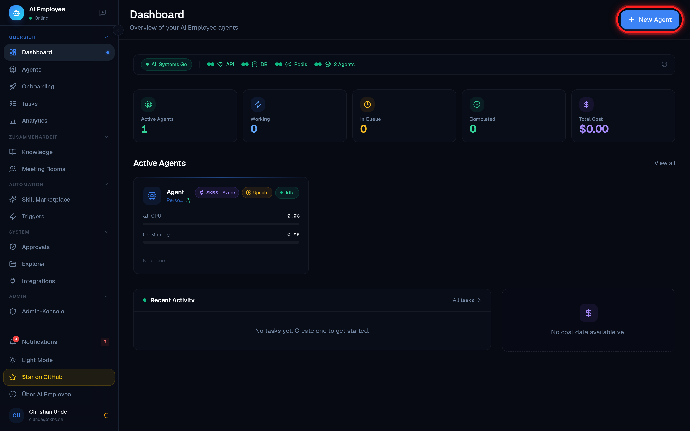

- **Übersicht** — **Dashboard** (Startseite), **Agents** (deine Agenten), **Onboarding**,
  **Tasks** (Aufträge), **Analytics** (Auswertungen).
- **Zusammenarbeit** — **Knowledge** (Wissensablage), **Meeting Rooms**
  (Multi-Agent-Zusammenarbeit).
- **Automation** — **Skill Marketplace**, **Triggers** (ereignisbasiert),
  **Schedules** (zeitgesteuert).
- **System** — **Approvals** (Freigaben), **Explorer** (Dateien), **Integrations**
  (externe Dienste/MCP).
- **Admin** — **Admin-Konsole** (nur für Administratoren).

**Bedienung:**
- Auf einen **Menüpunkt** klicken → öffnet die jeweilige Seite (der aktive Punkt ist
  hervorgehoben).
- Den kleinen **Pfeil** am Rand klicken → Leiste **einklappen** (nur Icons, mehr Platz).
  Erneut klicken = ausklappen.
- **Ganz unten** findest du: die **Glocke** (Benachrichtigungen, mit Zähler),
  **Light/Dark Mode** umschalten, **Star on GitHub**, **Über AI Employee** und dein
  **Profil** (Name/Avatar). Meldest du dich per **Microsoft-SSO** an, erscheint hier
  automatisch dein **Profilfoto** aus dem Firmenkonto (auch neben deinen Nachrichten im
  Chat); ohne Foto zeigen wir deine **Initialen**.

### 1.3 Abmelden
Unten auf dein **Profil** (Name/Avatar) klicken → **Abmelden**.

> Hinweis: Welche Menüpunkte du siehst, kann von deiner **Rolle** abhängen — ein Admin gibt
> pro Gruppe frei, welche Bereiche sichtbar sind (Kap. 22.4).

---

## 2. Onboarding

Das **Onboarding** ist der schnellste Start: Statt einzelne Agenten von Hand zu bauen,
wählst du ein **Branchen-Paket** — ein **fertiges Team** aus mehreren, aufeinander
abgestimmten Agenten — und richtest es **in einem Schritt** ein.

**Schritt 1 — Paket wählen.** Seitenleiste → **Onboarding**:

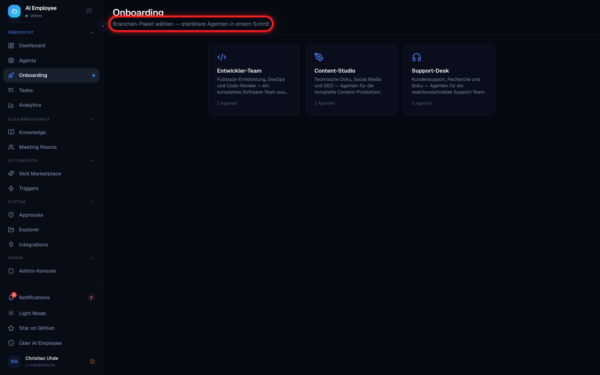

Jede Kachel ist ein vorkonfiguriertes Team (Anzahl Agenten unten angegeben):
- **Entwickler-Team** — Fullstack-Entwicklung, DevOps, Code-Review (komplettes
  Software-Team). *3 Agenten.*
- **Content-Studio** — Technische Doku, Social Media, SEO (komplette Content-Produktion).
  *3 Agenten.*
- **Support-Desk** — Kundensupport, Recherche, Doku (reaktionsschnelles Support-Team).
  *3 Agenten.*

Auf die gewünschte **Paket-Kachel** klicken.

**Schritt 2 — Paket-Inhalt prüfen & einrichten.** Es öffnet sich die Detailansicht:

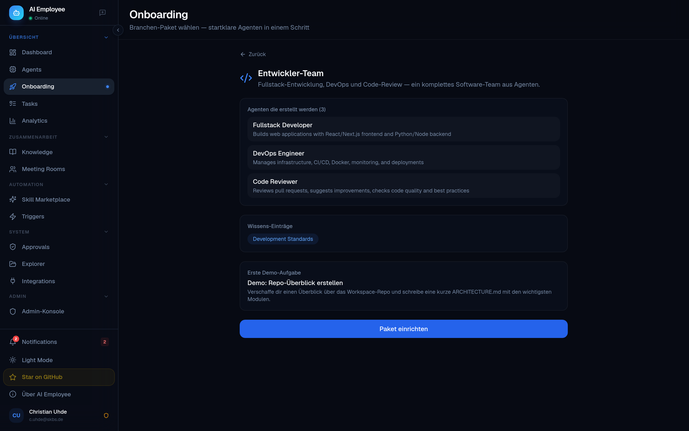

Hier siehst du **genau, was angelegt wird**:
- **„Agenten die erstellt werden (3)"** — die einzelnen Team-Mitglieder mit Rolle, z. B.
  beim Entwickler-Team: **Fullstack Developer**, **DevOps Engineer**, **Code Reviewer**
  (jeweils mit Kurzbeschreibung ihrer Aufgabe).
- **Wissens-Einträge** — Wissen, das dem Team mitgegeben wird (z. B. *Development
  Standards*).
- **Erste Demo-Aufgabe** — ein vorbereiteter Einstiegs-Task (z. B. „Repo-Überblick
  erstellen"), damit du das Team gleich in Aktion siehst.
- **Zurück** — andere Pakete ansehen. **Paket einrichten** (großer Button) — legt das
  **ganze Team** (alle Agenten + Wissen) auf einmal an.

Danach findest du die neuen Agenten unter **Agents** und kannst sofort loslegen.

> Wann Onboarding, wann „+ New Agent"? **Onboarding** = schnell ein **ganzes Team** für
> einen Anwendungsfall. **+ New Agent** (Kap. 4.2) = ein **einzelner**, gezielt
> konfigurierter Agent.

---

## 3. Dashboard

Das **Dashboard** ist deine Startseite nach dem Login — der Gesamtüberblick über deine
Agenten, ihre Auslastung, Kosten und letzte Aktivität. Seitenleiste → **Dashboard**.

**Aufbau der Seite, Element für Element:**

- **System-Status-Leiste** (oben) — zeigt mit grünen Punkten, dass die Plattform-Bausteine
  laufen: **All Systems Go**, **API**, **DB**, **Redis** und die **Anzahl Agenten**. Ist
  hier etwas rot, lohnt ein Blick auf **Health** (Kap. 19).
- **Kennzahlen-Kacheln** — fünf Summen auf einen Blick:
  - **Active Agents** — wie viele Agenten existieren/laufen.
  - **Working** — wie viele gerade an einem Task arbeiten.
  - **In Queue** — wie viele Aufträge anstehen.
  - **Completed** — abgeschlossene Tasks.
  - **Total Cost** — aufgelaufene Kosten.
- **Active Agents** (Liste) — deine laufenden Agenten als Kacheln mit **Live-CPU/Memory**,
  **Modell-Badge** und Status. Ein **Update**-Badge zeigt eine neue Version an.
  - Auf eine **Agent-Kachel** klicken → öffnet die **Agent-Detailseite** (Kap. 5).
  - **View all** (rechts) → zur vollständigen Agentenliste.
- **Recent Activity** (unten links) — die zuletzt erledigten Tasks. **All tasks →** führt
  zur Task-Liste (Kap. 6).
- **Kostenverlauf** (unten rechts) — Kosten über die Zeit (sobald Daten vorliegen).
- **+ New Agent** (oben rechts) — startet direkt den Anlege-Assistenten (Kap. 4.2).

> Faustregel: Hier startest du jeden Tag — siehst sofort, ob alles läuft, was deine
> Agenten gerade tun und was es kostet.

---

## 4. Agenten

Ein **Agent** ist dein eigenständiger KI-Mitarbeiter in einem isolierten Container. Dieses
Kapitel erklärt die Übersichtsseite und wie du Schritt für Schritt einen Agenten anlegst.

### 4.1 Die Agentenliste verstehen

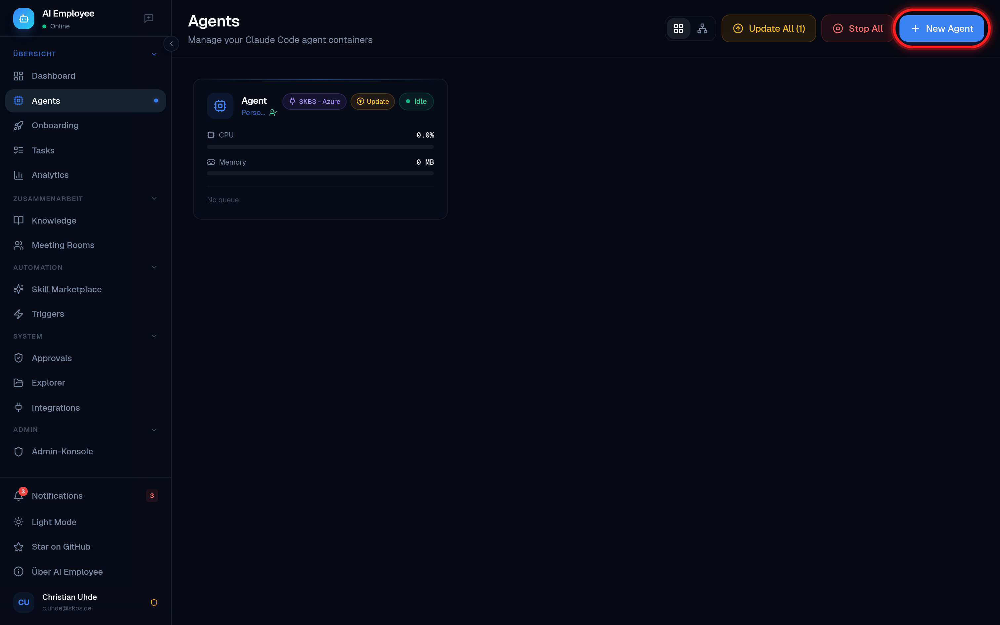

Seitenleiste → **Agents**. Jeder Agent erscheint als **Kachel**. Was du darauf siehst:

- **Name** des Agenten (oben links auf der Kachel).
- **Modell-/Account-Badge** (z. B. *SKBS – Azure*) — zeigt, mit welchem Modell er denkt.
- **Update-Badge** (orange „Update") — erscheint nur, wenn eine **neue Container-Version**
  bereitsteht. Klick darauf bzw. **Update** aktualisiert ihn (Workspace bleibt erhalten).
- **Status-Punkt**: *Idle* (bereit, nichts zu tun), *Working* (arbeitet gerade),
  *Stopped* (angehalten).
- **CPU** und **Memory** — Live-Auslastung des Containers.
- **No queue / Warteschlange** — wie viele Tasks anstehen.

**Die Buttons oben rechts** (von links):
- **Kachel-/Baum-Symbol** — schaltet zwischen Kachel-Ansicht und Netzwerk-/Baum-Ansicht um.
- **Update All ( n )** — aktualisiert **alle** Agenten, die eine neue Version haben (`n` = Anzahl).
- **Stop All** — hält **alle** laufenden Agenten an (z. B. um Kosten zu stoppen).
- **+ New Agent** — startet den Anlege-Assistenten (nächster Abschnitt).

> Du siehst hier nur **deine eigenen** Agenten. Als Admin findest du **alle** unter
> **Admin-Konsole → All Agents**.

### 4.2 Einen Agenten anlegen — Schritt für Schritt

**Schritt 1 — Vorlage wählen.** Klicke oben rechts auf **+ New Agent**. Es öffnet sich
zuerst die **Vorlagen-Auswahl**:

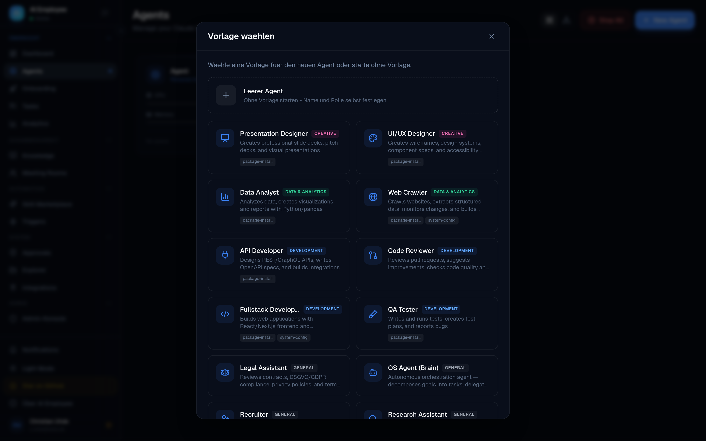

Hier entscheidest du, *womit* dein Agent startet — das spart Konfiguration:

- **Leerer Agent** — startet ohne Vorlage; du vergibst nur Name und Rolle selbst.
  Nimm das, wenn du den Agenten komplett selbst einrichten willst.
- **Fertige Vorlagen** — vorkonfigurierte Profile mit Rolle, Werkzeugen und Skills, nach
  Kategorie sortiert:
  - *CREATIVE* — z. B. **Presentation Designer** (Folien/Decks).
  - *DATA & ANALYTICS* — z. B. **Data Analyst** (Auswertungen, Diagramme, Python/Pandas),
    **Web Crawler**.
  - *DEVELOPMENT* — **API Developer**, **Code Reviewer**, **Fullstack Developer**,
    **QA Tester**.
  - *GENERAL* — **Legal Assistant**, **OS Agent (Brain)**, **Recruiter**,
    **Research Assistant**.
  - Die kleinen Tags **package install** / **system config** zeigen an, dass die Vorlage
    zusätzliche Pakete bzw. Systemkonfiguration mitbringt.

Klicke auf die gewünschte Karte (oder **Leerer Agent**).

**Schritt 2 — Konfigurieren.** Danach legst du die Eckdaten fest:
- **Name** — frei wählbar (erscheint überall in der Oberfläche).
- **Modell / AI-Account** — womit der Agent denkt. Es werden **nur Optionen angezeigt, die
  dir freigegeben sind**: vom Admin hinterlegte **AI-Accounts** (z. B. Azure), bei Bedarf
  manuelle Modelle (nur Admins) oder verbundene OAuth-Anbieter. Steht nichts zur Auswahl,
  muss der Admin erst einen Account/eine Rolle freigeben (siehe Anhang B, Rezept 1).
- **Rolle / Instruktionen** — Freitext, der dem Agenten sagt, *wer er ist* und *was seine
  Aufgabe* ist (bei Vorlagen vorausgefüllt).
- **Berechtigungen / Integrationen** — welche Werkzeuge/Dienste er nutzen darf.
- **Budget** (optional) — monatliche Kostenobergrenze (kann der Admin vorgeben).

**Schritt 3 — Erstellen.** Auf **Erstellen** klicken. Der Container wird provisioniert und
startet automatisch; nach wenigen Sekunden erscheint der neue Agent als Kachel mit Status
*Idle*. Ab jetzt kannst du ihn öffnen und mit ihm arbeiten (Kap. 5).

---

## 5. Agent-Detailseite

Ein Klick auf eine **Agent-Kachel** öffnet die Detailseite — die Kommandozentrale eines
einzelnen Agenten.

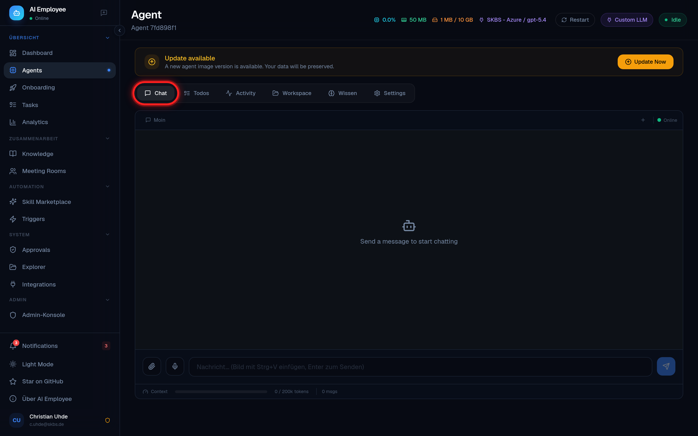

**Die Kopfzeile** (oben):
- **Live-Werte** — CPU-Auslastung, belegter Arbeitsspeicher und Festplatte (z. B.
  *45 MB / 10 GB*).
- **Modell-/Account-Anzeige** — z. B. *SKBS – Azure / gpt-5.4*.
- **Restart** — startet den Container neu (z. B. wenn er hängt; Daten bleiben erhalten).
- **Custom LLM** — Schnellzugriff auf die Modell-/LLM-Einstellung.
- **Status-Badge** rechts — *Idle* / *Working* / …
- **„Update available"-Banner** — falls eine neue Version bereitsteht: **Update Now**
  klicken (Workspace bleibt erhalten).

Darunter die **Tabs**: **Chat · Todos · Activity · Workspace · Wissen · Settings**.

### 5.1 Chat — mit dem Agenten sprechen
Tab **Chat**. Das ist das direkte Gespräch (wie ein Messenger).
- **Eingabefeld unten** — Nachricht/Anweisung tippen, **Enter** oder **Senden** (Pfeil).
  Mit **Shift+Enter** fügst du einen Zeilenumbruch ein — das Feld wächst automatisch mit
  (bis ca. 8 Zeilen, danach scrollt es), und die Umbrüche bleiben in der gesendeten
  Nachricht erhalten.
- **Datei per Drag & Drop anhängen** — zieh eine oder mehrere Dateien einfach
  **irgendwo in den Chat** (auch direkt aufs Eingabefeld). Es erscheint ein Overlay
  „Dateien hier ablegen zum Anhängen"; beim Loslassen werden die Dateien **unten am
  Eingabefeld angehängt** (Bilder als Vorschau, andere Dateien als Chip mit Name und
  Entfernen-Knopf) — genau wie ein per Strg/Cmd+V eingefügtes Bild. Du kannst noch
  Text dazu schreiben; **erst beim Senden** werden die Dateien in den Workspace des
  Agenten (`/workspace`) hochgeladen und gehen zusammen mit deiner Nachricht raus.
- **Büroklammer** — Datei anhängen (gleicher Weg wie Drag & Drop, nur per
  Dateiauswahl). Tipp: Bilder kannst du mit Strg/Cmd+V einfügen.
- **Mikrofon** — Anweisung diktieren statt tippen.
- **Token-Zähler** unten (z. B. *0 / 200k tokens*) — wie viel Kontext gerade belegt ist.
- Während der Agent arbeitet, erscheinen **Tool-Bubbles** (kleine Symbole für seine
  Werkzeug-Aufrufe). **Klick darauf** → du siehst genau, *was* er getan hat (welche Datei,
  welche Suche, welches Ergebnis). Bilder/Dateien zeigt er **inline** an.

### 5.2 Todos — die Aufgabenliste des Agenten
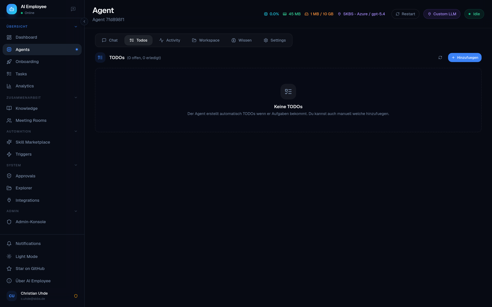
Tab **Todos**: Der Agent führt sich selbst eine To-do-Liste für mehrstufige Aufträge. Hier
siehst du, was er schon erledigt hat und was noch offen ist — gut, um seinen Fortschritt
bei größeren Aufgaben zu verfolgen.

### 5.3 Activity — was bisher geschah
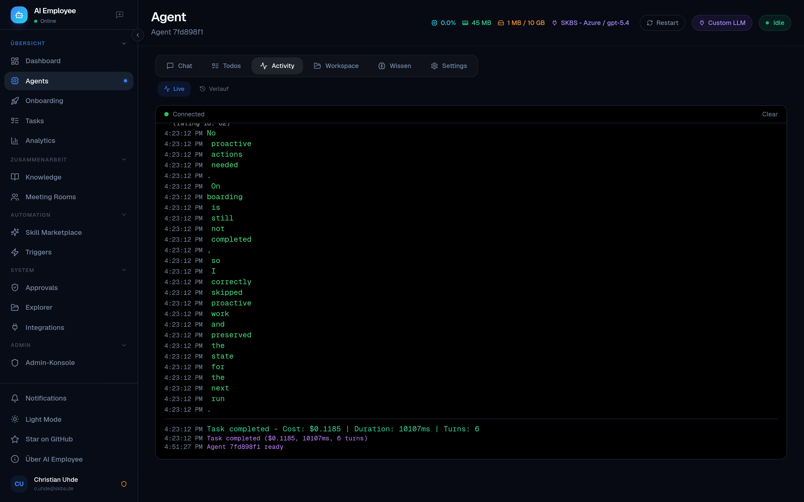
Tab **Activity**: chronologischer Verlauf seiner Aktivitäten und Tasks.

### 5.4 Workspace — die Dateien des Agenten
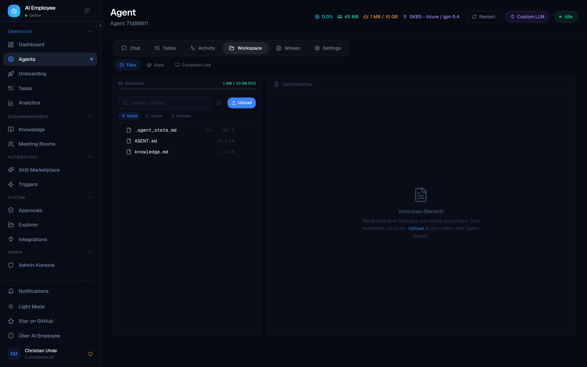
Tab **Workspace**: Dateibrowser seines privaten Bereichs (`/workspace`). Hier liegen seine
Notizen, sein Wissen (`knowledge.md`) und alle **Ergebnisse**. Datei **anklicken** →
ansehen oder **herunterladen**.

### 5.5 Wissen — Second Brains anbinden
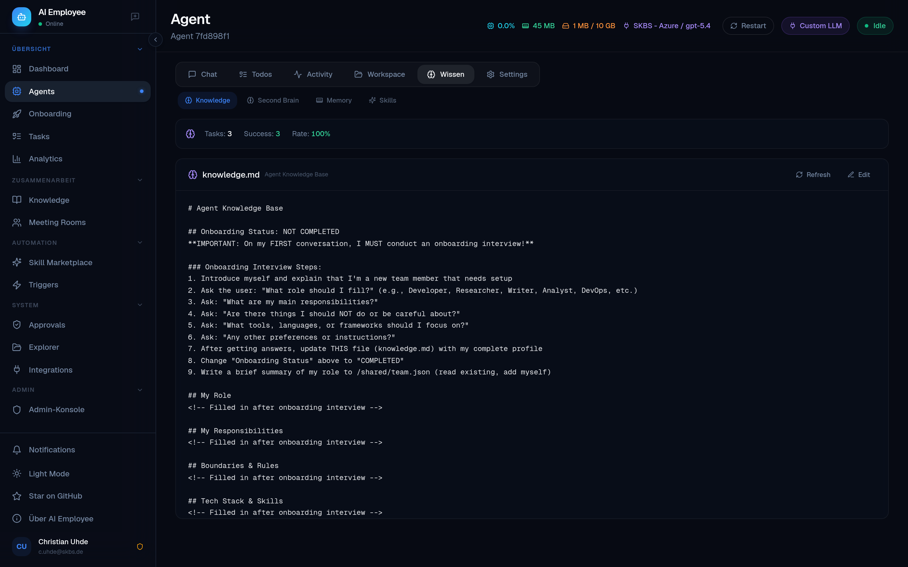
Tab **Wissen**: zeigt die diesem Agenten zugewiesenen **Second Brains** (geteilte
Abteilungs-Vaults). Über das Auswahlfeld **bindest du ein Brain an oder entfernst es**.
Danach kann der Agent in dessen Inhalten suchen (z. B. IT-Runbooks).

### 5.6 Settings — Verhalten & Modell steuern
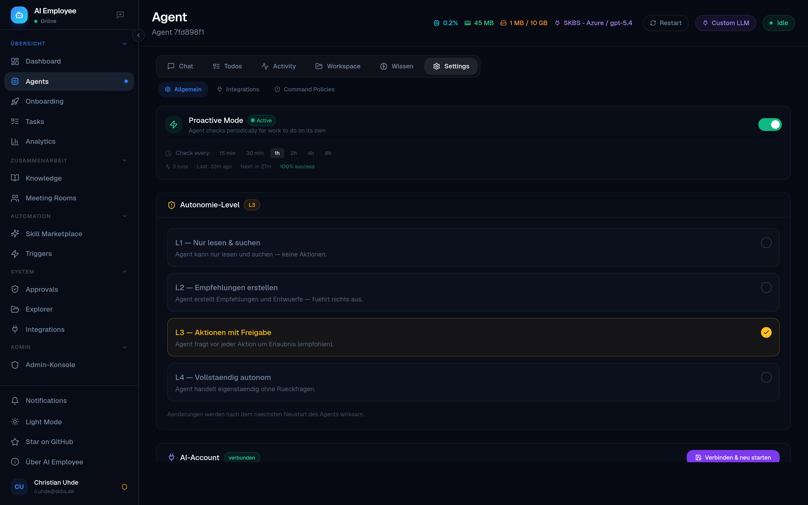
Tab **Settings** mit drei Unter-Tabs: **Allgemein · Integrationen · Command Policies**.

**Allgemein** enthält die wichtigsten Stellschrauben:

- **Proactive Mode** (Schalter) — ist er **an**, prüft der Agent **selbstständig in
  Intervallen**, ob es Arbeit gibt, und erledigt sie. Das **Intervall** wählst du
  (*15 min / 30 min / 1h / 2h / 4h*). Darunter siehst du letzte/nächste Prüfung und die
  Erfolgsquote. *Aus* lassen, wenn der Agent nur auf direkte Anweisung reagieren soll.

- **Autonomie-Level** — wie eigenständig der Agent **handeln** darf:
  - **L1 — Nur lesen & suchen**: darf nur lesen/recherchieren, **keine** verändernden
    Aktionen. Maximal sicher.
  - **L2 — Empfehlungen erstellen**: erstellt Vorschläge/Entwürfe, **führt aber nichts aus**.
  - **L3 — Aktionen mit Freigabe** *(empfohlen, Standard)*: handelt, **fragt aber vor jeder
    heiklen Aktion per Freigabe** nach (siehe Kap. 13).
  - **L4 — Vollständig autonom**: handelt eigenständig **ohne Rückfragen**. Nur für
    vertrauenswürdige, gut eingegrenzte Aufgaben.
  - *Hinweis:* Änderungen werden **nach dem nächsten Neustart** des Agenten wirksam.

- **AI-Account** — zeigt den verbundenen Modell-Zugang. Über **Verbinden & neu starten**
  änderst du Modell/Account (der Agent startet dann mit der neuen Konfiguration neu).

**Integrationen** (Unter-Tab) — welche verbundenen Dienste/MCP-Server dieser Agent nutzen
darf. **Command Policies** (Unter-Tab) — Feinregeln, welche Befehle erlaubt/gesperrt sind
und was eine Freigabe braucht.

> Budget (Admin setzt, User liest) und der **externe Zugriff** (Webhook/MCP-Endpoint mit
> Bearer-Token, um den Agenten von außen z. B. aus n8n anzusprechen) findest du ebenfalls
> in den Einstellungen.

### 5.7 Szenario: Vom leeren Agenten zum fertigen Helfer
1. **Agents → + New Agent → Leerer Agent.**
2. **Name** „IT-Helfer", **Modell** = freigegebener Azure-Account, **Erstellen**.
3. Agent öffnen → **Settings → Allgemein**: Autonomie **L3** lassen, **Proactive Mode**
   vorerst **aus**.
4. **Wissen**-Tab → das Second Brain *IT Operations* anbinden.
5. **Chat**: „Du bist unser IT-Helfer. Wenn jemand nach einem Fehlercode fragt, suche
   zuerst im IT-Operations-Wissen und antworte mit der Lösung." → Enter.
6. Testen: „Wie behebe ich Drucker-Fehler x17137?" → der Agent sucht im Brain und antwortet.
7. Läuft er gut? Dann kann der **Admin** ihn als Vorlage an die ganze IT-Abteilung
   **verteilen** (Kap. 22.3 / Anhang B, Rezept 3).

---

## 6. Tasks

Ein **Task** ist ein klar umrissener Auftrag, den ein Agent **autonom** (auch im
Hintergrund) abarbeitet. Während du im **Chat** mit dem Agenten *redest*, *beauftragst* du
ihn mit einem Task und holst das Ergebnis später ab.

### 6.1 Die Task-Liste

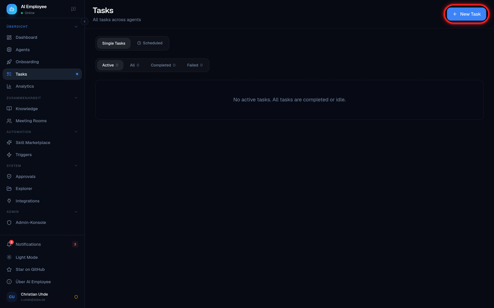

Seitenleiste → **Tasks**. Oben schaltest du um zwischen:
- **Single Tasks** — einmalige Aufträge.
- **Scheduled** — wiederkehrende, zeitgesteuerte Tasks (siehe Kap. 12).

Jeder Eintrag in der Liste zeigt **Titel**, **Status** (queued / working / completed /
failed), zuständigen **Agenten**, **Dauer**, **Kosten** und das Ergebnis.

### 6.2 Einen Task anlegen — jedes Feld erklärt

Klicke **+ New Task** → das Formular öffnet sich:

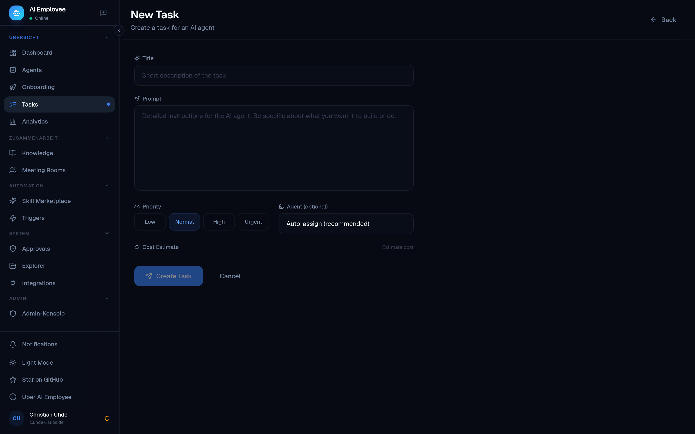

- **Title** — eine kurze Bezeichnung des Auftrags (für die Liste). Z. B. „Wochenbericht
  IT erstellen".
- **Prompt** — die **ausführliche Anweisung** an den Agenten. Hier gilt: *je konkreter,
  desto besser*. Sag, **was** das Ziel ist, **welche Quellen/Dateien** er nutzen soll und
  **in welcher Form** das Ergebnis kommen soll (z. B. „als PDF", „als Tabelle").
- **Priority** — **Low / Normal / High / Urgent**. Steuert, wie dringend der Task in der
  Warteschlange behandelt wird. Standard: *Normal*.
- **Agent (optional)** — wer den Task ausführt. **Auto-assign (recommended)** überlässt der
  Plattform die Wahl eines passenden Agenten; alternativ wählst du gezielt einen Agenten
  aus dem Dropdown.
- **Cost Estimate** — mit **Estimate cost** lässt du **vorab** die ungefähren Kosten
  schätzen, bevor du startest.
- **Create Task** — startet den Auftrag. **Cancel** verwirft ihn.

Nach **Create Task** läuft der Agent los; der Task erscheint in der Liste und wechselt von
*queued* über *working* zu *completed*.

### 6.3 Ergebnis ansehen & bewerten
- **Task-Detail:** auf einen **Task in der Liste** klicken → vollständiger Verlauf, alle
  **Tool-Aufrufe** (was der Agent konkret getan hat) und das **Ergebnis** (inkl. erzeugter
  Dateien).
- **Bewerten:** Nach Abschluss kommt eine **Benachrichtigung** „Task abgeschlossen —
  Bewertung?". Vergib **1–5 Sterne** — das fließt in die Qualitäts-**Analytics** ein und
  hilft, gute von schwachen Ergebnissen zu unterscheiden.

### 6.4 Szenario: Wochenbericht automatisieren
1. **Tasks → + New Task.**
2. **Title** „Wochenbericht IT", **Prompt** „Fasse die abgeschlossenen Tickets dieser
   Woche aus dem IT-Operations-Wissen zusammen und erstelle ein PDF mit den 5 wichtigsten
   Punkten.", **Priority** *Normal*, **Agent** = dein IT-Helfer.
3. **Estimate cost** prüfen → **Create Task**.
4. Ergebnis in der Liste öffnen, PDF aus dem **Workspace** herunterladen, **bewerten**.
5. Soll das **jede Woche** laufen? Dann lege es als **Schedule** an (Kap. 12).

---

## 7. Analytics

**Analytics** ist dein Auswertungs-Dashboard über alle Agenten und Tasks — hier siehst du,
**wie gut** und **wie wirtschaftlich** deine Agenten arbeiten. Seitenleiste → **Analytics**.

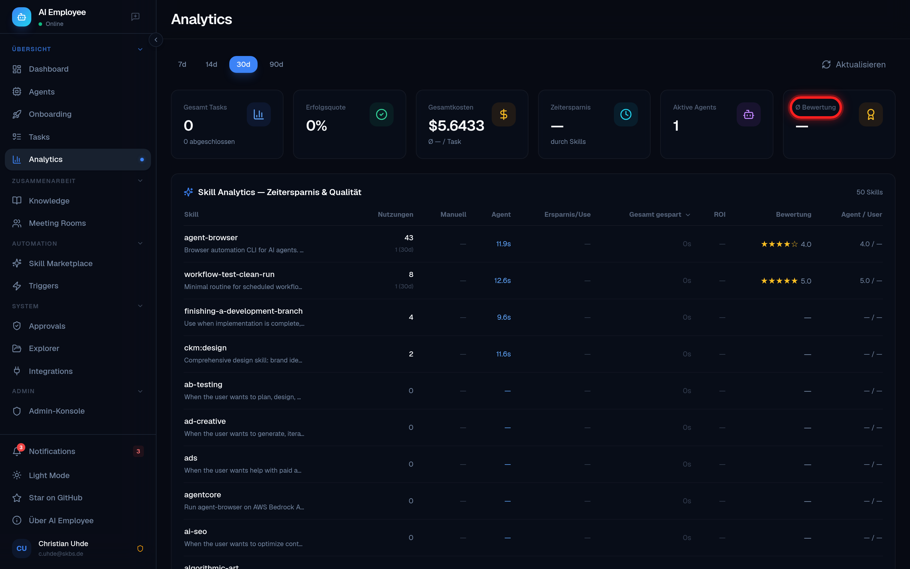

**Was du hier abliest:**
- **Übersichts-Kacheln** (oben) — die wichtigsten Summen auf einen Blick:
  - **Abgeschlossene Tasks** — wie viele Aufträge fertig wurden.
  - **Ø Bewertung** — die durchschnittliche Sterne-Bewertung (aus den Task-Bewertungen,
    Kap. 6.3). Niedrig? → Prompts/Agenten verbessern.
  - **Kosten** — was die Agenten verbraucht haben.
  - **Token** — verbrauchte Eingabe-/Ausgabe-Token (Kosten-Treiber).
  - **Bewertungen** — Anzahl abgegebener Bewertungen.
- **Tabelle pro Agent** (darunter) — je Agent die Kennzahlen (z. B. **Ø Bewertung**,
  abgeschlossene Tasks, Kosten, Ø Dauer). Über die **Spaltenköpfe** (z. B. **Bewertung**)
  **sortieren** — so findest du Top-Performer und Ausreißer.
- Gibt es noch keine Daten, steht „Noch keine Bewertungen oder Fehler." — dann erst Tasks
  ausführen und **bewerten**.

> Praxis: Nutze Analytics wöchentlich, um zu sehen, welche Agenten gut laufen (hohe
> Bewertung, niedrige Kosten) und welche Prompts/Konfigurationen nachjustiert werden sollten.

---

## 8. Knowledge Base

Die **Knowledge Base** ist deine persönliche, durchsuchbare Wissensablage — anders als ein
**Second Brain** (das abteilungsweit geteilt wird), ist sie an dich/deinen Kontext
gebunden.

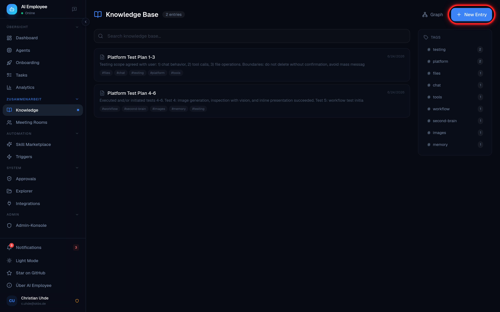

Seitenleiste → **Knowledge**. Aufbau der Seite:

- **Suchfeld** (oben Mitte) — tippe einen Begriff ein; gesucht wird **semantisch + im
  Volltext** über alle Einträge (findet also auch sinnverwandte Treffer, nicht nur exakte
  Wörter).
- **Eintrags-Liste** (Mitte) — jeder Eintrag mit **Titel**, **Datum** und seinen **Tags**.
  Auf einen Eintrag **klicken** → Detailansicht zum Lesen/**Bearbeiten**.
- **Tags-Leiste** (rechts) — alle vergebenen Schlagworte mit Anzahl (z. B. *testing 2,
  platform 2, files, chat, workflow, second-brain, images, tools, memory*). Auf ein Tag
  **klicken** → filtert die Liste auf diese Kategorie.
- **+ New Entry** (oben rechts) — neuen Wissenseintrag anlegen: **Titel**, **Inhalt**
  (Markdown) und **Tags** vergeben → **Speichern**.
- **Graph** (oben rechts, Symbol) — zeigt die Einträge als **Verknüpfungs-Netz**
  (welche Themen zusammenhängen).

### 8.1 Szenario: Wissen festhalten und wiederfinden
1. **Knowledge → + New Entry** → Titel „Drucker-Reset Standardablauf", Inhalt als
   Schritt-für-Schritt, Tags `drucker`, `runbook` → **Speichern**.
2. Später: oben **„Drucker"** suchen oder rechts auf das Tag **`drucker`** klicken →
   Eintrag öffnen.
3. Für **abteilungsweit** geteiltes Wissen nutzt du stattdessen ein **Second Brain**
   (Kap. 7 / 22.5).

---

## 9. Meeting Rooms

In einem **Meeting Room** arbeiten **mehrere Agenten gemeinsam** an einem Thema — moderiert
und in Phasen (Stages). Sinnvoll, wenn unterschiedliche „Rollen" (z. B. ein Analyst und ein
Reviewer) zusammen ein Ergebnis erarbeiten sollen. Seitenleiste → **Meeting Rooms**.

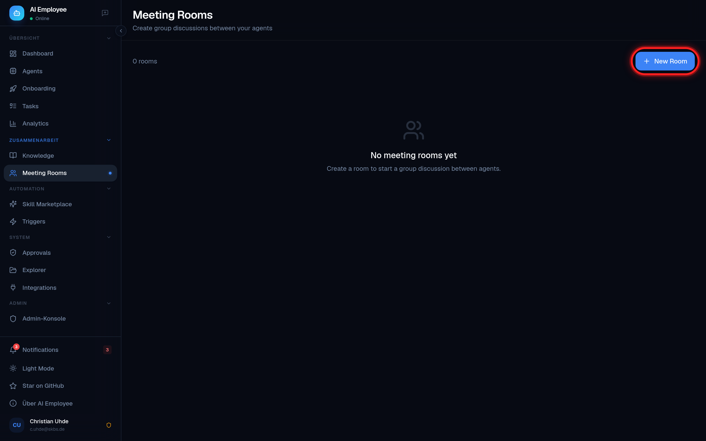

**Einen Raum erstellen und nutzen:**
1. **+ Neuer Raum** (bzw. **New Room**) klicken.
2. **Thema/Ziel** des Raums vergeben — möglichst konkret (was soll am Ende herauskommen).
3. **Teilnehmer hinzufügen** — die Agenten auswählen, die mitarbeiten sollen. Tipp:
   kombiniere unterschiedlich spezialisierte Agenten (z. B. Recherche + Review).
4. Den Raum **starten** — die Agenten durchlaufen die **Stages** (Phasen) und tauschen
   sich aus; ein **Moderator** steuert den Ablauf.
5. Auf einen bestehenden **Raum** klicken → den **Verlauf** der Zusammenarbeit ansehen und
   das Ergebnis abholen.

> Unterschied zum Chat/Task: Hier reden **mehrere Agenten miteinander**, statt dass du mit
> einem einzelnen sprichst.

> **Moderator-LLM:** Ist der Moderator aktiv, kannst du im „Neuer Raum"-Dialog wählen, **welches LLM** ihn antreibt. Leer = globaler Standard (Admin → Einstellungen → System → Automatisierung → „Meeting-Moderator — LLM").

**Was am Ende automatisch passiert:**
- Der **Moderator** fasst die Ergebnisse als **Action-Item-Liste** zusammen.
- Jede Aufgabe wird einem Agenten zugewiesen — der Agent **übernimmt sie in seine eigene To-Do-Liste** (`/workspace/todo.md`) und legt **selbst fest, bis wann und wie** er sie erledigt.
- Ein **Folge-Meeting** („… — Folgetermin") wird automatisch angelegt — mit dem Kontext und den offenen Punkten des Vortermins. Es **startet automatisch, sobald die Agenten alle Action-Items des Vortermins erledigt haben** (sie bringen die fertigen Ergebnisse mit) — mit einer 24-Stunden-Sicherheitsgrenze. So passt der Folgetermin zum tatsächlichen Arbeitsfortschritt der Agenten statt zu einem geschätzten Kalenderdatum.

---

## 10. Skill Marketplace

Ein **Skill** ist eine wiederverwendbare **Fähigkeit** (ein Slash-Command), die ein Agent
installieren kann — z. B. „Präsentation erstellen", „Second Brain durchsuchen" oder ein
fester Spezial-Workflow. Der **Skill Marketplace** ist der Katalog dieser Fähigkeiten.
Seitenleiste → **Skill Marketplace**.

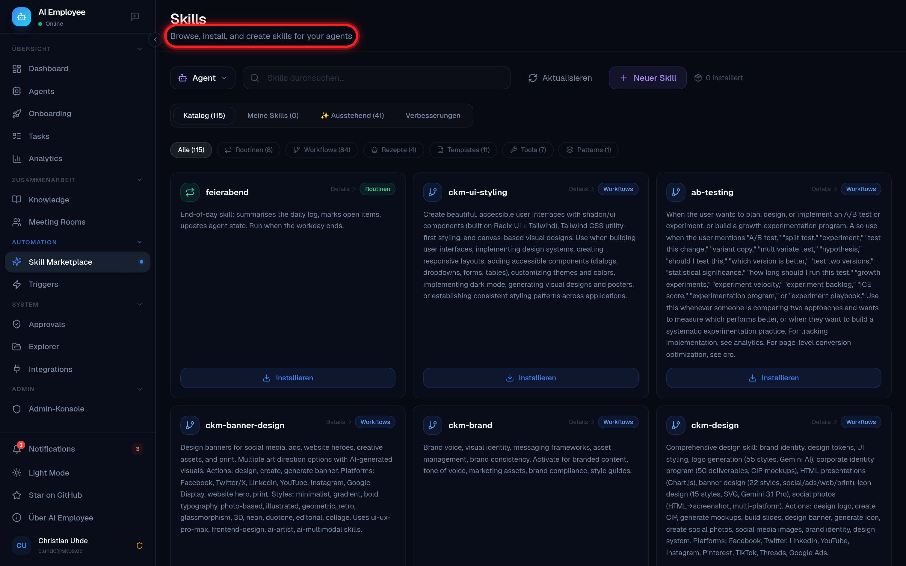

**So nutzt du Skills:**
1. **Suchen/Filtern** — oben nach Begriff suchen oder nach **Kategorie** filtern. Jede
   Kachel zeigt Name, Beschreibung und ggf. eine **Bewertung/Hilfreichkeit**.
2. Auf einen **Skill** klicken → Detailbeschreibung (was er tut, was er braucht).
3. **Installieren / einem Agenten zuweisen** → den **Ziel-Agenten** wählen.
4. Danach steht der Skill im Agenten als **Slash-Command** bereit (technisch unter
   `/workspace/.claude/skills/`) — du oder der Agent ruft ihn im Chat auf.

> Viele **Vorlagen** (Kap. 4.2) bringen bereits passende Skills mit. Eigene Skills entstehen
> auch dadurch, dass ein Agent sich beim Arbeiten neue Routinen „anlernt".

### 10.1 Szenario: Präsentations-Skill nutzen
1. **Skill Marketplace** → „Präsentation" suchen → Skill öffnen → **einem Agenten
   zuweisen**.
2. Im **Chat** des Agenten: „Erstelle aus diesen Stichpunkten eine PPTX." → der Agent nutzt
   den Skill.

---

## 11. Triggers

**Triggers** sind **Webhook-zu-Task-Regeln**: ein eingehendes Ereignis (z. B. ein
GitHub-Webhook) löst **automatisch** einen Task bei einem Agenten aus. Seitenleiste →
**Triggers**.

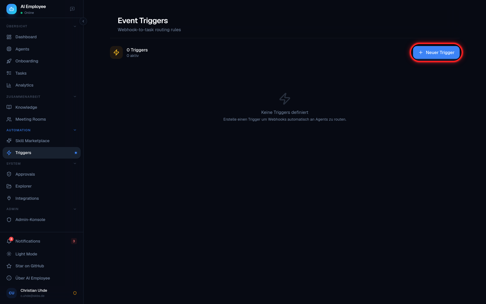

**Neuen Trigger anlegen — jedes Feld erklärt.** Klick **+ Neuer Trigger**:

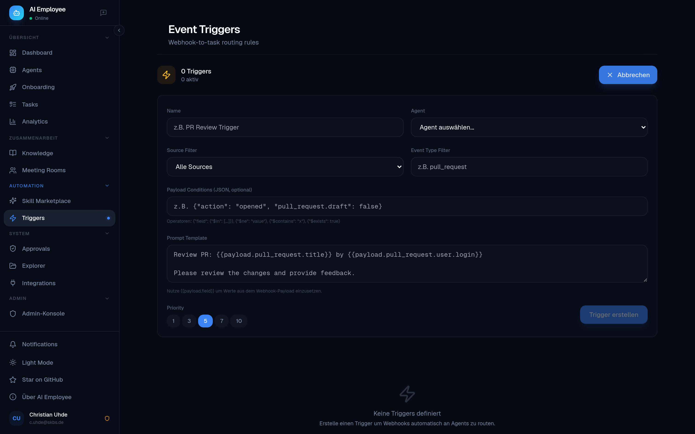

- **Name** — Bezeichnung der Regel (z. B. „PR Review Trigger").
- **Agent** — welcher Agent den ausgelösten Task bearbeitet (Dropdown **Agent auswählen**).
- **Source Filter** — von welcher Quelle Ereignisse akzeptiert werden (*Alle Sources* oder
  eine bestimmte).
- **Event Type Filter** — auf welchen Ereignistyp reagiert wird (z. B. `pull_request`).
- **Payload Conditions (JSON, optional)** — **Feinbedingungen** auf den Webhook-Inhalt,
  z. B. `{"action": "opened", "pull_request.draft": false}`. Es gibt Operatoren für
  Text/Zahl/Liste (z. B. „enthält", „gleich", „existiert").
- **Prompt Template** — die Anweisung an den Agenten, mit **Platzhaltern** aus dem
  Webhook-Payload: `{{payload.feld}}`. Beispiel: *„Review PR:
  {{payload.pull_request.title}} by {{payload.pull_request.user.login}} — bitte die
  Änderungen prüfen und Feedback geben."*
- **Priority** — Dringlichkeit (1 / 3 / 5 / 7 / 10).
- **Trigger erstellen** — speichert die Regel; sie ist dann **aktiv** und reagiert auf
  passende Ereignisse. Über den **Aktiv-Schalter** pausierst du sie.

### 11.1 Szenario: PRs automatisch reviewen
1. **Triggers → + Neuer Trigger.**
2. **Agent** = Code Reviewer, **Event Type** `pull_request`, **Conditions**
   `{"action":"opened"}`, **Prompt** mit `{{payload.pull_request.title}}` → **Trigger
   erstellen**.
3. Sobald ein PR geöffnet wird, legt die Plattform automatisch einen Review-Task an.

---

## 12. Schedules

**Schedules** sind **wiederkehrende, zeitgesteuerte Tasks** — der Agent erledigt etwas
automatisch in festem Takt (z. B. täglicher Bericht). Seitenleiste → **Schedules** (oder
**Tasks → Scheduled**).

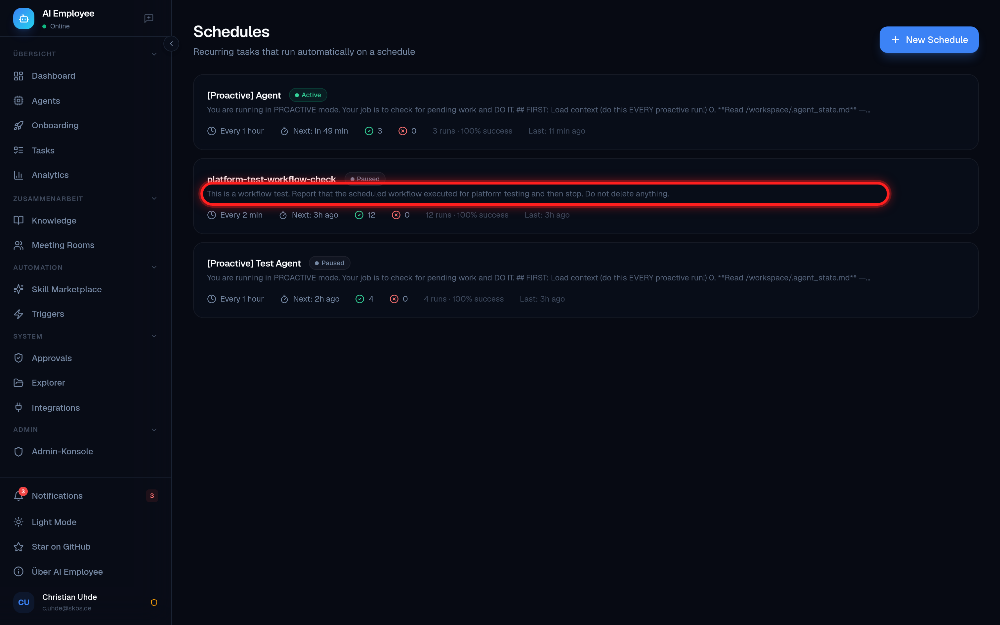

**Neuen Schedule anlegen — jedes Feld erklärt.** Klick **+ New Schedule** →
*Create Recurring Task*:

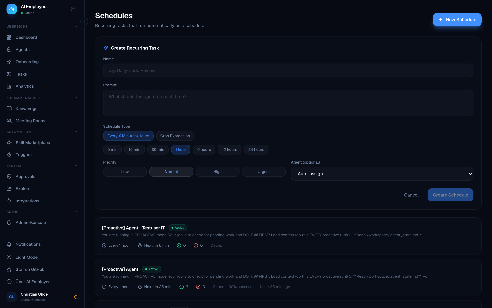

- **Name** — Bezeichnung (z. B. „Daily Code Review").
- **Prompt** — *was der Agent jedes Mal tun soll* (wie bei einem Task, nur wiederkehrend).
- **Schedule Type** — **Every X Minutes/Hours** (Intervall per Klick: *5 min, 15 min,
  30 min, 1h, 6h, 12h, 24h*) **oder** **Cron Expression** (für genaue Zeitpläne, z. B.
  „jeden Montag 8 Uhr").
- **Priority** — Low / Normal / High / Urgent.
- **Agent (optional)** — wer ausführt (*Auto-assign* oder gezielt).
- **Create Schedule** — aktiviert den Plan; **Cancel** verwirft.

**In der Liste** zeigt jeder Schedule **Intervall**, **nächste**/**letzte** Ausführung,
Anzahl Läufe und **Erfolgsquote**. Über den **Aktiv-Schalter** pausierst du ihn,
**Papierkorb** löscht ihn.

> Beispiel: Der **Proactive Mode** eines Agenten (Kap. 5.6) erzeugt intern solche
> wiederkehrenden Läufe — Schedules sind die manuelle, gezielte Variante davon.

### 12.1 Szenario: Täglicher Status um 8 Uhr
1. **Schedules → + New Schedule** → Name „Täglicher IT-Status".
2. **Prompt** „Fasse offene Tickets zusammen und poste die 3 dringendsten.", **Schedule
   Type** *Cron* `0 8 * * *`, **Agent** = IT-Helfer → **Create Schedule**.

---

## 13. Approvals (Freigaben)

**Freigaben** sind die Sicherheitsbremse: Bevor ein Agent (auf Autonomie-Level **L3**,
Kap. 5.6) eine potenziell heikle Aktion ausführt, **fragt er nach** — und wartet, bis du
entscheidest. Seitenleiste → **Approvals**.

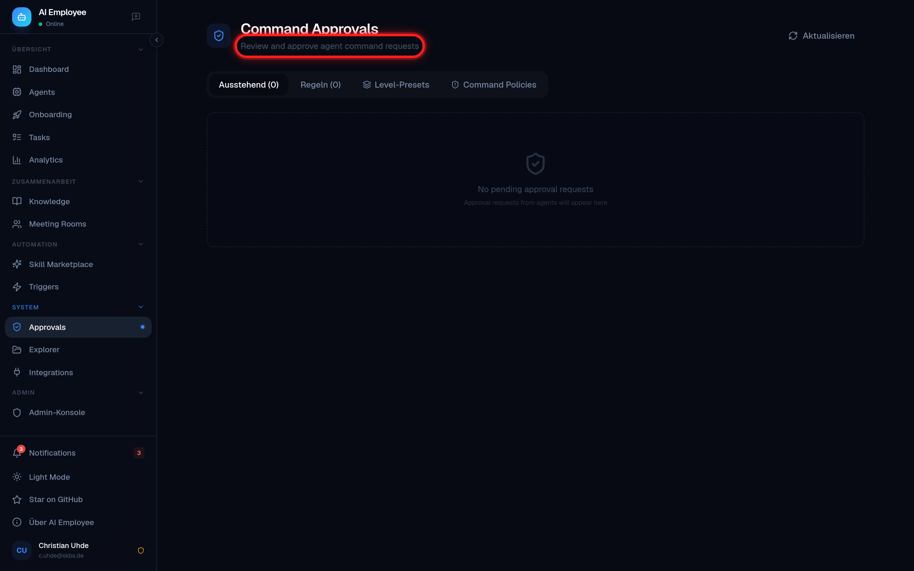

**So bearbeitest du eine Freigabe:**
1. Die Seite **Approvals** (oder die **Benachrichtigung** mit den Antwort-Buttons) öffnen.
2. Die **Genehmigungsanfrage** lesen: *welcher Agent*, *was er vorhat* und *warum* eine
   Freigabe nötig ist (z. B. „nutzt potenziell geschützte Webbilder").
3. Eine der **Antwort-Optionen** klicken — die Optionen sind kontextabhängig, z. B.
   **„Ja, bitte umsetzen"**, **„Nur interne Quellen verwenden"**, **„Nein, erst Konzept
   zeigen"**.
4. **Erst nach deiner Entscheidung** macht der Agent weiter — entsprechend deiner Wahl.

Freigaben werden zusätzlich per **Telegram** und **iOS-Push** zugestellt, damit du sie auch
unterwegs beantworten kannst.

> Willst du gar nicht gefragt werden, kannst du den Agenten auf **L4 (vollständig autonom)**
> stellen — oder auf **L2/L1**, wenn er gar nicht selbst handeln soll (Kap. 5.6).

---

## 14. Integrationen & MCP-Server

Unter **Integrations** verbindest du externe Werkzeuge und Datenquellen, die deine Agenten
dann nutzen können. Es gibt zwei Bereiche: **MCP-Server** (Werkzeug-/Datenanbindungen über
den MCP-Standard) und **OAuth-Integrationen** (Google, Microsoft 365, GitHub).

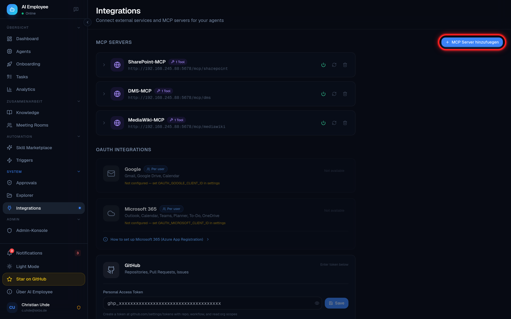

Seitenleiste → **Integrations**.

### 14.1 MCP-Server hinzufügen — jedes Feld erklärt

Ein **MCP-Server** stellt Agenten zusätzliche **Tools** bereit (z. B. ein Wiki, ein
Dokumenten-Management, ein Dateisystem). Klicke oben rechts auf **+ MCP Server
hinzufügen** → das Formular:

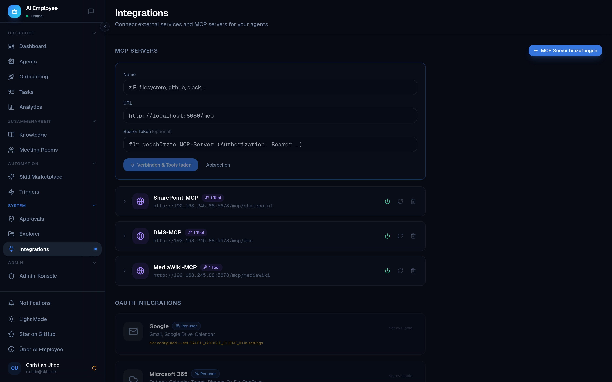

- **Name** — frei wählbarer Anzeigename (z. B. *filesystem*, *github*, *slack*, *Wiki*).
- **URL** — die Adresse des MCP-Servers (z. B. `http://192.168.245.89:5678/mcp/mediawiki`).
- **Bearer Token (optional)** — nur bei **geschützten** Servern: hier den Token eintragen,
  der als `Authorization: Bearer …` mitgeschickt wird.
- **Verbinden & Tools laden** — speichert den Server **und** fragt direkt seine verfügbaren
  Tools ab (die Anzahl erscheint danach als *„n Tool(s)"* an der Kachel). **Abbrechen**
  verwirft.

**Bestehende MCP-Server** (Liste darunter) — jede Kachel zeigt Name, URL und Tool-Anzahl
(z. B. *SharePoint-MCP, DMS-MCP, MediaWiki-MCP*). Die Symbole rechts:
- **Aktualisieren** — Tools neu laden (falls der Server neue Tools bekommen hat).
- **Bearbeiten** — Name/URL/Token ändern.
- **Löschen** (Papierkorb) — Anbindung entfernen.

### 14.2 OAuth-Dienste verbinden
Im Bereich **OAUTH INTEGRATIONS**:
- **Google** (Gmail, Drive, Calendar) und **Microsoft 365** (Outlook, Calendar, Teams,
  Planner, To-Do, OneDrive): auf **Verbinden** klicken (sichtbar, sobald der Admin die
  `*_CLIENT_ID` hinterlegt hat), im Popup beim Anbieter anmelden und Zugriff bestätigen.
  Steht *„Not configured"*, muss der Admin den Dienst erst in den Settings einrichten.
- **GitHub** (Repositories, Pull Requests, Issues): ein **Personal Access Token** ins Feld
  eintragen und **Save** klicken.

Verbundene Dienste stehen Agenten anschließend als **Werkzeuge** zur Verfügung; pro Agent
steuerst du im **Settings → Integrationen**-Tab, welche er nutzen darf.

### 14.3 Szenario: Wiki anbinden
1. **Integrations → + MCP Server hinzufügen.**
2. **Name** „Wiki", **URL** des MediaWiki-MCP, ggf. **Bearer Token** → **Verbinden & Tools
   laden** (zeigt „1 Tool").
3. Bei einem Agenten **Settings → Integrationen** → das Wiki erlauben.
4. Im **Chat**: „Suche im Wiki nach dem SFTP-Upgrade-Artikel und fasse ihn zusammen."

---

## 15. AI-Accounts

Ein **AI-Account** ist ein **zentral hinterlegter Modell-Zugang** (z. B. Azure OpenAI), den
Agenten nutzen — statt dass jeder User eigene Schlüssel pflegt. Verwaltung in der
**Admin-Konsole → AI-Accounts** (bzw. der gleichnamigen Seite).

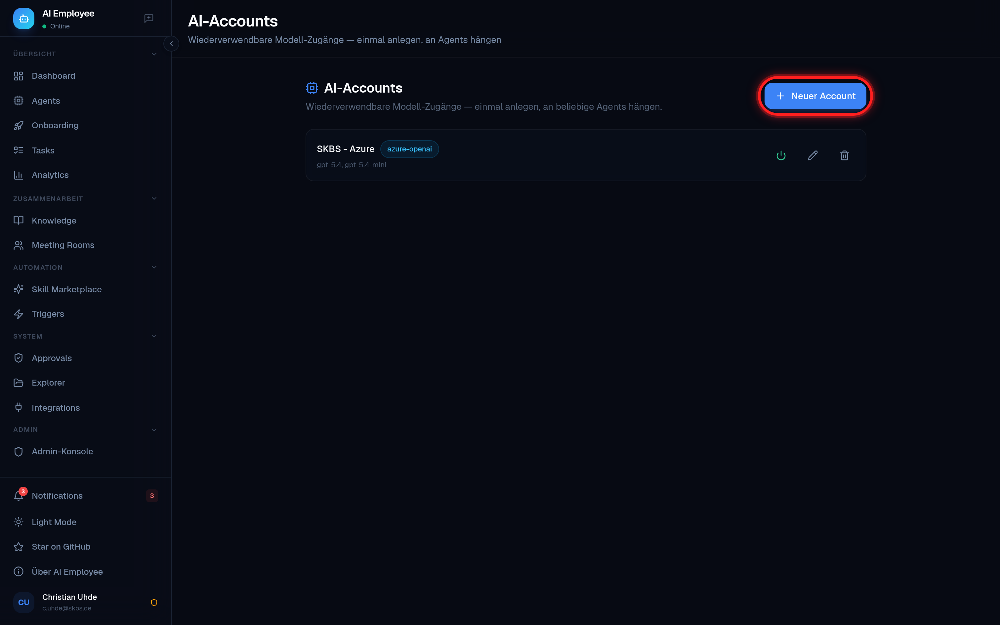

**Neuen Account anlegen — jedes Feld erklärt.** Klick **+ Neuer Account**:

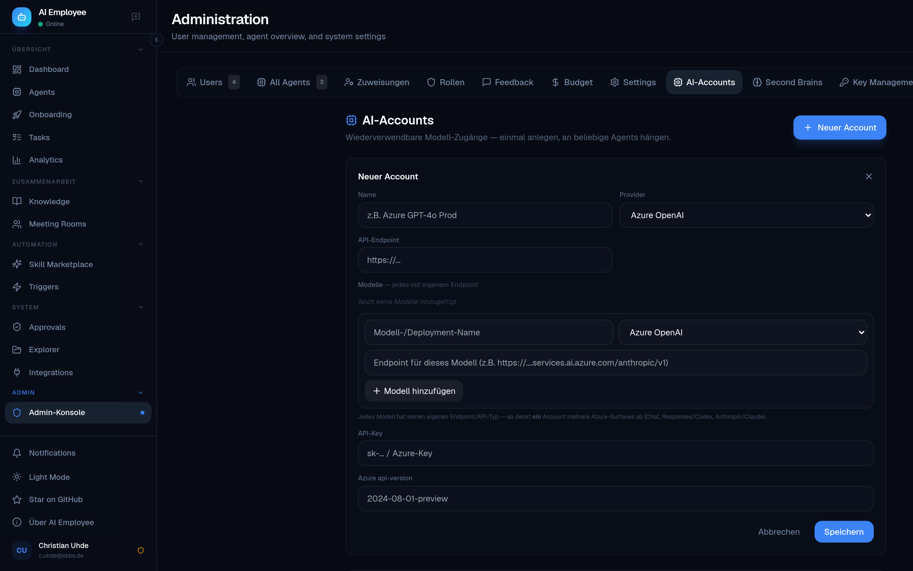

- **Name** — sprechender Name (z. B. „Azure GPT-4o Prod").
- **Provider** — der Anbieter (z. B. *Azure OpenAI*, Anthropic, …).
- **API-Endpoint** — die Basis-URL des Zugangs (`https://…`).
- **Modelle** — ein Account kann **mehrere Modelle** bereitstellen, **jedes mit eigenem
  Endpoint/Deployment**. Pro Modell:
  - **Modell-/Deployment-Name** + zugehöriger **Provider**,
  - **Endpoint für dieses Modell** (z. B. `https://…services.ai.azure.com/anthropic/v1`).
  - Über **+ Modell hinzufügen** weitere Modelle ergänzen. So deckt **ein** Account mehrere
    Azure-Oberflächen ab (Chat, Responses/Codex, Anthropic/Claude).
- **API Key** — der geheime Schlüssel (`sk-…` bzw. Azure-Key) — wird **verschlüsselt**
  gespeichert.
- **Azure api-version** — die API-Version (z. B. `2024-08-01-preview`).
- **Speichern** — legt den Account an; **Abbrechen** verwirft.

**Verwendung:** Der Account wird beim **Agenten-Anlegen** wählbar bzw. über eine **Rolle**
(Kap. 22.4) für eine ganze Gruppe freigegeben (siehe Anhang B, Rezept 1).

---

## 16. Secrets

**Secrets** sind sicher verschlüsselt gespeicherte Geheimnisse (API-Keys, Tokens,
Passwörter), die einem Agenten als **Umgebungsvariable** bereitgestellt werden — ohne sie
im Klartext im Chat oder Code zu hinterlegen. Seitenleiste → **Secrets**.

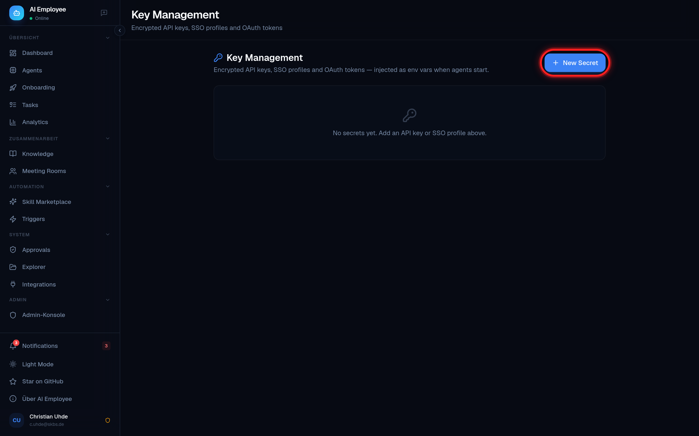

**Neues Secret anlegen — jedes Feld erklärt.** Klick **+ Neues Secret**:

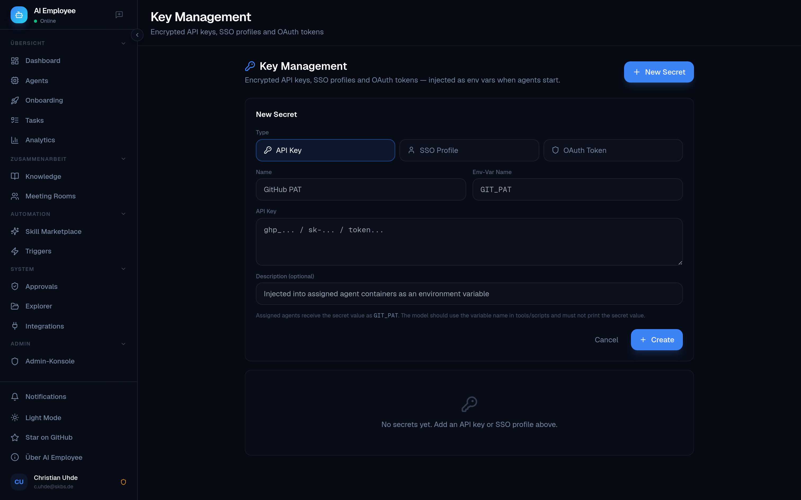

- **Schlüsselname** — der Name der Umgebungsvariable, wie der Agent ihn anspricht
  (z. B. `MY_API_KEY`). Konvention: GROSSBUCHSTABEN mit Unterstrichen.
- **Wert** — das eigentliche Geheimnis. Wird **verschlüsselt** abgelegt und ist danach
  **nicht erneut im Klartext auslesbar** (du kannst ihn nur ersetzen).
- **Speichern** — legt das Secret an.
- **Papierkorb** in der Liste — Secret löschen.

**Verwendung:** Welche Secrets ein Agent bekommt, steuerst du über die **Rolle** (Kap.
22.4 → *Keys / Secrets*) bzw. die Agent-Zuweisung. Im Agenten stehen sie dann als
Umgebungsvariablen bereit (z. B. damit ein Skript sich an einer fremden API anmeldet).

> Sicherheitshinweis: Gib Geheimnisse **nie** direkt in den Chat — lege sie als Secret an.

---

## 17. Explorer (Dateien)

Der **Explorer** ist der zentrale Dateibrowser über die **Workspaces** deiner Agenten —
hier holst du **Ergebnisse** ab (Dokumente, Bilder, Videos, Auswertungen). Seitenleiste →
**Explorer**.

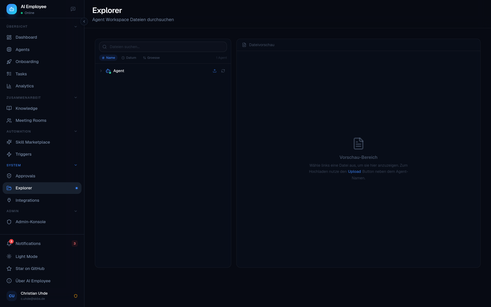

**So findest und holst du Dateien:**
1. Den **Agenten/Workspace** wählen, dessen Dateien du sehen willst.
2. Durch die **Ordnerstruktur** klicken (z. B. `transfer/` für fertige Ergebnisse).
3. Auf eine **Datei** klicken → **Vorschau** (bei Bildern/Text/PDF) bzw. **Herunterladen**.

> Dieselben Dateien siehst du auch direkt am Agenten unter **Workspace** (Kap. 5.4) — der
> Explorer bündelt sie zentral.

---

## 18. Audit-Log

Das **Audit-Log** ist das lückenlose Protokoll sicherheitsrelevanter und administrativer
Ereignisse — *wer hat wann was getan*. Wichtig für Nachvollziehbarkeit und Compliance.
Seitenleiste → **Audit** (Admin).

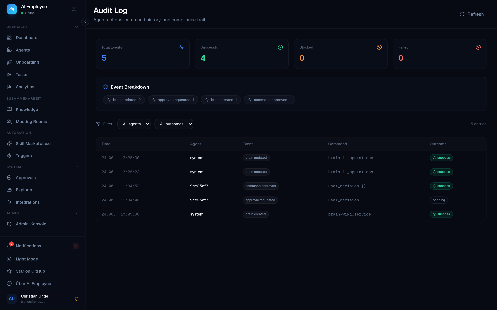

**So nutzt du es:**
1. Die Liste zeigt pro Eintrag **Zeitpunkt**, **Ereignistyp**, **Benutzer/Agent**, das
   betroffene Objekt und das **Ergebnis** (success/…).
2. Über **Filter/Suche** gezielt Ereignisse finden — z. B. **Löschungen** von Agenten,
   **Rechte-/Rollenänderungen**, Anlegen/Ändern von Accounts oder Brains.

> Beispiel: Wurde ein Agent gelöscht, steht hier, *wann* und *durch wen* — hilfreich bei
> „wo ist mein Agent hin?".

---

## 19. System-Health

Die **Health**-Seite zeigt den technischen Zustand der Plattform auf einen Blick — ideal,
um schnell zu sehen, ob „alles grün" ist. Seitenleiste → **Health**.

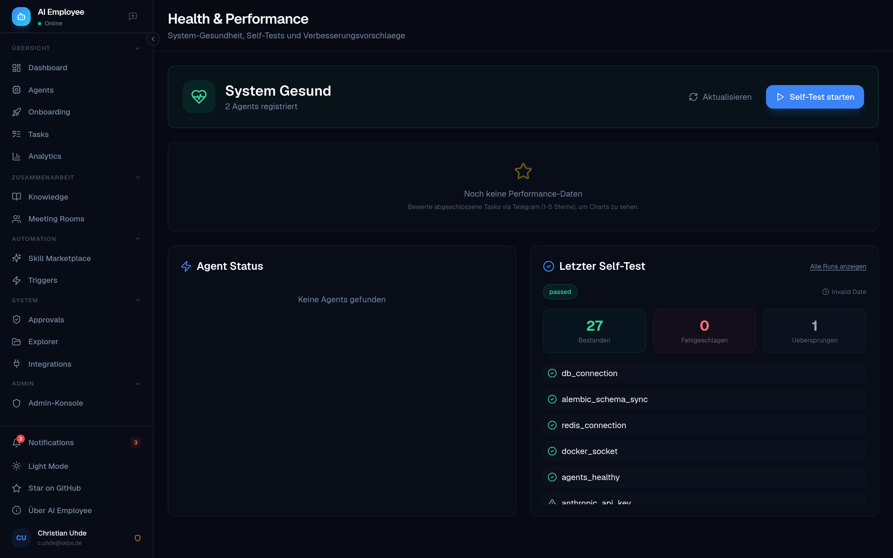

**Was du hier siehst:**
- **Self-Test-Report** — eine Reihe automatischer Tests (z. B. *27/28 bestanden*) mit
  Zeitstempel.
- **Ø API-Antwortzeit** — wie schnell die Plattform antwortet.
- **Dienst-Status** — Zustand der Bausteine (Datenbank, Redis, Embedding-Dienst, …).
- **Anzahl Bewertungen / Charts** — Qualitäts-Kennzahlen, sofern Tasks bewertet wurden.

Bei Bedarf den **Self-Test erneut ausführen**, um den aktuellen Stand zu prüfen.

---

## 20. Einstellungen

Unter **Settings** verwaltest du dein **persönliches Profil** und deine Vorlieben.
Seitenleiste → **Settings**.

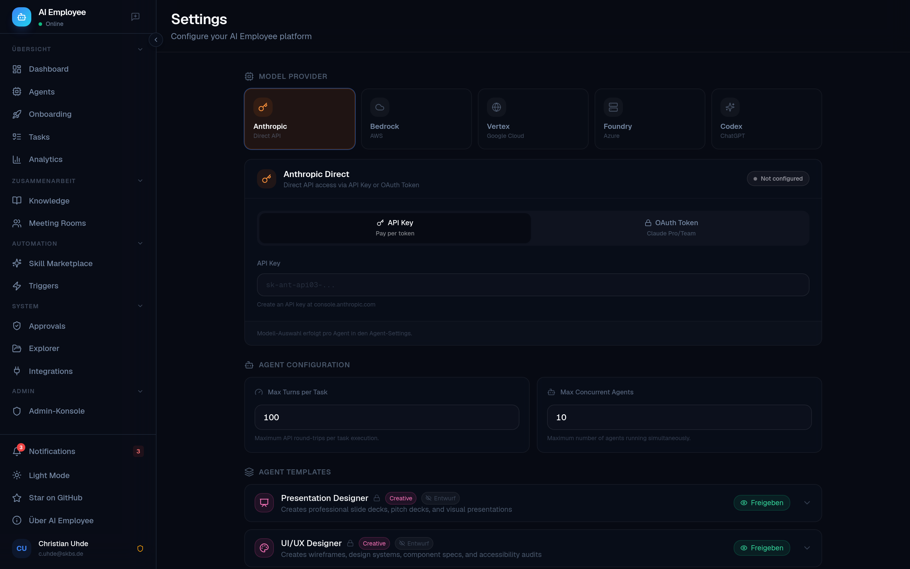

**Was du hier einstellst:**
- **Profil** — Name/Anzeigedaten.
- **Anzeige** — z. B. Dark/Light-Mode (auch direkt unten in der Seitenleiste umschaltbar).
- **Benachrichtigungs-Optionen** — wie/ob du informiert wirst.
- Nach Änderungen **Speichern**.

> Plattform-weite Einstellungen (Modelle, Accounts, Rollen, Budgets, Schlüssel) liegen
> **nicht** hier, sondern in der **Admin-Konsole** (Kap. 22).

---

## 21. Benachrichtigungen

Das **Benachrichtigungs-Center** hält dich über alles auf dem Laufenden, was deine Agenten
tun. Es öffnet über die **Glocke** unten links in der Seitenleiste (der **Zähler-Badge**
zeigt ungelesene).

**So bedienst du es:**
1. Auf die **Glocke** klicken → das Panel klappt auf.
2. **Arten von Meldungen**, die hier auflaufen:
   - **„Task abgeschlossen — Bewertung?"** — mit Möglichkeit, direkt zu **bewerten**.
   - **Freigabe-Anfragen** — mit **Antwort-Buttons** direkt in der Meldung.
   - **„Neuer Skill erstellt"**, **Self-Test-Report** und weitere System-Hinweise.
   - Nachrichten/Ergebnisse deiner Agenten.
3. **Bei einer Freigabe** direkt eine Option klicken (ohne die Approvals-Seite zu öffnen).
4. **Haken** = einzeln als gelesen; **Read all** = alle; **Papierkorb** = löschen.

> Datenschutz: Du siehst **nur Benachrichtigungen deiner eigenen** (bzw. dir freigegebener)
> Agenten. Bleiben neue Meldungen aus, einmal die Seite neu laden.

---

## 22. Admin-Konsole

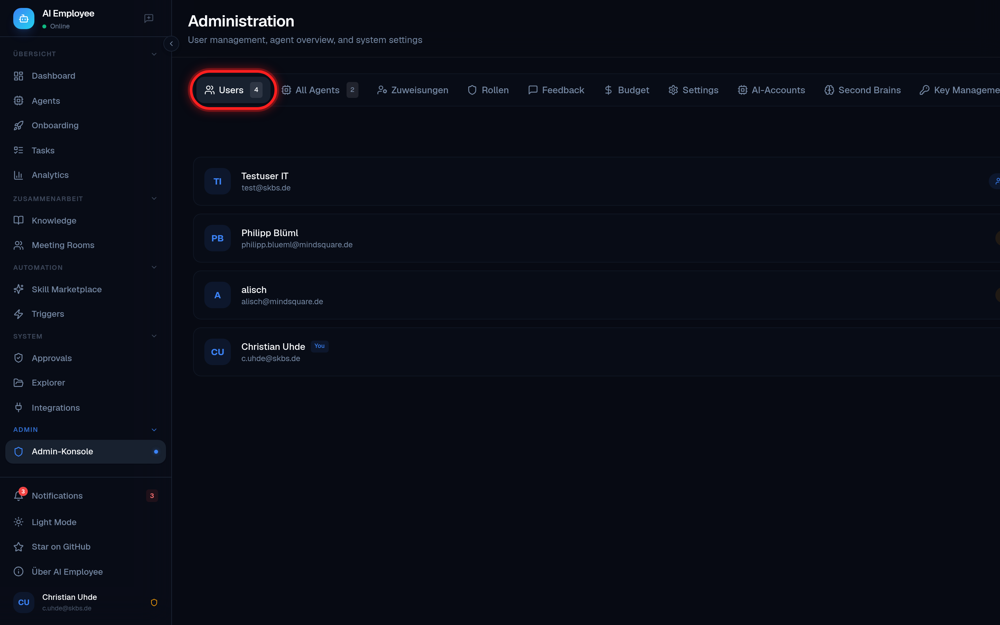

Seitenleiste → **Admin-Konsole** (nur Administratoren). Oben die Tabs: **Users**,
**All Agents**, **Zuweisungen**, **Rollen**, **Feedback**, **Budget**, **Settings**,
**AI-Accounts**, **Second Brains**, **Key Management**.

### 22.1 Users

Tab **Users** — die Benutzerverwaltung. Die Liste zeigt alle Benutzer mit **Name**,
**E-Mail** und (über das Badge) ihrer **Rolle**.

**Neuen Benutzer anlegen — jedes Feld erklärt.** Klick **+ User hinzufügen**:

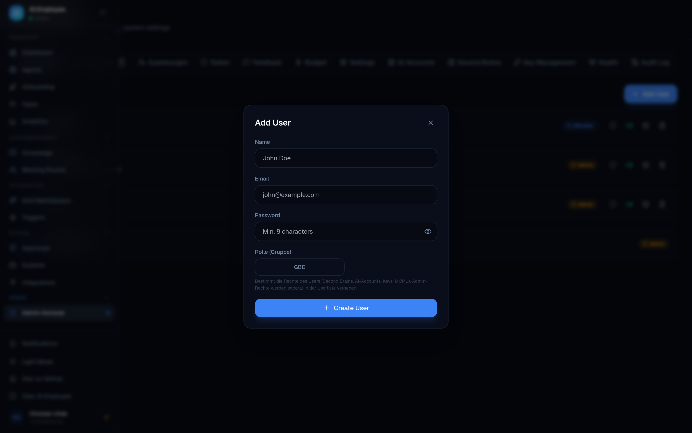

- **Name** — Anzeigename (z. B. „John Doe").
- **Email** — Login-Adresse.
- **Password** — Startpasswort (min. 8 Zeichen; Auge = ein-/ausblenden). Der Benutzer kann
  es später ändern bzw. per Reset neu setzen.
- **Role (Gruppe)** — die **Rolle** bestimmt, was der Benutzer über **Second Brains,
  AI-Accounts, Keys, MCP-Tools** usw. darf (Rollen verwaltest du im Tab **Rollen**, Kap.
  22.4). Optional — ohne Rolle gelten die Standardrechte.
- **Create User** — legt den Benutzer an.

**Bestehende Benutzer** verwalten: pro Benutzer **Bearbeiten** (Rolle/Status ändern),
**Passwort zurücksetzen**, **Aktiv/Inaktiv** schalten und **Mount-Rechte** setzen (welche
Second Brains der Benutzer **lesen/schreiben** darf).

### 22.2 All Agents

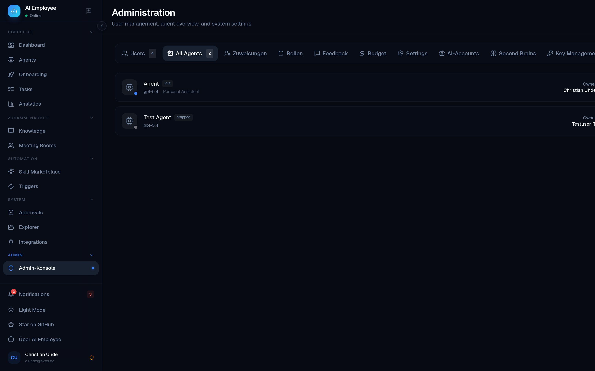

Tab **All Agents** — die **plattform-weite** Sicht auf **alle** Agenten über **alle**
Benutzer hinweg (auf der normalen Agents-Seite sieht jeder nur seine eigenen). Pro Agent
siehst du Besitzer, Status und Modell.
- Einen Agenten **anklicken** → öffnen/verwalten.
- Nützlich, um den Überblick zu behalten, fremde Agenten zu prüfen oder bei „wo ist mein
  Agent?" nachzusehen (Besitzer-Spalte).

### 22.3 Zuweisungen & „Trainierten Agent verteilen"

**Wozu das gut ist:** Nicht jeder Endanwender kann (oder will) sich selbst einen
vernünftigen Agenten bauen. Deshalb baut **der Admin** einmal einen guten Agenten, **lernt
ihn fertig an** — und **verteilt** ihn dann an einzelne User oder ganze Gruppen. Jeder
bekommt eine **eigene, einsatzbereite Kopie**, ohne selbst konfigurieren zu müssen.

Tab **Zuweisungen**. Hier siehst du, welche Agenten welchem User gehören, und hast oben
rechts zwei Buttons:

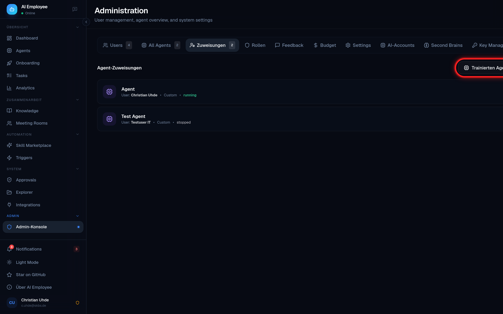

#### Variante A — Agent aus einer Vorlage zuweisen
Erzeugt für **einen** User einen Agenten aus einem **Template** (Blueprint):
1. **Agent zuweisen** klicken.
2. **User** und **Template** wählen, optional einen **Namen** vergeben.
3. **Zuweisen** — der Agent wird angelegt und dem User zugeordnet.

#### Variante B — Trainierten Agenten verteilen (Kopie pro User/Gruppe)

Das ist der Weg für **fertig angelernte** Agenten. Klicke **Trainierten Agent verteilen** →
das Modal öffnet sich:

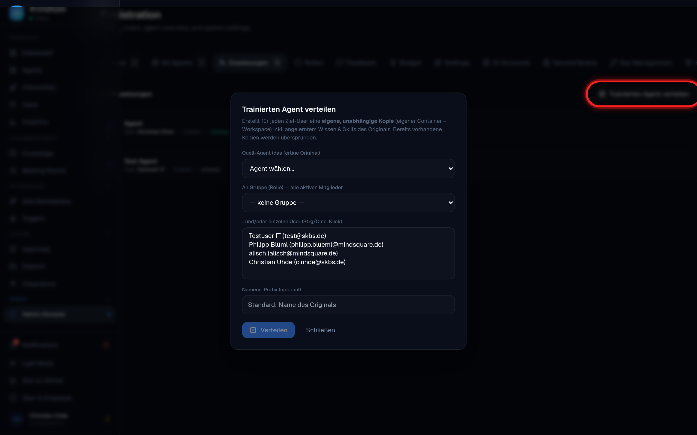

**Jedes Feld erklärt:**
- **Quell-Agent (das fertige Original)** — der Agent, den du klonst. Wähle den, den du
  vorher gebaut und angelernt hast (Rolle, Skills, Wissen in `knowledge.md`).
- **An Gruppe (Rolle)** — wählst du hier eine Rolle, bekommt **jedes aktive Mitglied**
  dieser Gruppe automatisch eine Kopie. So stattest du eine ganze Abteilung auf einmal aus.
- **…und/oder einzelne User** — Mehrfachauswahl (Strg/Cmd-Klick) für gezielte Einzelpersonen.
  Du kannst Gruppe **und** Einzel-User kombinieren.
- **Namens-Präfix (optional)** — Vorsilbe für die Namen der Kopien (Standard: Name des
  Originals). Jede Kopie heißt dann z. B. „IT-Helfer – Max Mustermann".
- **Verteilen** — legt die Kopien an. Im Ergebnis steht, **wie viele erstellt** und **wie
  viele übersprungen** wurden (mit Begründung).

**Was bei jeder Kopie passiert:**
- Es entsteht ein **vollständig eigenständiger Agent** — **eigener Container, eigenes
  Workspace, dem jeweiligen User gehörend**. Es ist **nie** derselbe geteilte Agent
  (kein gemeinsam genutzter Container).
- Die Kopie übernimmt die **volle Konfiguration** des Originals: Modell, Modus/LLM, Rolle,
  Berechtigungen, Integrationen, MCP-Server, Budget, Autonomie-Level.
- Und das **angelernte „Gehirn"**: der **komplette Workspace** des Originals
  (`knowledge.md`, installierte Skills, `CLAUDE.md`, Dokumente) wird mitkopiert — nur die
  technische Task-Historie (`.agent_state.md`) startet je Kopie frisch.
- **Snapshot & idempotent:** Es zählen die **aktuellen** Mitglieder. Wer **schon eine
  Kopie** dieses Originals hat, wird **übersprungen** (keine Dubletten). Neue Mitglieder
  später? Einfach erneut **Verteilen** — nur die fehlenden Kopien entstehen.

**Zuweisung entfernen:** in der Liste beim Agenten auf den **Papierkorb** klicken — das
**stoppt den Container und löscht** den (Kopie-)Agenten dieses Users.

#### Szenario: IT-Abteilung in 1 Minute ausstatten
1. **Agents → + New Agent → Leerer Agent**, „IT-Helfer" bauen, Rolle/Skills/Wissen anlernen
   (Kap. 5.7), bis er rund läuft.
2. **Admin-Konsole → Zuweisungen → Trainierten Agent verteilen.**
3. **Quell-Agent** = „IT-Helfer", **Gruppe (Rolle)** = „IT-Abteilung" → **Verteilen**.
4. Ergebnis: „8 Kopien erstellt". Jedes IT-Mitglied hat jetzt seinen **eigenen** IT-Helfer
   — mit demselben Wissen, aber getrennt und privat.
5. Kommt nächste Woche ein neuer Kollege in die Gruppe → erneut **Verteilen**, er bekommt
   seine Kopie, die anderen werden übersprungen.

### 22.4 Rollen (Gruppen-Rechte)

Eine **Rolle** ist ein **Rechtebündel für eine Gruppe**. Statt jedem Benutzer einzeln
Rechte zu geben, definierst du einmal eine Rolle und weist sie zu — alle Mitglieder erben
das ganze Bündel. Tab **Rollen**:

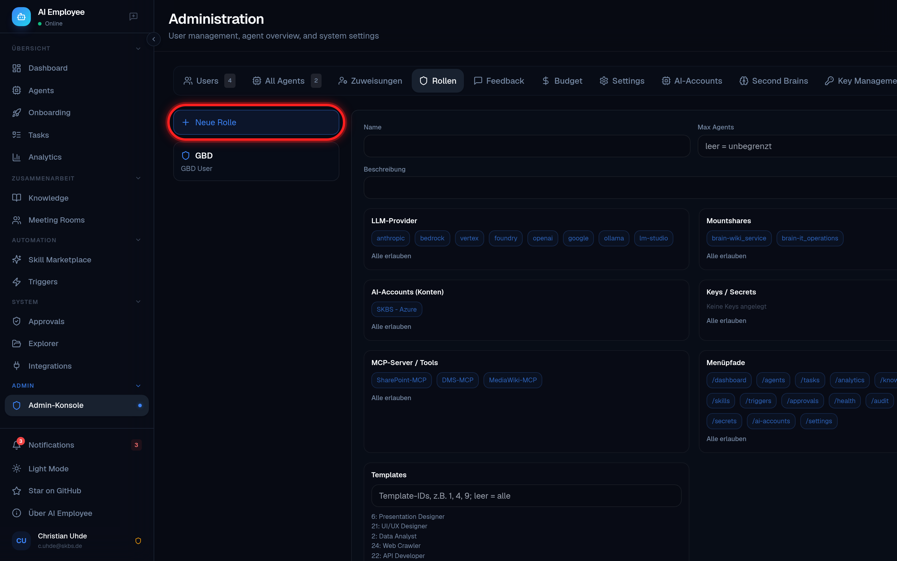

**Links**: Liste der Rollen + **+ Neue Rolle**. **Rechts**: das Formular mit allen
Stellschrauben. Klick **+ Neue Rolle** und fülle aus:

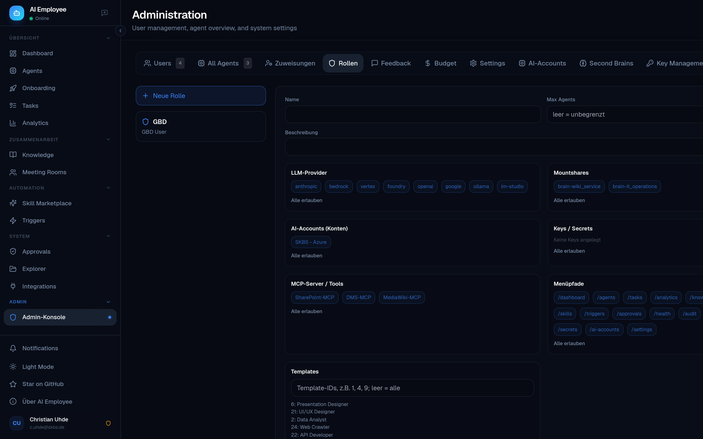

- **Name** — Bezeichnung der Gruppe (z. B. „IT-Abteilung").
- **Max Agents** — wie viele Agenten ein Mitglied anlegen darf (*leer = unbegrenzt*).
- **Beschreibung** — wofür die Rolle gedacht ist.
- **LLM-Provider** — welche Modell-Anbieter erlaubt sind (*anthropic, bedrock, vertex,
  foundry, openai, google, ollama, lm-studio*). **Alle erlauben** = keine Einschränkung.
- **Mountshares** — welche **Second Brains** die Gruppe nutzen darf (z. B.
  *brain-it_operations*).
- **AI-Accounts (Konten)** — welche zentralen Modell-Zugänge erlaubt sind (z. B.
  *SKBS – Azure*).
- **Keys / Secrets** — welche hinterlegten Secrets die Gruppe nutzen darf.
- **MCP-Server / Tools** — welche MCP-Anbindungen erlaubt sind (*SharePoint-MCP, DMS-MCP,
  MediaWiki-MCP*).
- **Menüpfade** — welche **Menüpunkte** die Gruppe in der Seitenleiste **sieht** (z. B.
  *dashboard, agents, tasks, knowledge, …*). So blendest du nicht benötigte Bereiche aus.
- **Templates** — welche Agent-Vorlagen die Gruppe nutzen darf (Template-IDs, z. B.
  *1, 4, 9*; *leer = alle*). Darunter eine Liste der verfügbaren Templates mit ihrer ID.

Jede Liste hat **„Alle erlauben"** als bequemen Schalter für „keine Einschränkung".
**Speichern** legt die Rolle an. Zuweisen tust du sie unter **Users** (Rezept 2, Anhang B).

> Tipp: Erst die Bausteine anlegen (**AI-Account**, **Second Brains**, **MCP-Server**),
> dann die Rolle — dann kannst du sie direkt auswählen.

### 22.5 Second Brains

Ein **Second Brain** ist ein **geteilter Wissens-Vault** (Markdown-Sammlung) für eine
Abteilung, der in zugewiesene Agenten eingebunden wird. Tab **Second Brains**:

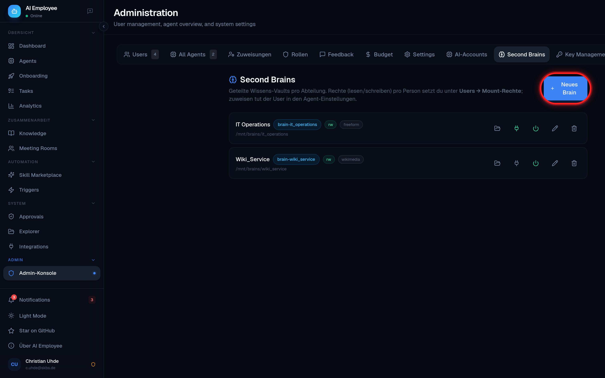

Oben rechts **+ Neues Brain**, darunter die vorhandenen Brains. Jedes Brain zeigt **Name**,
**Label** (z. B. `brain-it_operations`), **Modus** (rw/ro) und **Standard**.

**Neues Brain anlegen — jedes Feld erklärt.** Klick **+ Neues Brain**:

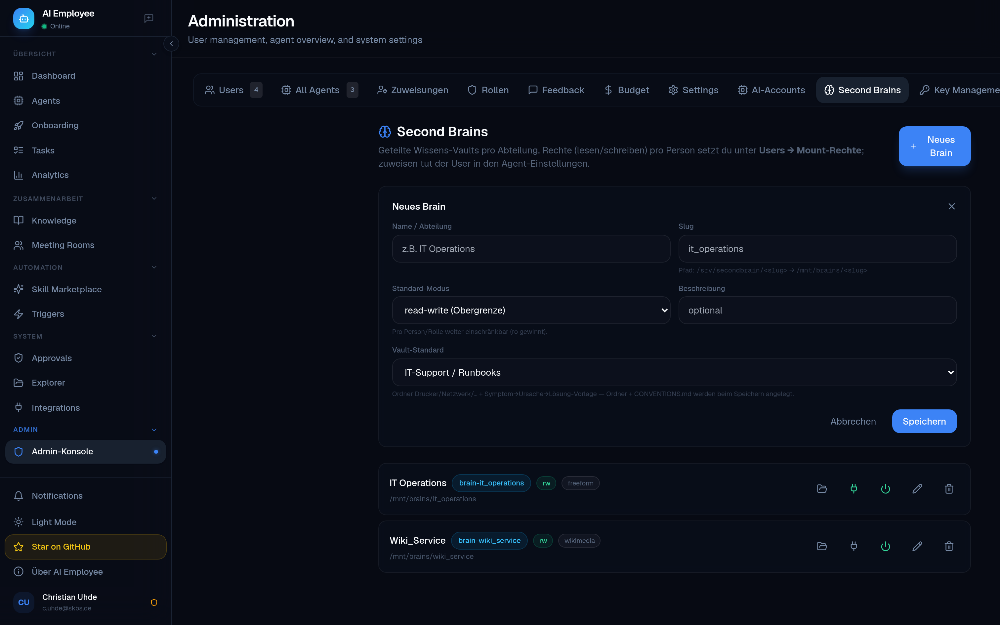

- **Name / Abteilung** — sprechender Name (z. B. „IT Operations").
- **Slug** — technischer Kurzname (z. B. `it_operations`). Darunter siehst du den
  **Pfad-Hinweis**: `/srv/secondbrain/<slug>` → wird in Agenten als `/mnt/brains/<slug>`
  eingebunden.
- **Standard-Modus** — die **Obergrenze** des Zugriffs: **read-write** (lesen + schreiben)
  oder **read-only**. Pro Person/Rolle lässt sich das später weiter einschränken (ro
  gewinnt).
- **Beschreibung** (optional) — wofür der Vault gedacht ist.
- **Vault-Standard** — legt die **Startstruktur** an: *Freiform* (nur `index.md`),
  *Wikimedia-Stil* (Themen-Ordner + `[[Wikilinks]]`) oder *IT-Support / Runbooks* (Ordner
  Drucker/Netzwerk/… + Symptom→Ursache→Lösung-Vorlage).
- **Speichern** — legt Ordner + `CONVENTIONS.md` an. **Abbrechen** verwirft.

**Aktionen pro Brain** (Symbole rechts in der Liste):
- **Ordner-Symbol** — **Inhalt öffnen**: Datei-Browser mit Vorschau, bearbeiten/anlegen/
  löschen und klickbaren `[[Wikilinks]]`.
- **Stecker-Symbol** — **MCP aktivieren**: macht den Vault als externen, **bearer-
  geschützten MCP-Server** unter `/api/v1/mcp/brains/<slug>` erreichbar. Der **Token wird
  nur einmal angezeigt** — kopieren! „Neu generieren" rotiert ihn (alter Token ungültig).
- **Power** — aktiv/inaktiv schalten.
- **Stift** — bearbeiten. **Papierkorb** — entfernen (die **Ordnerdaten bleiben erhalten**).

**Rechte vergeben:** pro Person unter **Users → Mount-Rechte** (ro/rw), pro Gruppe unter
**Rollen → Mountshares**. **Anbinden** an einen Agenten tut der jeweilige User im Agenten
unter **Wissen** (Kap. 5.5).

### 22.5.1 Szenario: Abteilungs-Wissen aufbauen
1. **Second Brains → + Neues Brain** → Name „IT Operations", Slug `it_operations`,
   Modus *read-write*, Vault-Standard *IT-Support / Runbooks* → **Speichern**.
2. **Ordner-Symbol** → einen Runbook-Artikel anlegen (z. B. „Drucker/x17137.md").
3. **Rollen → IT-Abteilung → Mountshares** → `brain-it_operations` erlauben.
4. Die Mitarbeiter binden es im Agenten (**Wissen**-Tab) an und können darin suchen.
5. Optional **Stecker-Symbol** → MCP aktivieren, um den Vault auch in n8n/Cursor zu nutzen.

### 22.6 AI-Accounts
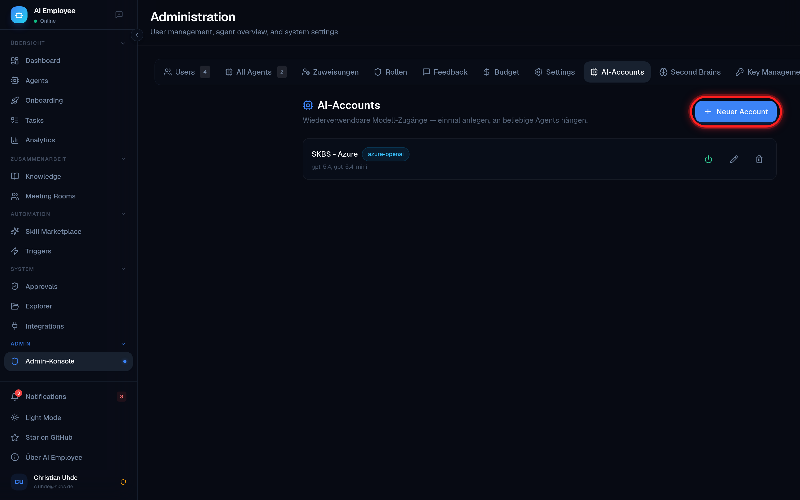
1. Tab **AI-Accounts** → zentrale Modell-/Provider-Zugänge anlegen/verwalten
   (z. B. Azure OpenAI). Siehe Kap. 15.

### 22.7 Budget
Tab **Budget** — **Kostenkontrolle**.
- **Plattform-Budget** — eine globale monatliche Obergrenze für die gesamte Instanz.
- **Agent-Budget** — pro Agent (der Admin setzt es; der User sieht es in den
  Agent-Settings **nur lesend**).
- **Verhalten bei Überschreitung** — optional **automatisches Fallback** auf ein
  günstiges Modell (statt Stopp), damit nichts liegen bleibt.
- Hier behältst du Verbrauch und Kosten im Blick (ergänzend zu **Analytics**).

### 22.8 Key Management
Tab **Key Management** — Verwaltung von **API-/Zugangs-Schlüsseln auf Plattformebene**
(z. B. für Integrationen/Webhooks). Schlüssel anlegen, ansehen (sofern erlaubt) und
widerrufen. Sensible Werte werden verschlüsselt gehalten.

---

## 23. Computer-Use Bridge (Desktop steuern)

Die **Computer-Use Bridge** ist eine separate **Desktop-App** (Windows & macOS). Mit ihr
darf ein Agent — **nach ausdrücklicher Freigabe** — deinen Rechner bedienen: Screenshot
ansehen, klicken, tippen, Apps öffnen, Text einfügen usw. Nichts passiert ohne die von dir
gesetzten Berechtigungen.

**Schritt 1 — App holen.** Aus dem Release `bridge-latest` herunterladen:
`AI-Employee-Bridge-Windows.zip` (Windows) bzw. `AI-Employee-Bridge.dmg` (macOS).

**Schritt 2 — Anmelden.** App starten → **Einstellungen/Anmelden**. Felder:
- **Bridge-URL / Server** — Adresse deiner Instanz.
- **E-Mail** + **Passwort** — deine Zugangsdaten.
- **Beim Start automatisch verbinden** (Häkchen) — optional.
- **Anmelden & Verbinden** klicken. *(Hinweis: Das Login-Fenster lässt sich vergrößern,
  falls der Button verdeckt ist.)*

**Schritt 3 — Berechtigungen festlegen.** Im Dialog wählst du pro Fähigkeit (Screenshot,
Klick, Tippen, App öffnen, Shell, Zwischenablage …), **was der Agent darf** — jeweils mit
**Risiko-Einstufung** (gering/mittel/hoch). Nur Freigegebenes ist möglich.

**Schritt 4 — Nutzen.** Im **Chat** eines Agenten bitten, `computer_use` zu verwenden. Der
Agent listet die verfügbaren **Bridge-Sessions**, macht Screenshots deines Bildschirms und
führt — im Rahmen deiner Freigaben — Aktionen aus.

### 23.1 Szenario: Agent zeigt etwas auf deinem PC
1. Bridge starten, anmelden, Berechtigungen *Screenshot* + *Klick* erlauben.
2. Im Agent-Chat: „Öffne den Browser und zeig mir die Startseite." → der Agent macht einen
   Screenshot und klickt sich nach deinen Freigaben durch.

---

## 24. Skills herunterladen & installieren

Ein **Skill** ist eine wiederverwendbare Fähigkeit (z. B. „Präsentation erstellen").

**Skill installieren (in einen Agenten laden):**
1. Linke Seitenleiste → **Skill Marketplace**.
2. Oben **einen Agenten auswählen** (sonst weist ein Hinweis darauf hin).
3. Beim gewünschten Skill auf **Installieren** klicken.

**Skill herunterladen (als Datei sichern):**
1. Im Skill Store auf das **Download-Symbol** neben *Installieren* klicken — **oder** den Skill öffnen und im Detailfenster auf **Herunterladen**.
2. Die Datei `SKILL.md` wird heruntergeladen.
3. Bereits installierte Skills: **Agent → Wissen → Skills** → Download-Symbol pro Skill.

> _[Screenshot folgt: Skill-Store-Karte mit markiertem Download-Symbol]_

---

## 25. Agent-Symbol (Icon + Farbe) anpassen

1. **Agents** → gewünschten Agenten öffnen → **Einstellungen**.
2. Bereich **Symbol** → ein **Icon** und eine **Farbe** wählen (wird sofort gespeichert).
3. Das Symbol erscheint auf den Agent-Karten und in der Übersicht.

> Beim **Erstellen** eines Agenten lässt sich das Symbol ebenfalls direkt wählen.
>
> _[Screenshot folgt: Symbol-Auswahl im Agent-Einstellungen-Tab]_

---

## 26. Mit dem Agenten sprechen (Voice)

1. Agent öffnen → **Chat** → die **Sprach-/Voice-Funktion** starten.
2. Sprechen — der Agent antwortet per Sprache.

**Microsoft-/Azure-Stimmen (optional, vom Admin freizuschalten):** siehe Abschnitt 30.

> _[Screenshot folgt: Voice-Bedienelement im Agent-Chat]_

---

## 27. Meeting-Transkription → MS Planner

Aus aufgezeichneten Meetings erkannte **Action-Items** werden automatisch als Aufgaben in einen **MS-Planner-Plan** übertragen (über das M365-Konto des Meeting-Owners).

1. **Meeting Rooms** → Meeting durchführen/aufzeichnen.
2. Nach der Auswertung erscheinen erkannte Aufgaben — sofern der Admin eine **Planner-Plan-ID** hinterlegt hat (Abschnitt 30), landen sie automatisch im Plan.

> _[Screenshot folgt: erkannte Action-Items im Meeting-Ergebnis]_

---

## 28. Benachrichtigung → Task-Details öffnen

1. Oben rechts auf die **Glocke** klicken.
2. Eine Benachrichtigung **anklicken** → ein zentriertes Fenster zeigt die **Task-Details**: Status, Ergebnis, Kosten, Dauer, Tokens und ggf. Fehlermeldung.

> _[Screenshot folgt: Task-Detail-Fenster aus einer Benachrichtigung]_

---

## 29. Hilfe & FAQ (im Menü)

1. Linke Seitenleiste → **Hilfe & FAQ**.
2. **Suchfeld** nutzen (z. B. „Skill herunterladen", „Exchange", „Symbol") oder Themen aufklappen.
3. Schnellzugriff oben: **Benutzerhandbuch (PDF)**, **Onboarding**, **Changelog**.

> _[Screenshot folgt: Hilfe-Seite mit Suchfeld und FAQ]_

---

## 30. Admin: Exchange on-prem, Azure-Stimmen, Dreaming

**Exchange on-prem (Mail + Kalender):**
1. **Admin-Konsole → Einstellungen → Integrationen → Exchange (on-prem)**.
2. **Server-URL (EWS)** + **Auth-Modus** (service_account | modern_auth | basic) eintragen.
3. Danach erscheint **Exchange** bei den Agent-Integrationen; jeder Agent greift nur auf das Postfach **seines Owners** zu.

**Microsoft-/Azure-Stimmen (Speech):**
1. **Admin-Konsole → Einstellungen → Voice** → **Azure-Speech-Key** + **Region** eintragen.
2. Danach sind Azure-STT/TTS als Sprach-Option wählbar.

**Dreaming-Memory (adaptives Nutzerprofil, optional):**
1. **Admin-Konsole → Einstellungen → Automatisierung** → **Dreaming** aktivieren.
2. Der Scheduler frischt periodisch das adaptive Nutzerprofil aus den Memories auf.

**Meeting → Planner:** unter Automatisierung die **Planner-Plan-ID** hinterlegen (Abschnitt 27).

> _[Screenshot folgt: Admin-Integrationen mit Exchange-Karte]_

---

## 31. Nachtschicht (Reflection) — Agenten lernen über Nacht

Die **Nachtschicht** ist der nächtliche Reflexions-Lauf der Plattform: Sie liest die
Gespräche, Aufgaben und Meetings des Tages, destilliert daraus **dauerhaftes Wissen**
(Fakten, Learnings, Team-Erkenntnisse, Skill-Entwürfe) und schreibt es in das Gedächtnis
der Agenten bzw. die Knowledge Base. **Morgens startet jeder Agent schlauer.**

### 31.1 Aktivieren (Admin)

1. Seitenleiste → **Einstellungen** → Karte **„Nachtschicht (Reflection)"**.
2. **Aktiviert** einschalten.
3. **Uhrzeit** wählen (Standard: **3 Uhr nachts**).
4. **Modus** wählen:
   - **Automatisch** — alles wird direkt übernommen.
   - **Ausgewogen (empfohlen)** — Neues wird direkt übernommen; alles, was **bestehendes
     Wissen verändert**, wartet auf deine Freigabe.
   - **Alles freigeben** — keine Änderung ohne deine Freigabe (maximale Kontrolle).
5. Optional das **Token-Budget** pro Lauf anpassen (Kostendeckel, Standard 200000).

> _[Screenshot folgt: Einstellungen — Karte Nachtschicht mit rotem Kreis auf dem Toggle]_

### 31.2 Das Ergebnis am Morgen ansehen

1. **Dashboard** öffnen → Karte **„Nachtschicht"**: eine Zeile fasst zusammen, was
   nachts passiert ist („X Notizen neu · Y aktualisiert · Z Freigaben offen").
2. Bei offenen Freigaben: **„Freigaben ansehen"** klicken → du landest auf **Approvals**.

> _[Screenshot folgt: Dashboard — Nachtschicht-Karte]_

### 31.3 Änderungen freigeben oder verwerfen

1. Seitenleiste → **Approvals** → Einträge mit dem Badge **„Nachtschicht"** (Mond-Symbol).
2. Jeder Eintrag zeigt **Vorher/Nachher** nebeneinander: links das bestehende Wissen,
   rechts der Vorschlag der Nachtschicht.
3. **Übernehmen** klicken → die Änderung wird sofort ins Gedächtnis geschrieben.
   **Verwerfen** → nichts passiert, der Vorschlag wird verworfen.

> _[Screenshot folgt: Approvals — Nachtschicht-Eintrag mit Vorher/Nachher]_

### 31.4 Nachvollziehen, was die Nachtschicht geändert hat

1. **Agent-Detailseite → Reiter „Wissen/Memory"**: Jede Notiz trägt jetzt ein
   **Herkunfts-Badge** (Agent / Gespräch / **Nachtschicht** / Du). Mit dem Filter
   **„Nur Nachtschicht"** siehst du ausschließlich nächtliche Änderungen.
2. **„Verlauf"** an einer Notiz aufklappen → Zeitleiste aller früheren Versionen
   (nichts geht verloren — alte Stände bleiben als Historie erhalten).
3. **Audit-Log** (Kap. 18): jeder Lauf und jede Einzeländerung als Prüf-Eintrag.
4. **Skill-Entwürfe** der Nachtschicht erscheinen im **Skill Marketplace** als
   **Entwurf** und werden erst nach deiner Freigabe aktiv (Kap. 10).

**Manuell anstoßen (Admin):** Dashboard → Nachtschicht-Karte → **„Jetzt laufen lassen"** —
praktisch zum Ausprobieren, ohne bis 3 Uhr zu warten.

> Die Nachtschicht ist standardmäßig **aus** und muss pro Installation bewusst
> eingeschaltet werden. Ohne Anthropic-API-Key läuft sie nicht (sie nutzt ein
> kleines, günstiges Modell für die Extraktion).

---

## A. Was kann ein Agent? (typische Einsätze)

Damit klar wird, **wofür** du Agenten nutzt — ein paar Beispiele, die du einfach im
**Chat** oder als **Task** formulierst:

- **Recherche & Zusammenfassung** — „Fasse die aktuellen Wiki-Artikel zum Thema X
  zusammen." (nutzt Second Brain / MCP-Wiki)
- **Dokumente erstellen** — „Erstelle ein Angebot/Protokoll/eine Anleitung als Word/PDF."
- **Bilder & Videos** — „Baue ein kurzes Vorstellungsvideo im CI-Stil."
- **Auswertungen** — „Werte diese CSV aus und mach ein Diagramm."
- **Web-Recherche** — „Suche aktuelle Infos zu … und liste die Quellen."
- **Routine/Automatisierung** — als **Schedule** wiederkehrend ausführen
  (z. B. täglicher Bericht) oder per **Trigger** ereignisbasiert.
- **IT-Support** — „Wie behebe ich Fehler x17137 beim Drucker?" (sucht im Second Brain).
- **Desktop-Hilfe** — mit der **Bridge** Schritte direkt auf deinem Rechner zeigen/ausführen.

> Faustregel: Formuliere die Aufgabe so, wie du sie einem neuen Kollegen geben würdest —
> klar, mit Ziel und ggf. Beispiel. Bei heiklen Aktionen fragt der Agent per **Freigabe** nach.

---

## B. Admin-Schnellstart: 3 Rezepte (Ende-zu-Ende)

### Rezept 1 — Modell für alle nutzbar machen
1. **Admin-Konsole → AI-Accounts → + New** → Provider (z. B. Azure OpenAI), Endpoint, Key,
   Modell eintragen → **Speichern**.
2. **Admin-Konsole → Rollen → + Neue Rolle** → unter *AI-Accounts* den neuen Account
   wählen, unter *Modelle/Provider* die erlaubten Modelle → **Speichern**.
3. **Admin-Konsole → Users** → beim Benutzer die **Rolle** zuweisen.
   → Der Benutzer kann beim Agenten-Anlegen jetzt dieses Modell wählen.

### Rezept 2 — Neuen Mitarbeiter komplett einrichten
1. **Admin-Konsole → Users → + User hinzufügen** → Name, E-Mail, Passwort, **Rolle** wählen
   → **Anlegen**.
2. Optional **Mount-Rechte** setzen (welche **Second Brains** ro/rw).
3. Optional einen **fertigen Agenten verteilen** (Rezept 3), damit der Mitarbeiter sofort
   einen einsatzbereiten Agenten hat.

### Rezept 3 — Eine ganze Abteilung mit einem fertigen Agenten ausstatten
1. Einen **Muster-Agenten** anlegen und **fertig anlernen** (Rolle/Instruktionen, Skills,
   Wissen in `knowledge.md`) — bis er gut funktioniert.
2. **Admin-Konsole → Zuweisungen → Trainierten Agent verteilen**.
3. **Quell-Agent** = der Muster-Agent, **Gruppe (Rolle)** = die Abteilung → **Verteilen**.
   → Jedes Mitglied erhält eine **eigene Kopie** (eigener Container/Workspace) inkl. des
   angelernten Wissens. Neue Mitglieder später: einfach erneut **Verteilen** (idempotent).

---

## C. FAQ & Problemlösung

| Problem | Lösung |
|---|---|
| **Ich sehe keinen Agenten** | Auf der Agents-Seite siehst du nur **deine eigenen**. Admins: **Admin-Konsole → All Agents** für alle. |
| **Modell/Account nicht wählbar** | Es werden nur **freigegebene** Optionen angezeigt. Admin muss den **AI-Account** anlegen und per **Rolle** freigeben (Rezept 1). |
| **Agent reagiert nicht / „arbeitet ewig"** | Status auf der Detailseite prüfen; bei Bedarf **Restart**. Lange Aufgaben (Render/Build) brauchen Zeit. |
| **„Update available"** | Auf **Update Now** klicken — Workspace-Daten bleiben erhalten. |
| **Freigabe-Anfrage blockiert** | Unter **Approvals** bzw. in der **Benachrichtigung** eine Option wählen — erst dann macht der Agent weiter. |
| **Bridge verbindet nicht** | Server-URL/E-Mail/Passwort prüfen; das Login-Fenster ist vergrößerbar (Button unten). Berechtigungen im Dialog freigeben. |
| **Benachrichtigungen aktualisieren nicht live** | Seite einmal neu laden. Du siehst nur Benachrichtigungen **deiner** Agenten. |
| **Datei/Ergebnis finden** | Im Agenten **Workspace**-Tab oder unter **Explorer**; dort herunterladen. |

---

## Anhang: Funktion → Seite → Screenshot

| Funktion | Pfad | Screenshot |
|---|---|---|
| Dashboard | `/dashboard` | `01-dashboard.png` |
| Agenten-Übersicht | `/agents` | `02-agents.png` |
| Agent-Detail | `/agents/<id>` | `27-agent-detail.png` |
| Onboarding | `/onboarding` | `03-onboarding.png` |
| Tasks | `/tasks` | `04-tasks.png` |
| Analytics | `/analytics` | `05-analytics.png` |
| Knowledge | `/knowledge` | `06-knowledge.png` |
| Meeting Rooms | `/meeting-rooms` | `07-meeting-rooms.png` |
| Skill Marketplace | `/skills` | `08-skill-marketplace.png` |
| Triggers | `/triggers` | `09-triggers.png` |
| Schedules | `/schedules` | `10-schedules.png` |
| Integrations / MCP | `/integrations` | `11-integrations.png` |
| AI-Accounts | `/ai-accounts` | `12-ai-accounts.png` |
| Secrets | `/secrets` | `13-secrets.png` |
| Explorer | `/files` | `14-files.png` |
| Audit | `/audit` | `15-audit.png` |
| Health | `/health` | `16-health.png` |
| Settings | `/settings` | `17-settings.png` |
| Approvals | `/approvals` | `18-approvals.png` |
| Admin: Users | `/admin` | `19-admin.png` |
| Admin: Zuweisungen | `/admin` | `21-admin-zuweisungen.png` |
| Admin: Verteilen-Modal | `/admin` | `22-verteilen-modal.png` |
| Admin: Rollen | `/admin` | `23-admin-rollen.png` |
| Admin: Second Brains | `/admin` | `24-admin-second-brains.png` |
| Admin: AI-Accounts | `/admin` | `25-admin-ai-accounts.png` |
| Admin: All Agents | `/admin` | `26-admin-all-agents.png` |
| Chat | `/chat` | `20-chat.png` |
